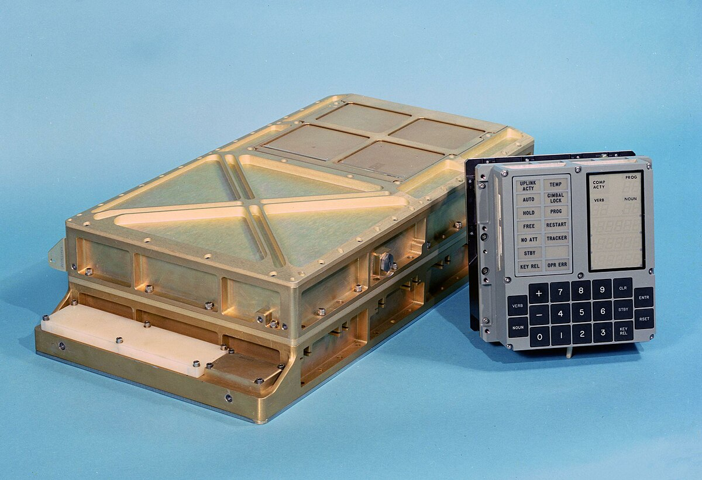

# Apollo Guidance Computer

---
layout: quote
---
# *We choose to go to the moon*
John F. Kennedy, Rice University, 1961

*in this decade and do the other things, **not because they are easy, but because they are hard**, because **that goal will serve to organize and measure the best of our energies and skills**, because that challenge is one that we are willing to accept, one we are unwilling to postpone, and one which we intend to win, and the others, too.*

---
---
# AGC
August 1966

|  |  |
|-----------|-------|
| Frequency | 2.048 MHz |
| World Length | 15 + 1 bit |
| RAM | 4096 B |
| Storage | 72 KB |
| Software API | AGC Assembly Language |

This landed the *moon eagle*.

---
---
# DSKY
Display and keyboard

[Simulator](https://svtsim.com/moonjs/agc.html)
