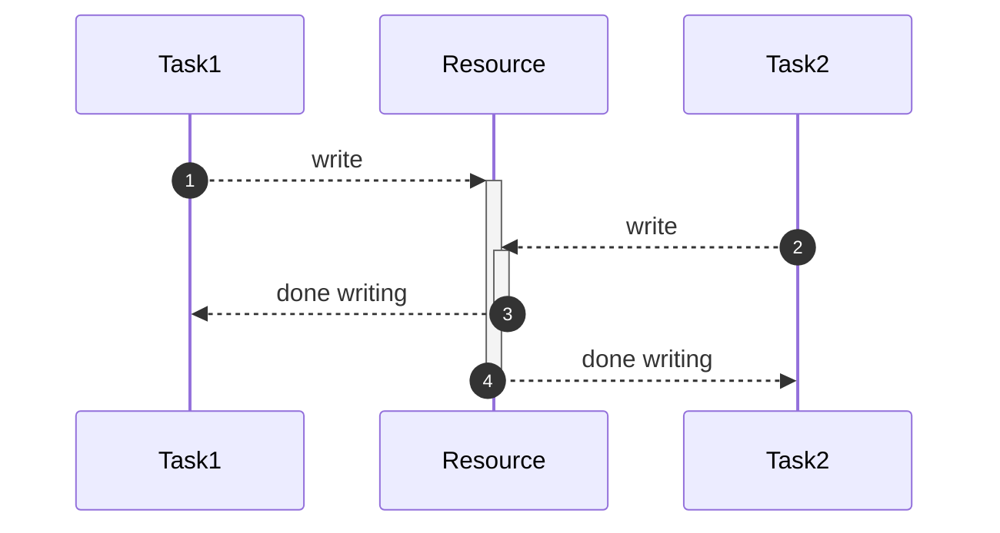
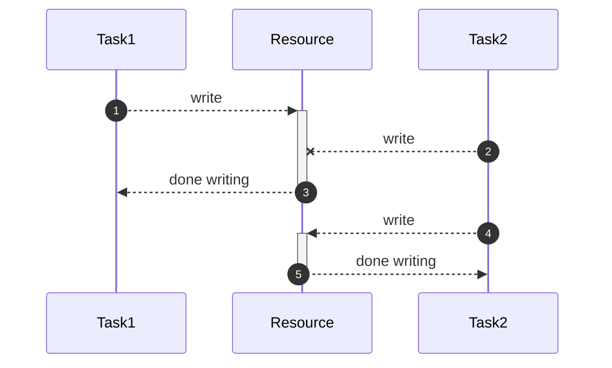
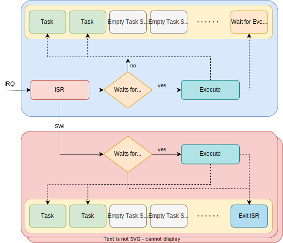
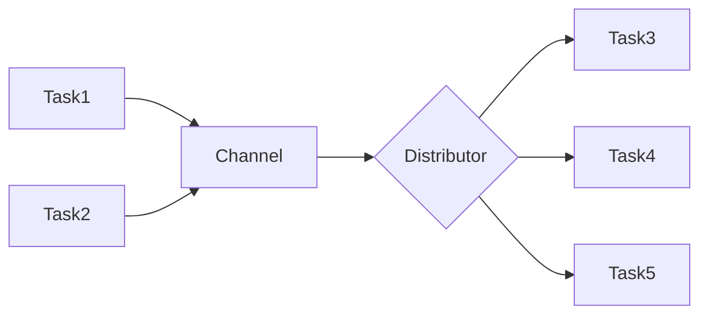
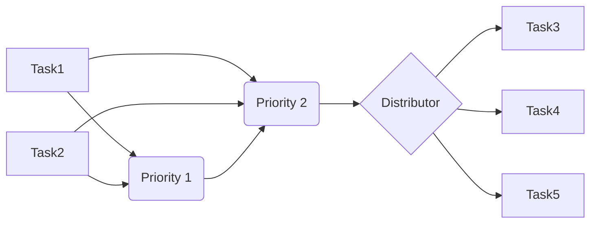
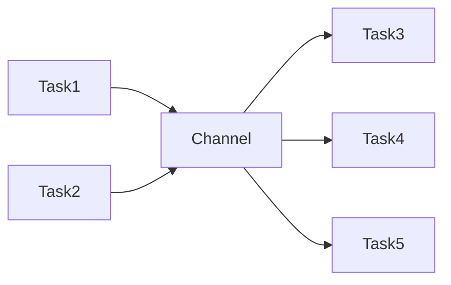

# Communication
between tasks

---
---
# Bibliography
for this section

**Omar Hiari**, *[Sharing Data Among Tasks in Rust Embassy: Synchronization Primitives](https://dev.to/apollolabsbin/sharing-data-among-tasks-in-rust-embassy-synchronization-primitives-59hk)* 

---
---
# Simultaneous Access
Rust forbids simultaneous writes access



---
---
# Exclusive Access
we want to sequentiality access the resource



---
layout: two-cols
---

# Synchronization
safely share data between tasks

- [`NoopMutex`](https://docs.embassy.dev/embassy-sync/git/default/blocking_mutex/type.NoopMutex.html) - used for data shared between tasks within the **same executor** 
- [`CriticalSectionMutex`](https://docs.embassy.dev/embassy-sync/git/default/blocking_mutex/type.CriticalSectionMutex.html) - used for data shared between multiple executors, ISRs and cores 
- [`ThreadModeMutex`](https://docs.embassy.dev/embassy-sync/git/default/blocking_mutex/struct.ThreadModeMutex.html) - used for data shared between tasks within **low priority executors** (**not** running in **ISRs** mode) running on a **single core**

:: right ::

<div align="center">

</div>

- ISRs are executed in parallel with tasks
- embassy allows registering priority executors, that run tasks in ISRs
- some MCUs have multiple cores

---

# Blocking Mutex

no `.await` allowed while the mutex is held

```rust{all|1|3-5|7-14|10-14}
use embassy_sync::blocking_mutex::Mutex;

struct Data {/* ... */ }

static SHARED_DATA: Mutex<ThreadModeRawMutex, RefCell<Data>> = Mutex::new(RefCell::new(Data::new(/* ... */)));

#[embassy_executor::task]
async fn task1() {
    // Load value from global context, modify and store
    SHARED_DATA.lock(|f| {
        let data = f.borrow_mut();
        // edit data
        f.replace(data);
    });
}
```


---
---
# Async Mutex
`.await` is allowed while the Mutex is held, it will release the Mutex while `await`ing

```rust{all|1|3-5|7-14|10-14}
use embassy_sync::mutex::Mutex;

struct Data {/* ... */ }

static SHARED: Mutex<ThreadModeRawMutex, Data> = Mutex::new(Data::new(/* ... */));

#[embassy_executor::task]
async fn task1() {
    // Load value from global context, modify and store
    {
        let mut data = SHARED_DATA.lock().await;
        // edit *data
        Timer::after(Duration::from_millis(1000)).await;
    }
}
```

---
---
# Channels
send data from a task to another

Embassy provides four types of channels synchronized using `Mutex`s
| Type | Description |
|-|-|
| [`Channel`](https://docs.embassy.dev/embassy-sync/git/default/channel/struct.Channel.html) | A Multiple Producer Multiple Consumer (MPMC) channel. Each message is only received by a single consumer. |
| [`PriorityChannel`](https://docs.embassy.dev/embassy-sync/git/default/priority_channel/struct.PriorityChannel.html) | A Multiple Producer Multiple Consumer (MPMC) channel. Each message is only received by a single consumer. Higher priority items are shifted to the front of the channel. |
| [`Signal`](https://docs.embassy.dev/embassy-sync/git/default/pubsub/struct.PubSubChannel.html) | Signalling latest value to a single consumer. |
| [`PubSubChannel`](https://docs.embassy.dev/embassy-sync/git/default/signal/struct.Signal.html) | A broadcast channel (publish-subscribe) channel. Each message is received by all consumers. |

---
---
# Channel and Signal
sends data from one task to another

[`Channel`](https://docs.embassy.dev/embassy-sync/git/default/channel/struct.Channel.html) - A Multiple Producer Multiple Consumer (MPMC) channel. Each message is only received by a single consumer.

[`Signal`](https://docs.embassy.dev/embassy-sync/git/default/pubsub/struct.PubSubChannel.html) - Signalling latest value to a single consumer. 



---
---
# PriorityChannel
sends data from one task to another with a priority

[`PriorityChannel`](https://docs.embassy.dev/embassy-sync/git/default/priority_channel/struct.PriorityChannel.html) - A Multiple Producer Multiple Consumer (MPMC) channel. Each message is only received by a single |consumer. Higher priority items are shifted to the front of the channel. 



---
---
# PubSubChannel
sends data from one task to all receiver tasks

[`PubSubChannel`](https://docs.embassy.dev/embassy-sync/git/default/signal/struct.Signal.html) - A broadcast channel (publish-subscribe) channel. Each message is received by all consumers.



---

# Channel Example

```rust{all|1|2|5,7,14,17-25|5,8-14}
enum LedState { On, Off }
static CHANNEL: Channel<ThreadModeRawMutex, LedState, 64> = Channel::new();

#[embassy_executor::main]
async fn main(spawner: Spawner) {
    // init led
    spawner.spawn(execute_led(CHANNEL.sender(), Duration::from_millis(500))));
    loop {
        match CHANNEL.receive().await {
            LedState::On => led.on(),
            LedState::Off => led.off()
        }
    }
}

#[embassy_executor::task]
async fn execute_led(control: Sender<'static, ThreadModeRawMutex, LedState, 64>, delay: Duration) {
    let mut ticker = Ticker::every(delay);
    loop {
        control.send(LedState::On).await;
        ticker.next().await;
        control.send(LedState::Off).await;
        ticker.next().await;
    }
}
```
