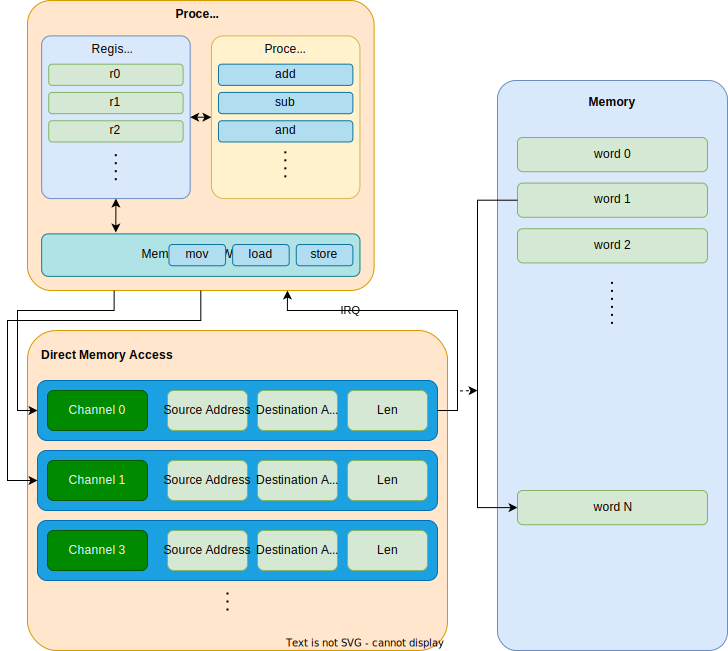

# DMA
Direct Memory Access

---
---
# Bibliography
for this section

**Raspberry Pi Ltd**, *[RP2040 Datasheet](https://datasheets.raspberrypi.com/rp2040/rp2040-datasheet.pdf)*
   - Chapter 2 - *System Description*
     - Chapter 2.5 - *DMA*

---
layout: two-cols
---
# DMA

- offloads the MCU from doing **memory to memory** operations
- due to MMIO, usually implies **transfers from and to peripherals**
- raises an interrupt when a transfer is done

<v-click>

⚠️ DMA does not know about the data stored in cache.

</v-click>

<v-click>

- for chips that use cache
  - the DMA buffer's memory region has to be set manually to *nocache* (if MCU knows)
  - or, the cache has to be flushed before and, possibly after, a DMA transfer

</v-click>

:: right ::

