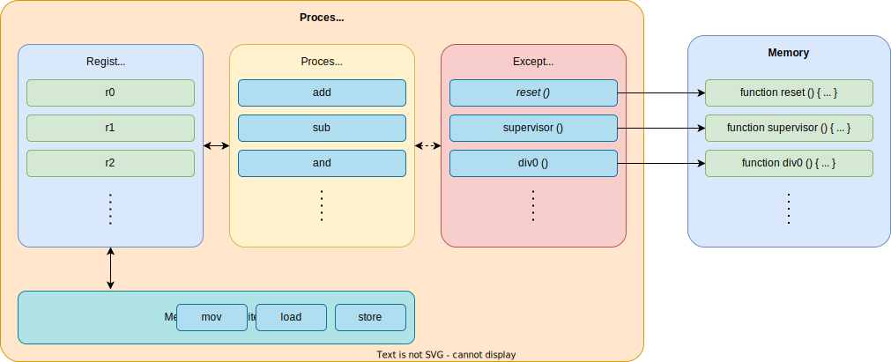
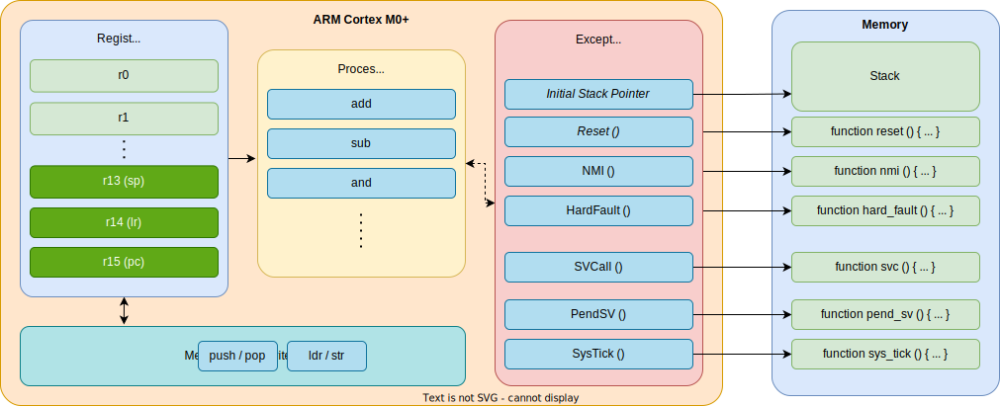
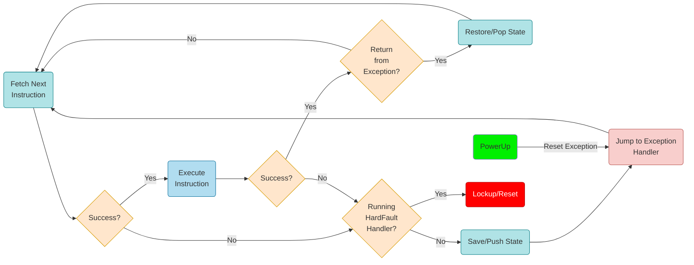
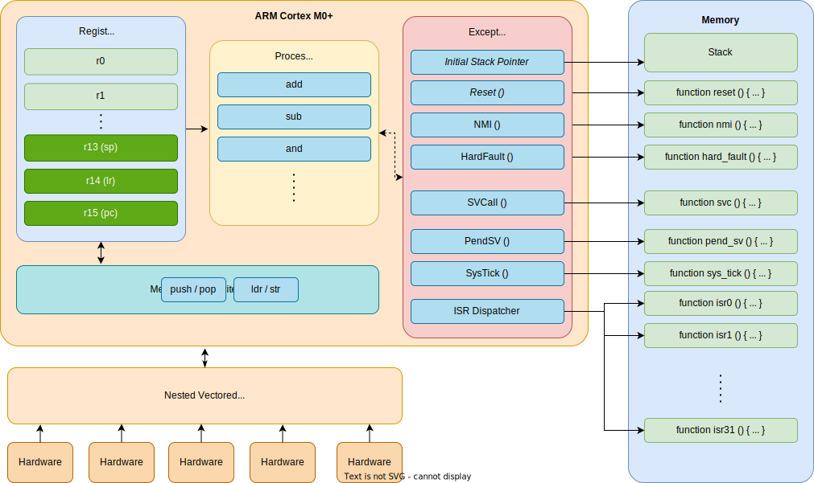
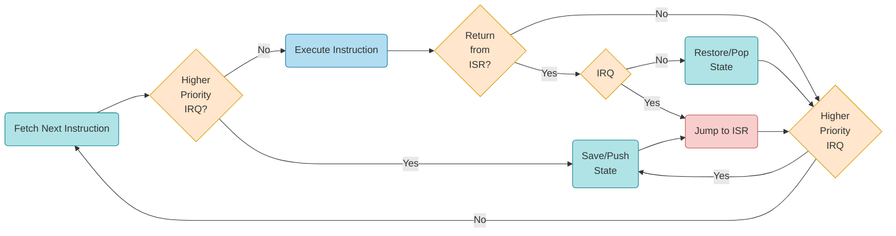
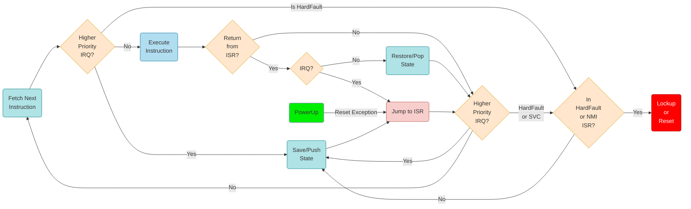
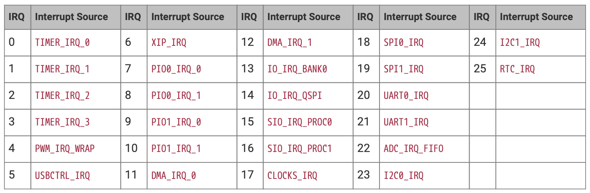
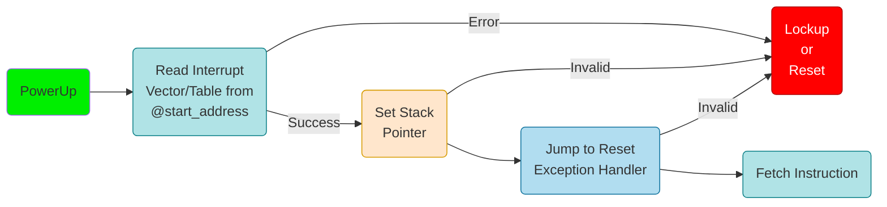
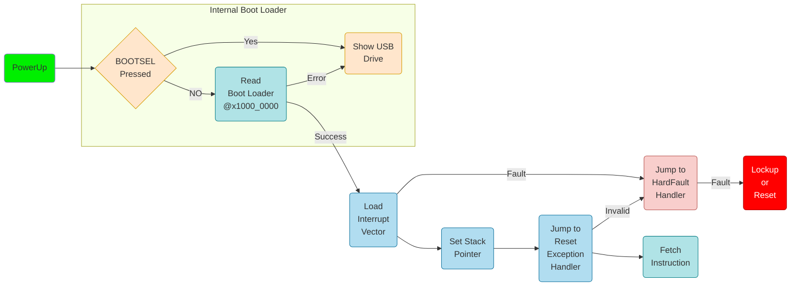

# Exceptions
for the ARM Cortex-M0+ processor

---
---
# Bibliography
for this section

**Joseph Yiu**, *The Definitive Guide to ARM® Cortex®-M0 and Cortex-M0+ Processors, 2nd Edition*
   - Chapter 4 - *Architecture*
     - Section 4.4 - *Stack Memory Operations*
     - Section 4.5 - *Exceptions and Interrupts*
   - Chapter 8 - *Exceptions and Interrupts*
     - Section 8.1 - *What are Exceptions and Interrupts*
     - Section 8.2 - *Exception types on Cortex-M0 and Cortex-M0+*

---
---
# Processor Exceptions
what happens if something does not work as required



---
---
# ARM Cortex-M0+ Exceptions
what happens if something does not work as required



---
---
# Exception (HardFault) Handling
ARM Cortex-M0+ has one **actual exception**, *HardFault*



- the exception table of RP2040 at address 0x1000_0100 (start of the boot area + 4 bytes)
- the processor generates a *Reset* exception when it starts

---
layout: section
---
# Interrupts
for ARM Cortex-M0+

---
---
# Bibliography
for this section

**Joseph Yiu**, *The Definitive Guide to ARM® Cortex®-M0 and Cortex-M0+ Processors, 2nd Edition*
   - Chapter 8 - *Exceptions and Interrupts*
     - Section 8.1 - *What are Exceptions and Interrupts*
     - Section 8.3 - *Brief Overview of the NVIC*
     - Section 8.4 - *Definition of Exception Priority Levels*
     - Section 8.5 - *Vector Table*
     - Section 8.6 - *Exception Sequence Overview*
   - Chapter 11 - *Fault Handling*
     - Section 11.1 - *Fault Exception Overview*
     - Section 11.2 - *What Can Cause a Fault*
     - Section 11.7 - *Lockup*

---
---

# ARM Cortex-M0+ Interrupts
some hardware device notifies the MCU

<div align="center">

</div>

---
---
# Interrupt Handling
ARM Cortex-M0+



<div grid="~ cols-2 gap-2">

| | |
|-|-|
| *IRQ* | Interrupt Request |
| *ISR* | Interrupt Service Routine |

<div>

- the interrupt vector (table) of RP2040 starts at address 0x1000_0040 (after the exceptions table with 15 interrupts)
- ARM Cortex-M0+ has a maximum of 32 interrupt requests (IRQs)

</div>
</div>

---
---
# Exceptions are Software Interrupt Requests
with a negative IRQ number and a higher priority



<div grid="~ cols-2 gap-2">

<div>

- Reset (-14)
- HardFault (-13)
- SVC (-5)
- PendSV (-2)
- SysTick (-1)
</div>



</div>

---
layout: section
---
# Boot
of the RP2040

---
---
# Bibliography
for this section

**Raspberry Pi Ltd**, *[RP2040 Datasheet](https://datasheets.raspberrypi.com/rp2040/rp2040-datasheet.pdf)*
   - Chapter 2 - *System Description*
     - Section 2.7 - *Boot sequence*
     - Section 2.8 - *Bootrom*
       - Subsection 2.8.1 - *Processor Controlled Boot Sequence*

---
---
# Boot
how the ARM Cortex-M0+ starts



- the *start_address* for RP2040 is 0x1000_0100
- RP2040 has another boot loader that it loads from 0x1000_0000


---
layout: two-cols
---
# Boot

<style>
.two-columns {
    grid-template-columns: 2fr 1fr;
}
</style>

The RP2040 boot process



The internal boot loader cannot be overwritten and assures that bricking the device is difficult.

:: right ::

<div align="center">

</div>

---
---
# Set Fault Handler
bare metal, pac or embassy-rs


```rust {*}{lines:false}
// defined by the cortex-m-rt crate
pub struct ExceptionFrame {
    r0: u32,
    r1: u32,
    r2: u32,
    r3: u32,
    r12: u32,
    lr: u32,
    pc: u32,
    xpsr: u32,
}
```

`HardFault` never returns

```rust {all|1|2,4|3}
#[exception]
unsafe fn HardFault(_frame: &ExceptionFrame) -> ! {
    panic!("HardFault {:?}", frame);
}
```

---
---
# Set SysTick Handler
bare metal, PAC or embassy-rs

```rust {all|1|2,4|3}
#[exception]
unsafe fn SysTick() {
    // execute at a fixed interval
}
```

---
---
# Set Interrupt Handlers
bare metal, PAC

*embassy-rs already defined the interrupts as it needs them*

<div align="center">

</div>

```rust {all|1|2,4|3}
#[interrupt]
unsafe fn IO_IRQ_BANK0 {
    // so some work when a pin interrupt triggers
}
```

---
---
# Use interrupts in embassy-rs
embassy-rs registers interrupt handlers and exposes a high level API

<div align="center">

</div>

```rust {all|4|9,10,11}
#[embassy_executor::main]
async fn main(_spawner: Spawner) {
    let p = embassy_rp::init(Default::default());
    let mut button = Input::new(p.PIN_20, Pull::None);

    loop {
        info!("Waiting for the button press");

        // waits for interrupt (sent by button)
        // IO_IRQ_BANK0
        button.wait_for_high().await;

        info!("Button was pressed");
    }
}
```
