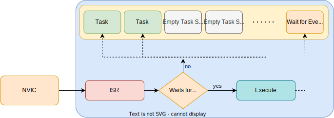

# Asynchronous Executor
of Embassy

---
---
# Bibliography
for this section

**Embassy Documentation**, *[Embassy executor](https://embassy.dev/book/dev/runtime.html)*

---
---
# Tasks

<div grid="~ cols-2 gap5">

<div>

- `#[embassy_executor::main]`
  - starts the Embassy scheduler
  - defines the `main` task
- `#[embassy_executor::task]` - defines a new task
  - `pool_size` -is *optional* and defines how many identical tasks can be spawned
- the `main` task
  - initializes the the `led`
  - spawns the `led_blink` task (adds to the scheduler)
  - uses `.await` to give up the MCU while waiting form the button

</div>


```rust {all|9-22|1-7|18-21|19|3-6|4|5}
#[embassy_executor::task(pool_size = 2)]
async fn led_blink(mut led:Output<'static, PIN_X>) {
    loop {
        led.toogle();
        Timer::after_secs(1).await;
    }
}

#[embassy_executor::main]
async fn main(spawner: Spawner) {
    // ...

    // init led
    spawner.spawn(led_blink(led)).unwrap();
    info!("task started");

    // init button
    loop {
        button.wait_for_rising_edge().await;
        info!("button pressed");
    }
}
```

</div>

---
---
# Tasks can stop the executor

<div grid="~ cols-2 gap5">

<div>

- unless awaited, `async` functions are not executed
- tasks have to use `.await` in loops, otherwise they block the scheduler

</div>


``` {all|5-8|3-9}
#[embassy_executor::task]
async fn led_blink(mut led:Output<'static, PIN_X>) {
    loop {
        led.toogle();
        // this does not execute anything
        Timer::after_secs(1);
        // infinite loop without `.await`
        // that never gives up the MCU
    }
}

#[embassy_executor::main]
async fn main(spawner: Spawner) {
    // ..
    loop {
        button.wait_for_rising_edge().await;
        info!("button pressed");
    }
}
```

</div>

---
---
# How it works

<div align="center">

</div>

- sleep when **all tasks wait for events**
- after an ISR is executed
  - if waiting for events, ask every task if it can execute (if the IRQ was what the task was `.await`ing for)
  - if a task is executing, continue the task until it `.await`s
- if a task never `.await`s, the executor does not run and never executes another task

---
layout: two-cols
---
## Priority Tasks

<style>
.two-columns {
    grid-template-columns: 3fr 5fr;
}
</style>

<div align="center">

</div>

```rust {*}{lines: false}
#[interrupt]
unsafe fn SWI_IRQ_1() {
    EXECUTOR_HIGH.on_interrupt()
}
#[interrupt]
unsafe fn SWI_IRQ_0() {
    EXECUTOR_MED.on_interrupt()
}
```

:: right ::

```rust {all|5,6,22|1,7-10|2,12-15|3,17-21}
static EXECUTOR_HIGH: InterruptExecutor = InterruptExecutor::new();
static EXECUTOR_MED: InterruptExecutor = InterruptExecutor::new();
static EXECUTOR_LOW: StaticCell<Executor> = StaticCell::new();

#[entry]
fn main() -> ! {
    // High-priority executor: SWI_IRQ_1, priority level 2
    interrupt::SWI_IRQ_1.set_priority(Priority::P2);
    let spawner = EXECUTOR_HIGH.start(interrupt::SWI_IRQ_1);
    spawner.spawn(run_high()).unwrap();

    // Medium-priority executor: SWI_IRQ_0, priority level 3
    interrupt::SWI_IRQ_0.set_priority(Priority::P3);
    let spawner = EXECUTOR_MED.start(interrupt::SWI_IRQ_0);
    spawner.spawn(run_med()).unwrap();

    // Low priority executor: runs in thread mode, using WFE/SEV
    let executor = EXECUTOR_LOW.init(Executor::new());
    executor.run(|spawner| {
        unwrap!(spawner.spawn(run_low()));
    });
}
```

priority executors run in ISRs, lower priority tasks are interrupted
