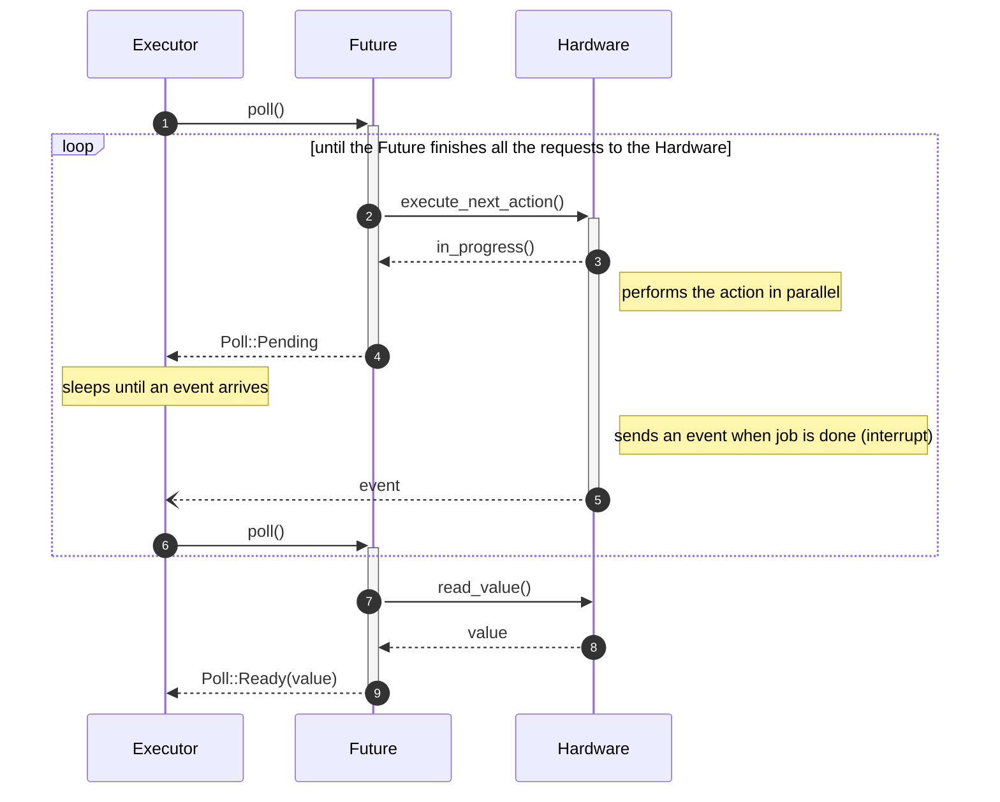
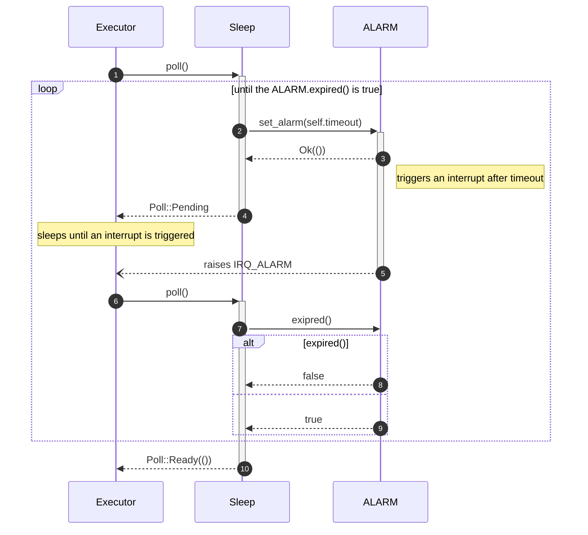
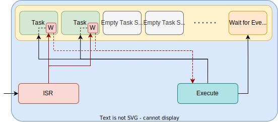

# The `Future` type
a.k.a `Promise` in other languages

---
---
# Bibliography
for this section

**Bert Peters**, *[How does async Rust work](https://bertptrs.nl/2023/04/27/how-does-async-rust-work.html)*

---
layout: two-cols
---
# Future

<style>
.two-columns {
    grid-template-columns: 3fr 5fr;
}
</style>

```rust {*}{lines: false}
enum Poll<T> {
    Pending,
    Ready(T),
}
trait Future {
   type Output;
   fn poll(&mut self) -> Poll<Self::Output>;
}
```

```rust {all|5,10|6|6,7|6|6,7|6|6,8|1,8}{lines: false}
fn execute<F>(mut f: F) -> F::Output
where
  F: Future
{
  loop {
    match f.poll() {
      Poll::Pending => wait_for_event(),
      Poll::Ready(value) => break value
    }
  }
}
```

:: right ::



---
---
# Implementing a Future

<div grid="~ cols-2 gap-5">

```rust {all|1-4|6-9|11-18}
enum SleepStatus {
    SetAlarm,
    WaitForAlarm,
}

struct Sleep {
    timeout: usize,
    status: SleepStatus,
}

impl Sleep {
    pub fn new(timeout: usize) -> Sleep {
        Sleep {
            timeout,
            status: SleepStatus::SetAlarm,
        }
    }
}
```

<v-click>

```rust {all|1,20|1,2,20|4,19|5,18|6-10|11-17|11,12,13|11,14,15}{lines: false}
impl Future for Sleep {
    type Output = ();

    fn poll(&mut self) -> Poll<Self::Output> {
        match self.status {
            SleepStatus::SetAlarm => {
                ALARM.set_alarm(self.timeout);
                self.status = SleepStatus::WaitForAlarm;
                Poll::Pending
            }
            SleepStatus::WaitForAlarm => {
                if ALARM.expired() {
                    Poll::Ready(())
                } else {
                    Poll::Pending
                }
            }
        }
    }
}
```

</v-click>

</div>

---

# Executing Sleep

<div grid="~ cols-2 gap-5">

```rust {all|1,20|1,2,20|4,19|5,18|6-10|11-17|11,12,13|11,14,15}{lines: false}
impl Future for Sleep {
    type Output = ();

    fn poll(&mut self) -> Poll<Self::Output> {
        match self.status {
            SleepStatus::SetAlarm => {
                ALARM.set_alarm(self.timeout);
                self.status = SleepStatus::WaitForAlarm;
                Poll::Pending
            }
            SleepStatus::WaitForAlarm => {
                if ALARM.expired() {
                    Poll::Ready(())
                } else {
                    Poll::Pending
                }
            }
        }
    }
}
```



</div>


---
layout: two-cols
---

# Async Rust

```rust {*}{lines: false}
async fn blink(mut led: Output<'static, PIN_X>) {
    led.on();
    Timer::after_secs(1).await;
    led.off();
}
```
<v-click>
Rust rewrites

```rust {1-7|1-3,7|1,4-7|8-12|13-15|all}{lines: false}
struct Blink {
    // status
    status: BlinkStatus,
    // local variables
    led: Output<'static, PIN_X>,
    timer: Option<impl Future>,
}
impl Blink {
  pub fn new(led: Output<'static, PIN_X>) -> Blink {
    Blink { status: BlinkStatus::Part1, led, timer: None }
  }
}
fn blink(led: Output<'static, PIN_X>) -> Blink {
    Blink::new(led)
}
```

</v-click>

:: right ::

<v-click>

```rust {4-23|5-22|5,6-10,22|5,11-17,22|12-14|5,11-17,22|12,14,15,16|5,18-21,22}{lines: false}
impl Future for Blink {
  type Output = ();
  fn poll(&mut self) -> Poll<Self::Output> {
    loop {
      match self.status {
        BlinkStatus::Part1 => {
          self.led.on();
          self.timer1 = Some(Timer::after_secs(1));
          self.status = BlinkStatus::Part2;
        }
        BlinkStatus::Part2 => {
          if self.timer.unwrap().poll() == Poll::Pending {
            return Poll::Pending;
          } else {
            self.status = BlinkStatus::Part3;
          }
        }
        BlinkStatus::Part3 => {
          self.led.off();
          return Poll::Ready(());
        }
      }
    }
  }
}
```

</v-click>


---

# Async Rust

- the Rust compiler rewrites `async` function into `Future`
- it does not know how to execute them
- executors are implemented into third party libraries

```rust {all|12|11,13,15|14}
use engine::execute;

// Rust rewrites the function to a Future
async fn blink(mut led: Output<'static, PIN_X>) {
    led.on();
    Timer::after_secs(1).await;
    led.off();
}

#[entry]
fn main() -> ! {
    blink(); // this returns the Blink future, but does not execute it
    blink().await; // does not work, as `main` is not an `async` function
    execute(blink()); // this works, as `execute` executes the Blink future
}
```


---
---
# Executor

```rust {all|1|4-16|5-12|14,15}
static TASKS: [Option<impl Future>; N] = [None, N];

fn executor() {
    loop {
        // ask all tasks to continue if they have available data
        for task in TASKS.iter_mut() {
            if let Some(task) = task {
                if Poll::Ready(_) = task.poll() {
                    *task =  None
                }
            }
        }

        // wait for interrupts
        cortex_m::asm::wfi();
    }
}
```

- this is a simplified version, `Option<impl Future>` does not work
- the executor is not able to use `TASKS` like this
- an efficient executor will not poll all the tasks, it uses a `waker` that tasks use to signal the executor

---
---
# The `Future` trait
that Rust provides

```rust
trait Future {
    type Output;

    fn poll(mut self: std::pin::Pin<&mut Self>, cx: &mut Context<'_>) -> Poll<Self::Output>;
}
```

<div grid="~ cols-2 gap-2">

<div>

- `Pin` to `mut self`, which means that `self` cannot be moved
- `Context` which provides the `waker`
  - tasks are polled only if they ask the executor (by using the `wake` function)
- `embassy-rs` provides the execution engine

</div>



</div>
