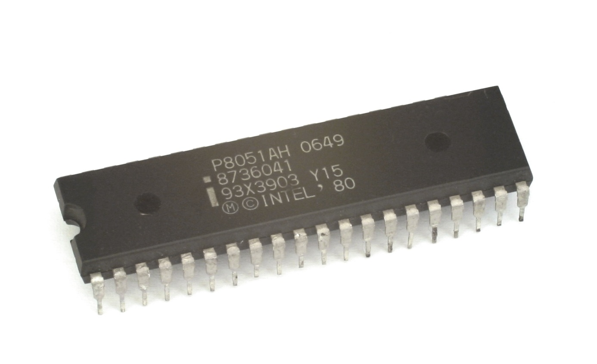
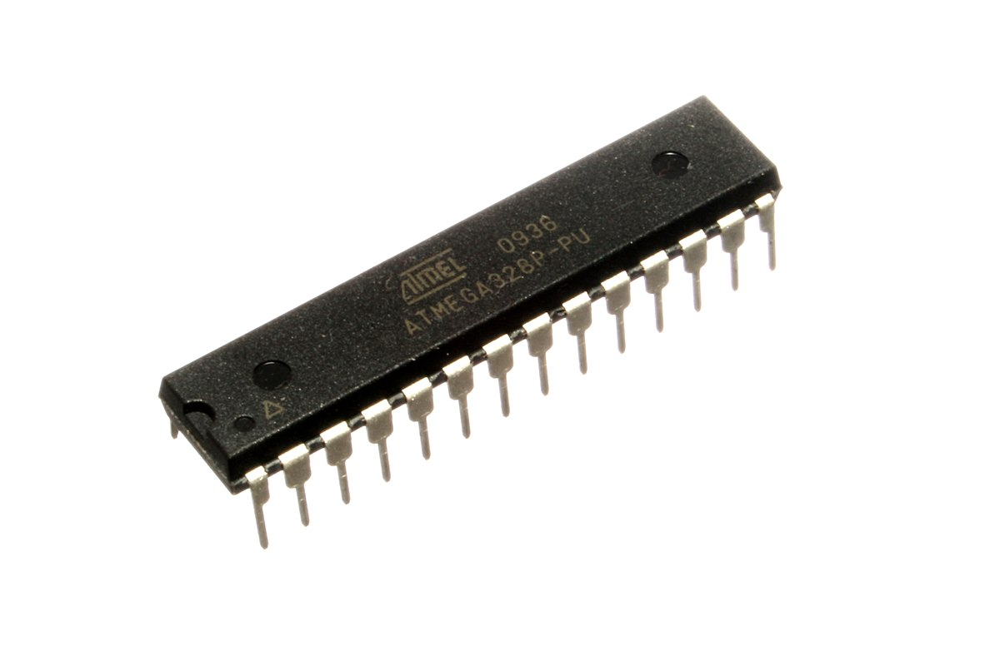
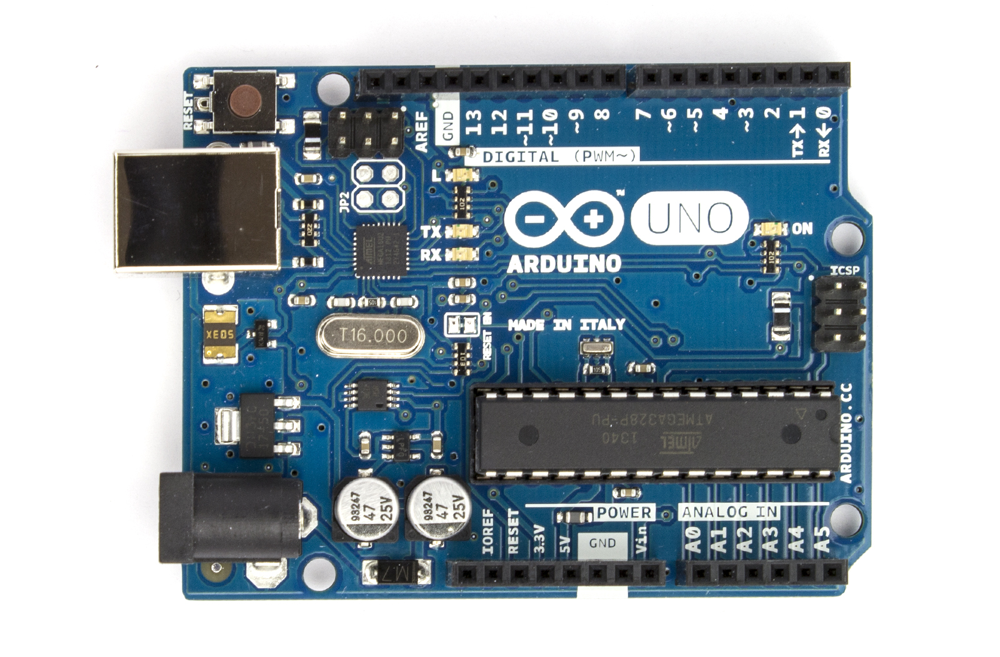
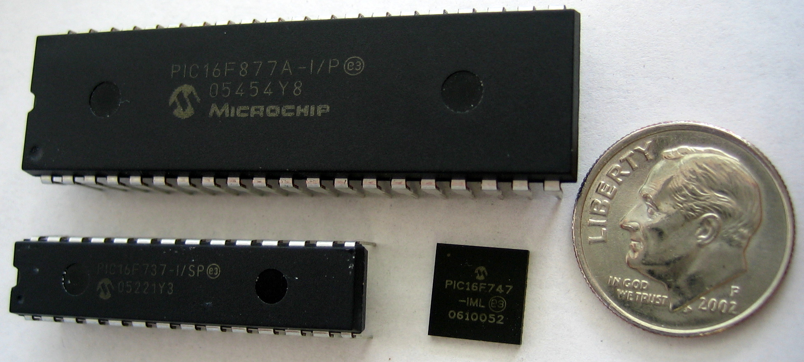
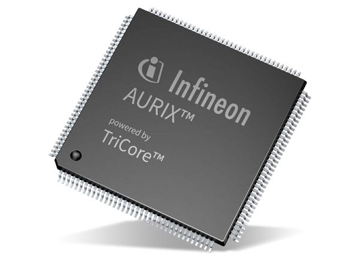

# Real Word Microcontrollers
Intel / AVR / PIC / TriCore / ARM Cortex-M / RISC-V rv32i(a)mc

---
---
# Bibliography
for this section

**Joseph Yiu**, *The Definitive Guide to ARM® Cortex®-M0 and Cortex-M0+ Processors, 2nd Edition*
   - Chapter 1 - *Introduction*
   - Chapter 2 - *Technical Overview*

---
---
# Intel

| | |
|-|-|
| Vendor | Intel |
| ISA | 8051, 8051 |
| Word | 8 bit |
| Frequency | a few MHz |
| Storage | ? |
| Variants | *8048*, *8051* |

---
---
# AVR
probably *Alf and Vegard's RISC processor*

| | |
|-|-|
| Authors | Alf-Egil Bogen and Vegard Wollan |
| Vendor | Microchip (*Atmel*) |
| ISA | AVR |
| Word | 8 bit |
| Frequency | 1 - 20 MHz |
| Storage | 4 - 256 KB |
| Variants | *ATmega*, *ATtiny* |

    
    Board
    

---
---
# PIC
Peripheral Interface Controller / Programmable Intelligent Computer

| | |
|-|-|
| Vendor | Microchip |
| ISA | PIC |
| Word | 8 - 32 |
| Frequency | 1 - 20 MHz |
| Storage | 256 B - 64 KB |
| Variants | *PIC10*, *PIC12*, *PIC16*, *PIC18*, *PIC24*, *PIC32* |

---
---
# TriCore

| | |
|-|-|
| Vendor | Infineon |
| ISA | AURIX32 |
| Word | 32 bit |
| Frequency | hundreds of MHz |
| Storage | a few MB |
| Variants | *TC2xx*, *TC3xx*, *TC4xx* |

---
---
# ARM Cortex-M
Advanced RISC Machine

| | |
|-|-|
| Vendor | Qualcomm, NXP, Nordic Semiconductor, Broadcom, Raspberry Pi |
| ISA | ARMv6-M (Thumb and some Thumb-2) ARMv7-M (Thumb and Thumb-2) |
| Word | 32 |
| Frequency | 1 - 900 MHz |
| Storage | up to a few MB |
| Variants | *M0*, *M0+*, *M3*, *M4*, *M7*, *M33* |

---
---
# RISC-V rv32i(a)mc
Fifth generation of RISC ISA

| | |
|-|-|
| Authors | University of California, Berkeley |
| Vendor | Espressif System  |
| ISA | rv32i(a)mc |
| Word | 32 bit |
| Frequency | 1 - 200 MHz |
| Storage | 4 - 256 KB |
| Variants | *rv32imc*, *rv32iamc* |

