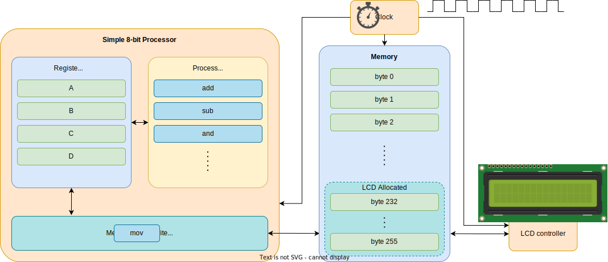

# MMIO
Memory Mapped Input Output

---
---
# 8 bit processor
a simple 8 bit processor with a text display


---
layout: two-cols
---

# STM32L0x2
A real MCU

| | |
|-|-|
| Cortex-M0+ Peripherals | MCU's *settings* and internal peripherals, available at the same address on all M0+ |
| Peripherals | GPIO, USART, SPI, I2C, USB, etc |
| Flash | The storage space |
| SRAM | RAM memory |
| @0x0000_0000 | Alias for SRAM or Flash |

::right::


---
layout: two-cols
---

# System Control Registers
@0xe000_0000

Compute the actual address 
- 0xe000_0000 + Offset

Examples:
- SYST_CSR: **0xe000_e010** (*0xe000_0000 + 0xe010*)
- CPUID: **0xe000_ed00** (*0xe000_0000 + 0xed00*)

```rust{all|1-2|4|5|6,7}
const SYS_CTRL: usize = 0xe000_0000;
const CPUID: usize = 0xed00;

let cpuid_reg = (SYS_CTRL + CPUID) as *const u32;
let cpuid_value = unsafe { *cpuid_reg };
// or
let cpuid_value = unsafe { cpuid_reg.read() };
```

<v-click>
⚠️ Compilers optimize code and processors use cache!
</v-click>

::right::


---
---
# Compiler Optimization
compilers optimize code

Write bytes to the `UART` (serial port) data register

```rust {1,2|3,4,7|5,6|all}
// we use mut as we need to write to it
const UART_TX: *mut u8 = 0x400_3400;
// b".." means ASCII string (Rust uses UTF-8 strings by default)
for character in b"Hello, World".iter() {
	// character is &char, so we use *character to get the value
	unsafe { UART_TX.write(*character); }
}
```

<v-clicks>

1. The compiler does not know that `UART_TX` is a register and uses it as a memory address.
2. Writing several values to the same memory address will result in having the last value stored at that address.
3. The compiler optimizes the code write the value

</v-clicks>

<v-after>

```rust
const UART_TX: *mut u8 = 0x400_3400;
unsafe { UART_TX.write(b'd'); }
```

</v-after>

---
layout: two-cols
---

# No Compiler Optimization

CPUID: **0xe000_ed00** (*0xe000_0000 + 0xed00*)

```rust{all|1|3-4|6|7-9}
use core::ptr::read_volatile;
    
const SYS_CTRL: usize = 0xe000_0000;
const CPUID: usize = 0xed00;

let cpuid_reg = (SYS_CTRL + CPUID) as *const u32;
unsafe {
    read_volatile(cpuid_reg) // avoid cache
}
```

|  |  |
|----------|-------------|
| `read_volatile`, `write_volatile` | **no** compiler **optimization** |
| `read`, `write`, `*p` | **use** compiler **optimization**  |

::right::


---
---
# No Compiler Optimization

Write bytes to the `UART` (serial port) data register

```rust {1|3,4|5,6,9|7,8|all}
use core::ptr::write_volatile;

// we use mut as we need to write to it
const UART_TX: *mut u8 = 0x400_3400;
// b".." means ASCII string (Rust uses UTF-8 strings by default)
for character in b"Hello, World".iter() {
	// character is &char, so we use *character to get the value
	unsafe { write_volatile(UART_TX, *character); }
}
```

<v-clicks>

The compiler **knows** that `UART_TX` **must be written** every time.

</v-clicks>


---
---
# 8 bit processor
with cache


---
---
# No Cache or Flush Cache

- Cache types:
  - *write-through* - data is written to the cache and to the main memory (bus)
  - *write-back* - data is written to the cache and later to the main memory (bus)
- few Cortex-M MCUs have cache
- the Memory Mapped I/O region is set as *nocache*
- for chips that use cache
  - *nocache* regions have to be set manually (if MCU knows)
  - or, the cache has to be flushed before a `volatile_read` and after a `volatile_write`
  - beware DMA controllers that can't see the cache contents

---
layout: two-cols
---

# Read the CPUID
About the MCU

```rust{all|1|3-4|6|7-9|11,12|14,15|17,18|20,21}
use core::ptr::read_volatile;

const SYS_CTRL: usize = 0xe000_0000;
const CPUID: usize = 0xed00;

let cpuid_reg = (SYS_CTRL + CPUID) as *const u32;
let cpuid_value = unsafe {
    read_volatile(cpuid_reg)
};

// shift right 24 bits and keep only the last 8 bits
let variant = (cpuid_value >> 24) & 0b1111_1111;

// shift right 16 bits and keep only the last 4 bits
let architecture = (cpuid_value >> 16) & 0b1111;

// shift right 4 bits and keep only the last 12 bits
let part_no = (cpuid_value >> 4) & 0b11_1111_1111;

// shift right 0 bits and keep only the last 4 bits
let revision = (cpuid_value >> 0) & 0b1111;
```

::right::

## CPUID Register
Offset: 0xed04


---
layout: two-cols
---

# AIRCR
Application Interrupt and Reset Control Register

```rust{all|1,2|4,5|10-13|8,17|7,15|7,16|19-21}
use core::ptr::read_volatile;
use core::ptr::write_volatile;

const SYS_CTRL: usize = 0xe000_0000;
const AIRCR: usize = 0xed0c;

const VECTKEY: u32 = 16;
const SYSRESETREQ: u32 = 2;

let aircr_register = (SYS_CTRL + AIRCR) as *mut u32;
let mut aircr_value = unsafe { 
    read_volatile(aircr_register) 
};

aircr_value = aircr_value & ~(0x1111 << VECTKEY); 
aircr_value = aircr_value | (0x05fa << VECTKEY);
aircr_value = aircr_value | (1 << SYSRESETREQ);

unsafe {
    write_volatile(aircr_register, aircr_value);
}
```

::right::

## AIRCR Register

Offset: 0xed0c


---
layout: two-cols
---
# Read and Write
they do stuff

- Read
  - reads the value of a register
  - might ask the peripheral to do something
  
- Write
  - writes the value to a register
  - might ask the peripheral to do something
    - SYSRESETREQ

::right::

## AIRCR Register

Offset: 0xed0c


---
---
# SVD XML File
System View Description

```xml{all|3|4,21|4,5,21|4,6,21|4,7-9,20,21|4,7-8,12-17,20,21}
<device schemaVersion="1.1"
	xmlns:xs="http://www.w3.org/2001/XMLSchema-instance" xs:noNamespaceSchemaLocation="CMSIS-SVD.xsd">
	<name>RP2040</name>
	<peripherals>
		<name>PPB</name>
		<baseAddress>0xe0000000</baseAddress>
		<register>
			<name>CPUID</name>
			<addressOffset>0xed00</addressOffset>
			<resetValue>0x410cc601</resetValue>
			<fields>
				<field>
					<name>IMPLEMENTER</name>
					<description>Implementor code: 0x41 = ARM</description>
					<bitRange>[31:24]</bitRange>
					<access>read-only</access>
				</field>
				<!-- rest of the fields of the register -->
			</fields>
		</register>
	</peripherals>
</device>
```
