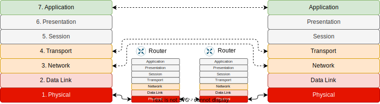

# OSI Network Stack
Open Standard for Intercommunication

---
---
# Bibliography
for this section

**Andrew Tanenbaum**, *Computer Networks (5th edition)*
  - Chapter 1 - *Introduction*
    - Subchapter 1.1 - *Uses of Computer Networks*
    - Subchapter 1.2 - *Network Hardware*
    - Subchapter 1.3 - *Network Software*
    - Subchapter 1.4.1 - *The OSI Reference Model*

---
---
# Standardized Interfaces
7 layers, each one communicates with its counterpart

- **L1** *hardware*, sends and receives data on the physical media
- **L2** *hardware* and *driver* sends and receives data from a device that it is directly connected to
- **L3** *driver* sends and receives data from devices not directly connected to using L2 from device to device
- **L4** *driver* connects the applications to the networking stack
- **L5**/**L6** not used
- **L7** is the *application*