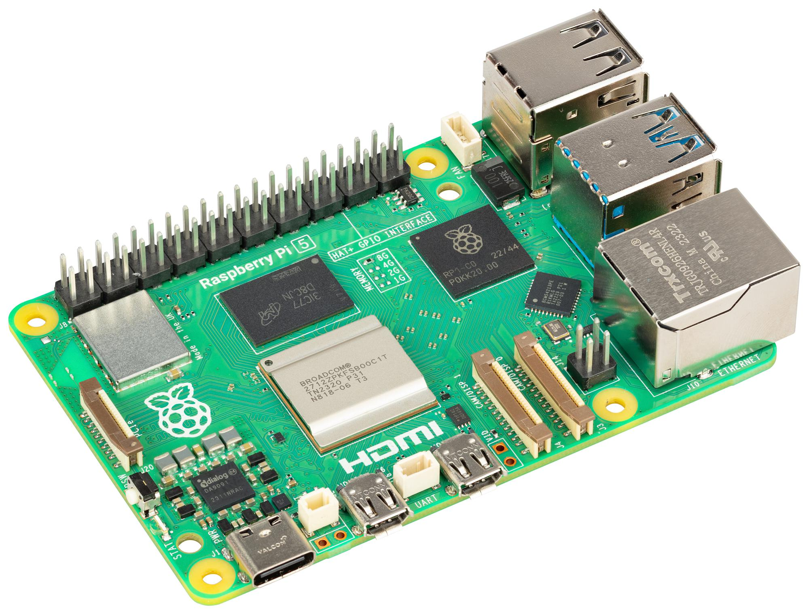
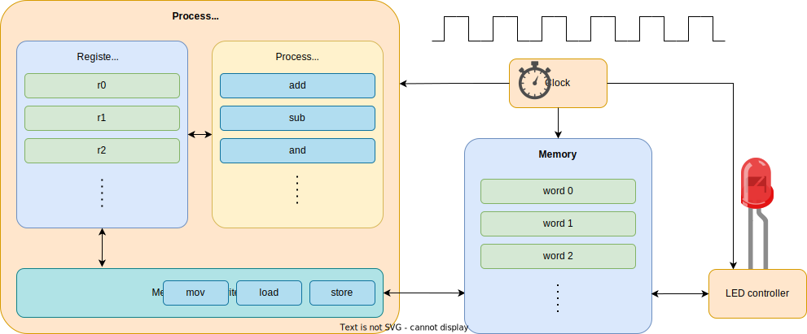
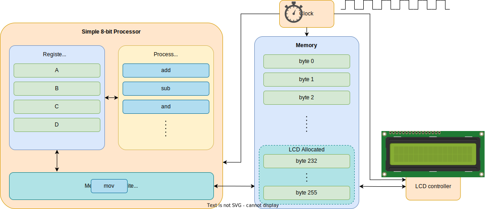

# What is a microprocessor?

---
layout: two-cols
---
# Microcontroller (MCU)
Integrated in embedded systems for certain tasks

- low operating frequency (MHz)
- a lot of I/O ports
- controls hardware
- does not require an Operating System
- costs $0.1 - $25
- annual demand is billions


:: right ::

# Microprocessor (CPU)
General purpose, for PC & workstations

- high operating frequency (GHz)
- limited number of I/O ports
- usually requires an Operating System
- costs $75 - $500
- annual demand is tens of millions


---
---
# How a microprocessor (MCU) works
This is a simple processor



---

# 8 bit processor
a simple 8 bit processor with a text display



---
layout: two-cols
---
# Programming
in Rust


<v-click>

```rust
use eight_bit_processor::print;

static hello: &str = "Hello World!";

#[start]
fn start() {
    print(hello);
}
```

</v-click>

:: right ::

## Assembly

<v-click>

```asm
	JMP start
hello: DB "Hello World!" ; Variable
       DB 0	; String terminator
start:
	MOV C, hello    ; Point to var
	MOV D, 232	; Point to output
	CALL print
        HLT             ; Stop execution
print:			; print(C:*from, D:*to)
	PUSH A
	PUSH B
	MOV B, 0
.loop:
	MOV A, [C]	; Get char from var
	MOV [D], A	; Write to output
	INC C
	INC D
	CMP B, [C]	; Check if end
	JNZ .loop	; jump if not

	POP B
	POP A
	RET
```

</v-click>

---
layout: fact
---
# Demo
a working example for the previous code

[Start](https://schweigi.github.io/assembler-simulator/)
