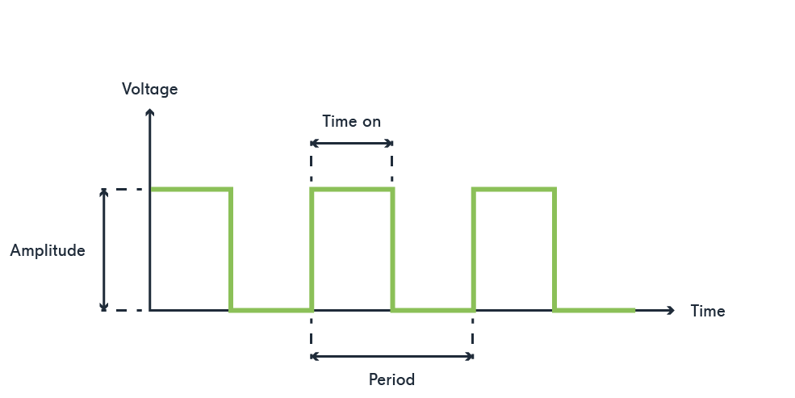
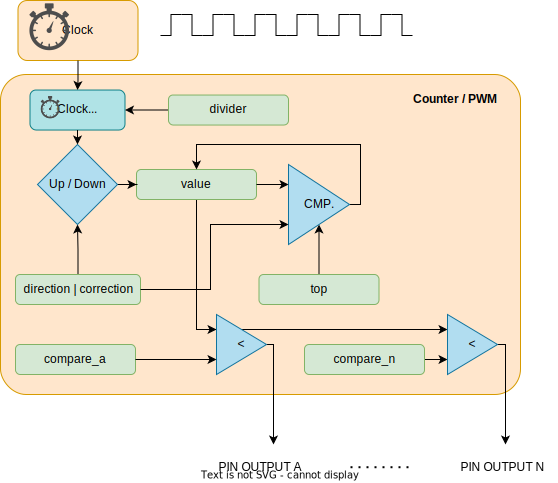
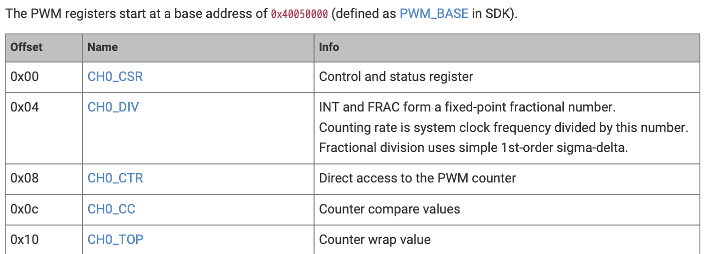
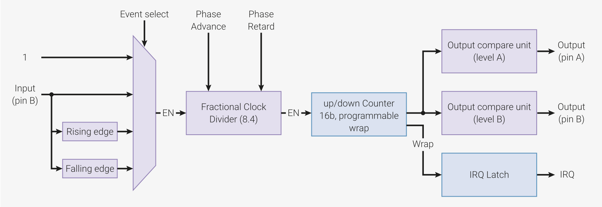
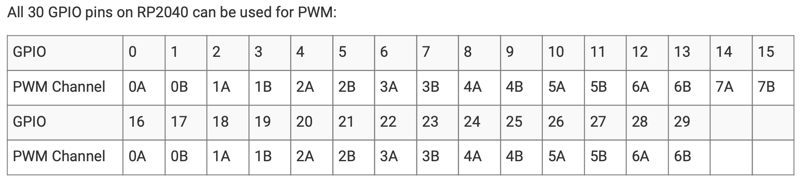
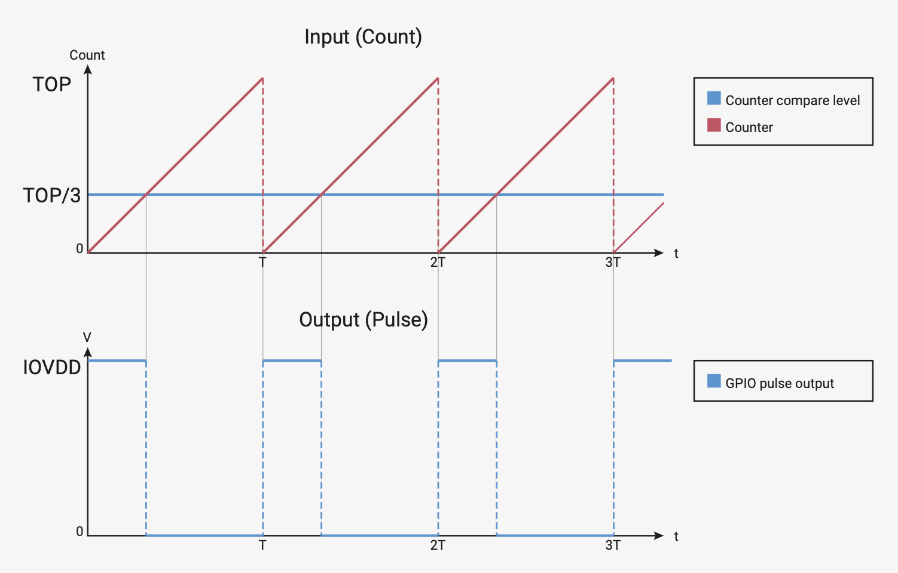
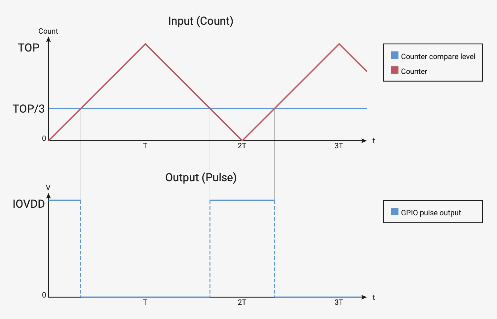

# PWM
Pulse Width Modulation

---
---
# Bibliography
for this section

1. **Raspberry Pi Ltd**, *[RP2040 Datasheet](https://datasheets.raspberrypi.com/rp2040/rp2040-datasheet.pdf)*
   - Chapter 4 - *Peripherals*
     - Chapter 4.5 - *PWM*

2. **Paul Denisowski**, *[Understanding PWM](https://www.youtube.com/watch?v=nXFoVSN3u-E)*

---
layout: two-cols
---
# PWM
simulates an *analog* signal (using integration)

- generates a square signal
- if integrated (averaged), it looks like an analog signal

|  |  |  |
|-----------|------|-------------|
| *frequency* | Hz | The number of repeats per s |
| *duty_cycle* | % | The percentage of the time when the signal is `High` |


:: right ::



$$

f = \frac{1}{period} \left[\frac{1}{s} = 1 Hz\right]_{SI}

$$

$$

duty\_cycle = \frac{time\_on}{period} \%

$$

---
layout: two-cols
---
# PWM
generic device

$$

f = \begin{cases}
    \frac{f_{clock}}{divider \times (top + 1)} && correction = 0\\
    \\
    \frac{f_{clock}}{divider \times 2 \times (top + 1)} && correction = 1\\
\end{cases}

$$

$$
pin_{a,b} = \begin{cases}
    0 && compare_{a,b} >= value\\
    1 && compare_{a,b} < value
\end{cases}
$$


<style>
.two-columns {
    grid-template-columns: 4fr 5fr;
}
</style>

:: right ::

<div align="center">

</div>

---
---

# Usage examples

- dimming an LED

- controlling motors
  - controlling the angle of a stepper motor
  - controlling the RPM of a motor

---
layout: two-cols
---

# RP2040's PWM

- generates square signals
- counts the pulse with of input signals
- 8 PWM units, each with 2 channels (A and B)
- each PWM channel is connected to a certain pin
- some channels are connected to two pins

## Registers

<style>
.two-columns {
    grid-template-columns: 4fr 5fr;
}
</style>

<div align="center">

</div>

:: right ::

<div align="center">

</div>

<div align="center">

</div>

<div align="center">

</div>


---

# RP2040's PWM Modes

<div grid="~ cols-2 gap-5">

<div align="center">
standard mode

</div>

<div align="center">
phase-correct mode

</div>

</div>

$$

period = (TOP + 1) \times (PH\_CORRECT + 1) \times \left(DIV\_INT + \frac{DIV\_FRAC}{16}\right) [s]_{SI}

$$

$$

f = \frac{f_{sys}}{period} [Hz]_{SI}

$$


---
layout: two-cols
---
# Example
using Embassy

```rust{all|1|3|5|5,6|5,6,7|9-13|16|17|18,19|15,18,19,20}
use embassy_rp::pwm::{Config, Pwm};

let p = embassy_rp::init(Default::default());

let mut c: Config = Default::default();
c.top = 0x8000;
c.compare_b = 8;

let mut pwm = Pwm::new_output_b(
    p.PWM_CH4, 
    p.PIN_25, 
    c.clone()
);

loop {
    info!("LED duty cycle: {}/32768", c.compare_b);
    Timer::after_secs(1).await;
    c.compare_b += 10;
    pwm.set_config(&c);
}
```

:: right ::

```rust {lineNumbers: false}
pub struct Config {
    /// Inverts the PWM output signal on channel A.
    pub invert_a: bool,
    /// Inverts the PWM output signal on channel B.
    pub invert_b: bool,
    /// Enables phase-correct mode for PWM operation.
    pub phase_correct: bool,
    /// Enables the PWM slice, allowing it to generate an output.
    pub enable: bool,
    /// A fractional clock divider, represented as a fixed-point number with
    /// 8 integer bits and 4 fractional bits. It allows precise control over
    /// the PWM output frequency by gating the PWM counter increment.
    /// A higher value will result in a slower output frequency.
    pub divider: fixed::FixedU16<fixed::types::extra::U4>,
    /// The output on channel A goes high when `compare_a` is higher than the
    /// counter. A compare of 0 will produce an always low output
    pub compare_a: u16,
    /// The output on channel B goes high when `compare_b` is higher than the
    /// counter.
    pub compare_b: u16,
    /// The point at which the counter wraps, representing the maximum possible
    /// period. The counter will either wrap to 0 or reverse depending on the
    /// setting of `phase_correct`.
    pub top: u16,
}

```
