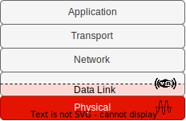
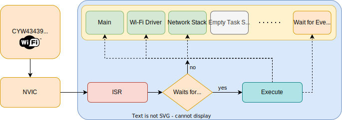
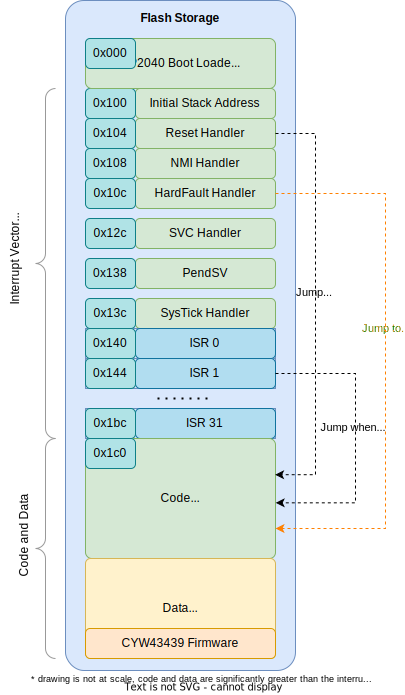
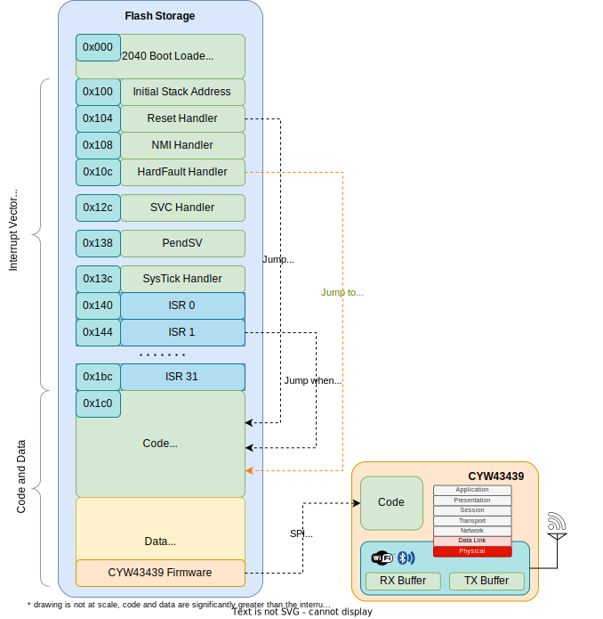
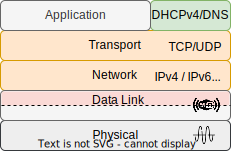
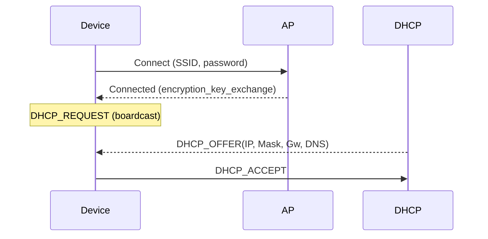

# Raspberry Pi Pico W

---
---
# Bibliography
for this section

**Andrew Tanenbaum**, *Computer networks (5th edition)*
  - Chapter 7 - *Application Layer*
    - Subchapter 7.1 - *DNS - Domain Name System*

---
---
# Raspberry Pi Pico W
uses a discrete Wi-Fi chip

<div grid="~ cols-2 gap-5">

<div>

- Wi-Fi and BLE provided by [**CYW43439**](https://www.infineon.com/cms/en/product/wireless-connectivity/airoc-wi-fi-plus-bluetooth-combos/wi-fi-4-802.11n/cyw43439/) made by *Infineon*
- connected over SPI/PI0
- Wi-Fi 4 (802.11n), 2.4 GHz
  - WPA 3
  - SoftAP (4 clients)
  - Device
- BLE 5.2
  - Central
  - Peripheral
  - Bluetooth Classic
- Provides *L2* - allows sending of *Ethernet* (*MAC*) frames

</div>

<div align="center">

</div>

</div>

---
---
# Tasks
tasks that run when using Wi-Fi

<div align="center">

</div>

---
layout: two-cols
---
# CYW43439 API
the embassy driver

<style>
.two-columns {
    grid-template-columns: 7fr 3fr;
}
</style>

1. Load the *firmware* into the `.data` section.

```rust {*}{lines:false}
let fw = include_bytes!("./cyw43439_firmware/43439A0.bin");
let clm = include_bytes!("./cyw43439_firmware/43439A0_clm.bin");
```

2. Use PIO0 as SPI device

```rust {none|1-3|5|6|7|7-12|all}{lines:false}
bind_interrupts!(struct Irqs {
    PIO0_IRQ_0 => InterruptHandler<PIO0>;
});

let pwr = Output::new(p.PIN_23, Level::Low);
let cs = Output::new(p.PIN_25, Level::High);
let mut pio = Pio::new(p.PIO0, Irqs);
let spi = PioSpi::new(
    &mut pio.common, pio.sm0, pio.irq0,
    cs, p.PIN_24, p.PIN_29, p.DMA_CH0
);

```

:: right ::



---
---
# CYW43439 API
the embassy driver

3. Write a task for the Wi-Fi driver

```rust {*}{lines:false}
#[embassy_executor::task]
async fn wifi_task(runner: cyw43::Runner<'static, Output<'static>, PioSpi<'static, PIO0, 0, DMA_CH0>>) -> ! {
    runner.run().await
}
```

4. Start the driver

```rust
static STATE: StaticCell<cyw43::State> = StaticCell::new();
let state = STATE.init(cyw43::State::new());
let (_net_device, mut control, runner) = cyw43::new(state, pwr, spi, fw).await;
unwrap!(spawner.spawn(wifi_task(runner)));
```

5. Init the device

```rust
control.init(clm).await;
control
    .set_power_management(PowerManagementMode::PowerSave)
    .await;
```

---
layout: two-cols
---
# Flash the firmware
write the firmware to the wifi device

<style>
.two-columns {
    grid-template-columns: 6fr 3rfr;
}
</style>

The first action of the *wifi* task is to write the firmware from *.data* to the CY43439 chip.

```rust {*}{lines:false}
#[embassy_executor::task]
async fn wifi_task(/* ... */) -> ! {
    runner.run().await
}
```

:: right ::



---
---
# Wi-Fi AP Mode

Start an **AP** and allow other devices to connect.

*Open Network* (not a very good idea)
  - network SSID
  - channel number
```rust {*}{lines:false}
control.start_ap_open("Network SSID", 5).await;
```

*WPA network*
  - network SSID
  - WPA password
  - channel number
```rust {*}{lines:false}
control.start_ap_wpa2("Network SSID", "WPA password", 5).await;
```

---
---
# Wi-Fi Device Mode

Start an **device** and connect to a Wi-Fi network

*Open Network* (not a very good idea)
  - network SSID
```rust {*}{lines:false}
control.join_open("network SSID").await;
```

*WPA network*
  - network SSID
  - network password
```rust {*}{lines:false}
match control.join_wpa2("network ssid", "network password").await {
    Ok(_) => break,
    Err(err) => {
        info!("join failed with status={}", err.status);
    }
}
```


---
---
# Embassy Net
*a smol TCP/IP stack*

<div grid="~ cols-2 gap-5">

<div>

- uses [*smoltcp*](https://docs.rs/smoltcp/latest/smoltcp/), embedded (no_std) TCP/IP stack written in Rust
- *L3*: IPv4, IPv6, IGMPv4 (ping), 6LoWPAN
- *L4*: TCP and UDP
- *L7*: DHCPv4 and DNS

</div>

<div align="center">

</div>

</div>

---
---
# Embassy Net API
over smoltcp

1. Set how to obtain an IP address
   - self assigned
   - DHCP
2. Start the network stack
3. Use sockets to communicate

---
---
# DHCP
Dynamic Host Control Protocol



---
---
# Obtain a network address
self assigned or obtain one from a DHCP server

*Self assigned*
```rust {all|2|3|4|all}
let config = embassy_net::Config::ipv4_static(embassy_net::StaticConfigV4 {
    address: Ipv4Cidr::new(Ipv4Address::new(192, 168, 69, 2), 24),
    dns_servers: vec![Ipv4Address::new(8, 8, 8, 8), Ipv4Address::new(1, 1, 1, 1)],
    gateway: Some(Ipv4Address::new(192, 168, 69, 1)),
});

```

*Dynamic Host Control Protocol* (*DHCP*)
```rust {none|1|3|5-9}
let config = Config::dhcpv4(Default::default());

// start the network stack

// Wait for DHCP
info!("waiting for DHCP...");
while !stack.is_config_up() {
    Timer::after_millis(100).await;
}
```

---
---
# Start the network stack

1. Write a network task
```rust {*}{lines:false}
#[embassy_executor::task]
async fn net_task(stack: &'static Stack<cyw43::NetDriver<'static>>) -> ! {
    stack.run().await
}
```

2. Start the network stack
```rust {1,2|4,5|4,6|4,7-12|14} {lines:false}
// chosen by fair dice roll. guaranteed to be random.
let seed = 0x0123_4567_89ab_cdef;

// Init network stack
static STACK: StaticCell<Stack<cyw43::NetDriver<'static>>> = StaticCell::new();
static RESOURCES: StaticCell<StackResources<2>> = StaticCell::new();
let stack = &*STACK.init(Stack::new(
    net_device,
    config,
    RESOURCES.init(StackResources::<2>::new()),
    seed,
));

unwrap!(spawner.spawn(net_task(stack)));
```

---
---
# Query an IP address using DNS
IP address for a domain

- sockets use IP addresses
- to talk to a server, the IP of the server has to be obtained

```rust
let dns = DnsSocket::new(stack);
match dns.get_host_by_name("www.example.com", AddrType::IPv4) {
    Ok(ip) => info!("Ip is {:?}", ip),
    Err(e) => warn!("failed to retrieve address {:?}", e)
}
```

---
---
# TCP Server Socket
listening for one single connection

*smoltcp can only listen and accept one client*

```rust {1,2|4,17|5|5,6|9-12|14}
let mut rx_buffer = [0; 4096];
let mut tx_buffer = [0; 4096];

loop {
    let mut socket = TcpSocket::new(stack, &mut rx_buffer, &mut tx_buffer);
    socket.set_timeout(Some(Duration::from_secs(10)));

    info!("Listening on TCP:1234...");
    if let Err(e) = socket.accept(1234).await {
        warn!("accept error: {:?}", e);
        continue;
    }

    info!("Received connection from {:?}", socket.remote_endpoint());

    // handle the connection
}
```

---
---
# TCP Client Socket
connecting to a server

```rust {1,2|4,17|5|5,6|9-12|14}
let mut rx_buffer = [0; 4096];
let mut tx_buffer = [0; 4096];

loop {
    let mut socket = TcpSocket::new(stack, &mut rx_buffer, &mut tx_buffer);
    socket.set_timeout(Some(Duration::from_secs(10)));

    info!("Connecting to TCP 1.2.3.5:1234...");
    if let Err(e) = socket.connect(IpEndpoint::new(IpAddress::v4(1,2,3,5), 1234)).await {
        warn!("accept error: {:?}", e);
        continue;
    }

    info!("Connected to {:?}", socket.remote_endpoint());

    // handle the connection
}
```


---
---
# Read from a TCP Socket
read bytes

```rust {all|1|3,13|3,4-7,13|3,8,13|3,9-12,13|15,16}
let mut buf = [0u8; 4096];

let n = match socket.read(&mut buf).await {
    Ok(0) => {
        warn!("read EOF");
        break;
    }
    Ok(n) => n,
    Err(e) => {
        warn!("read error: {:?}", e);
        break;
    }
};

// display bytes as a UTF-8 string
info!("rxd {}", from_utf8(&buf[..n]).unwrap());
```

---
---
# Write to a TCP Socket
write bytes

```rust {all|1|3|5,13|5,6-8,13|5,9-12,13}
let buf = [0u8; 4096];

// write n bytes to buf

match socket.write_all(&buf[..n]).await {
    Ok(()) => {
        /* write was successful */
    }
    Err(e) => {
        warn!("write error: {:?}", e);
        break;
    }
};
```

---
---
# Listen for UDP Packets

```rust {all|1-4|6|8-10|12-16|18,24|19-23}
let mut rx_buffer = [0; 4096];
let mut rx_metdata_buffer = [PacketMetadata::EMPTY; 3];
let mut tx_buffer = [0; 4096];
let mut tx_metadata_buffer = [PacketMetadata::EMPTY; 3];

let mut buf = [0u8; 4096];

let mut socket = UdpSocket::new(
    stack, &mut rx_buffer, &mut rx_metadata_buffer, &mut tx_buffer, &mut tx_metadata_buffer
);

// listen for UDP packet on port 1234
if let Err(e) = socket.bind(1234) {
    warn!("bind error {:?}", e);
    break;
}

loop {
    match socket.recv_from(&mut buf) {
        Ok((n, endpoint)) => {
            info!("Received from {:?}: {:?}", endpoint, buf[..n]);
        }
    }
}

```

---
---
# Send UDP Packets

```rust {all|1-4|6|8-10|12,13,20|12,13,14-16,20|12,13,17-19,20}
let mut rx_buffer = [0; 4096];
let mut rx_metdata_buffer = [PacketMetadata::EMPTY; 3];
let mut tx_buffer = [0; 4096];
let mut tx_metadata_buffer = [PacketMetadata::EMPTY; 3];

let mut buf = [0u8; 4096];

let mut socket = UdpSocket::new(
    stack, &mut rx_buffer, &mut rx_metadata_buffer, &mut tx_buffer, &mut tx_metadata_buffer
);

info!("Sending to UDP 1.2.3.5:1234...");
match socket.send_to(&buf, IpEndpoint::new(IpAddress::v4(1,2,3,5), 1234)) {
    Ok(()) => {
        /* send successful */
    }
    Err(e) => {
        warn!("send error: {:?}", e);
    }
}

```
