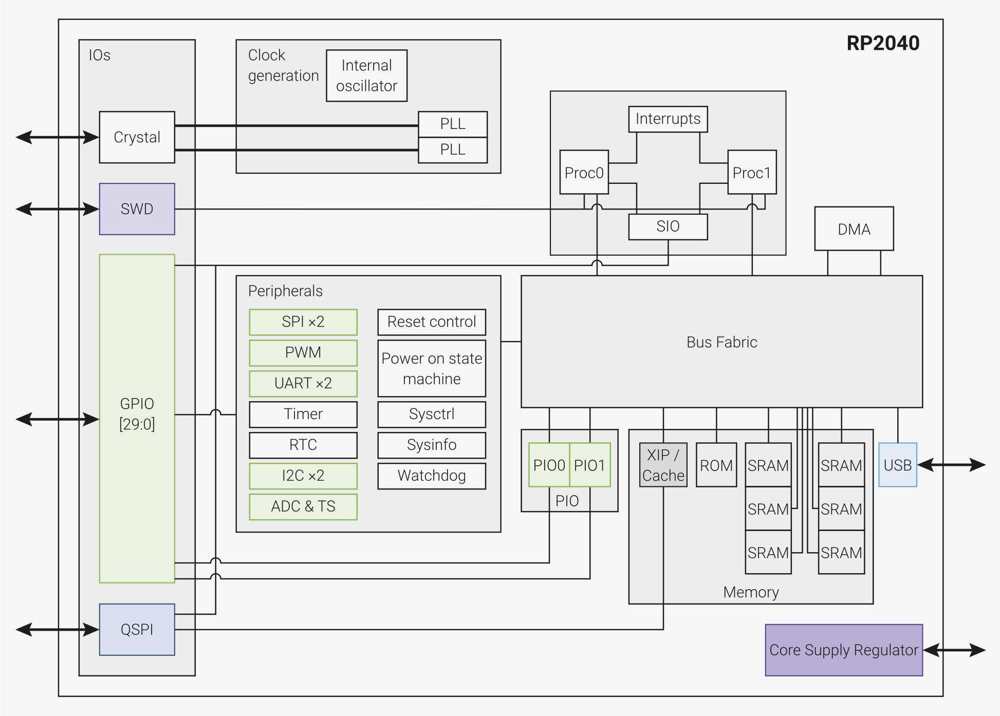

# RP2040
ARM Cortex-M0+, built by Raspberry Pi

---
---
# Bibliography
for this section

**Raspberry Pi Ltd**, *[RP2040 Datasheet](https://datasheets.raspberrypi.com/rp2040/rp2040-datasheet.pdf)*
   - Chapter 1 - *Introduction*
   - Chapter 2 - *System Description*
     - Section 2.1 - *Bus Fabric*

---
layout: two-cols
---
# RP2040
the MCU

| | |
|-|-|
| Vendor | Raspberry PI |
| Variant | ARM Cortex-M0+ |
| ISA | ARMv6-M (Thumb and some Thumb-2) |
| Cores | 2 |
| Word | 32 bit |
| Frequency | up to 133 MHz |
| RAM | 264 KB |
| Storage | N/A (external only) |

::right::

# Boards
that use RP2040

### Raspberry Pi Pico (W)

### Arduino Nano RP2040 Connect

---
layout: two-cols
---
# The Chip

*GPIO*: General Purpose Input/Output\
*SWD*: Debug Protocol\
*DMA*: Direct Memory Access

::right::

## Peripherals

|  |  |
|------|-------------|
| SIO  | Single Cycle Input/Output |
| PWM | Pulse With Modulation |
| ADC | Analog to Digital Converter |
| (Q)SPI | (Quad) Serial Peripheral Interface |
| UART | Universal Async. Receiver/Transmitter |
| RTC | Real Time Clock |
| I2C | Inter-Integrated Circuit |
| PIO | Programmable Input/Output |

---
layout: two-cols
---
# Pins
have multiple functions

...

::right::

---
---
# The Bus
that interconnects the cores with the peripherals

