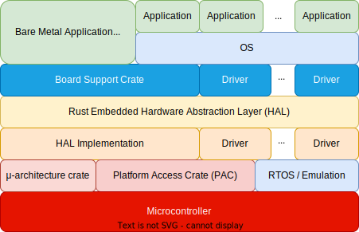

# Rust Embedded HAL
The Rust API for embedded systems

---
---
# The Rust Embedded Stack

<div grid="~ cols-2 gap-4">
<div>

| | |
|-|-|
| Framework | Tasks, Memory Management, Network etc. `embassy-rs`, `rtic` |
| BSC | Board Support Crate `embassy-rp`, `rp-pico` |
| *HAL Implementation* | Uses the PAC and exports a standard HAL towards the upper levels `embassy-rp` |
| PAC | Accesses registers, usually created automatically from SVD files - `rp2040_pac`, `rp-pac` |


</div>

<div align="center">
    
</div>

</div>

---
---
# GPIO HAL
A set of [standard traits](https://docs.rs/embedded-hal/latest/embedded_hal/)

All devices should implement these traits for GPIO.

```rust
pub enum PinState {
    Low,
    High,
}
```

<div grid="~ cols-2 gap-2">

<div>

##### Input

```rust {*}{lines:false}
pub trait InputPin: ErrorType {
  // Required methods
  fn is_high(&mut self) -> Result<bool, Self::Error>;
  fn is_low(&mut self) -> Result<bool, Self::Error>;
}
```

</div>

<div>

##### Output

```rust {*}{lines:false}
pub trait OutputPin: ErrorType {
  // Required methods
  fn set_low(&mut self) -> Result<(), Self::Error>;
  fn set_high(&mut self) -> Result<(), Self::Error>;

  // Provided method
  fn set_state(&mut self, state: PinState) -> Result<(), Self::Error> { ... }
}
```
</div>

</div>


---
---
# Bare metal
This is how a Rust application would look like

<div grid="~ cols-2 gap-4">

```rust{all|1|2|4|6|7,11|10|13-16}
#![no_std]
#![no_main]

use cortex_m_rt::entry;

#[entry]
fn main() -> ! {
    // your code goes here

    loop { }
}

#[panic_handler]
pub fn panic(_info: &PanicInfo) -> ! {
    loop { }
}
```

<div>

### Rules
1. never exit the `main` function
2. add a panic handler that does not exit

</div>

</div>

---

# Bare metal without PAC & HAL
This is how a Rust application would look like

<div grid="~ cols-2 gap-2">

```rust
#![no_std]
#![no_main]

use core::ptr::{read_volatile, write_volatile};
use cortex_m_rt::entry;

const GPIOX_CTRL: u32 = 0x4001_4004;
const GPIO_OE_SET: *mut u32= 0xd000_0024 as *mut u32;
const GPIO_OUT_SET:*mut u32= 0xd000_0014 as *mut u32;
const GPIO_OUT_CLR:*mut u32= 0xd000_0018 as *mut u32;

#[panic_handler]
pub fn panic(_info: &PanicInfo) -> ! {
    loop { }
}
```

```rust{all}{startLine:18}
#[entry]
fn main() -> ! {
    let gpio_ctrl = GPIOX_CTRL + 8 * pin as *mut u32;
    unsafe {
        write_volatile(gpio_ctrl, 5);
        write_volatile(GPIO_OE_SET, 1 << pin);
        let reg = match value {
        0 => GPIO_OUT_CLR,
        _ => GPIO_OUT_SET
        };
        write_volatile(reg, 1 << pin);
    };

    loop { }
}
```

</div>
