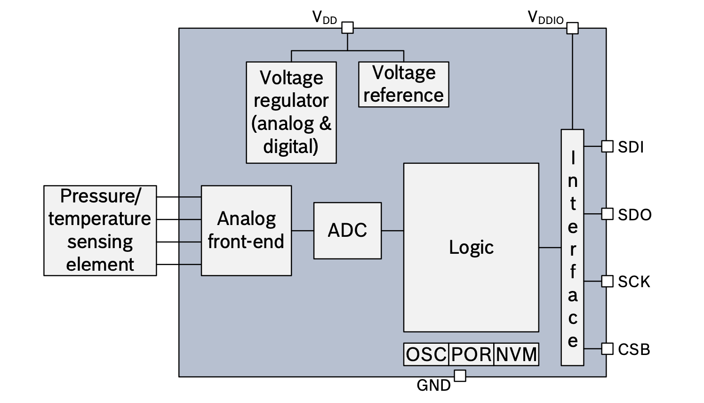
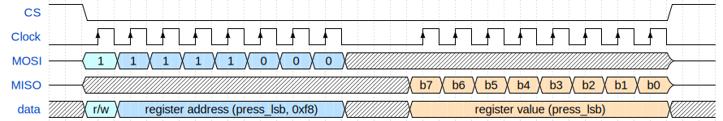
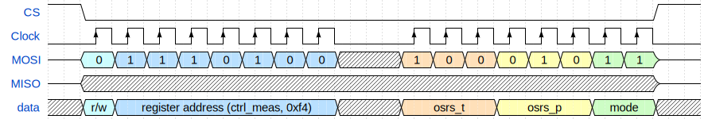

# Sensors
Analog and Digital Sensors

---
---
# Bibliography
for this section

**BOSCH**, *[BMP280 Digital Pressure Sensor](https://www.bosch-sensortec.com/media/boschsensortec/downloads/datasheets/bst-bmp280-ds001.pdf)*
  - Chapter 3 - *Functional Description*
  - Chapter 4 - *Global memory map and register description*
  - Chapter 5 - *Digital Interfaces*
    - Subchapter 5.3 - *SPI Interface*

---
---
# Sensors
analog and digital

<div grid="~ cols-2 gap-5">

<div>

### Analog
- only the transducer (the analog sensor)
- outputs (usually) voltage
- requires:
  - an ADC to be read
  - cleaning up the noise

<br>


</div>

<div>

### Digital
- consists of:
  - a transducer (the analog sensor)
  - an ADC
  - an MCU for cleaning up the noise
- outputs data using a digital bus

<br>


</div>

</div>

---
---
# BMP280 Digital Pressure Sensor
schematics

<div align="center">

</div>

[Datasheet](https://www.bosch-sensortec.com/media/boschsensortec/downloads/datasheets/bst-bmp280-ds001.pdf)

---
---
# BMP280 Digital Pressure Sensor
registers map


[Datasheet](https://www.bosch-sensortec.com/media/boschsensortec/downloads/datasheets/bst-bmp280-ds001.pdf)

---

# Reading from a digital sensor
using synchronous/asynchronous SPI to read the `press_lsb` register of BMP280



<div grid="~ cols-2 gap-5">

```rust{all|1|3,4|6,7|6,7,8|10,11|13,14}
const REG_ADDR: u8 = 0xf8;

// enable the sensor
cs.set_low();

// buffer[2]: the address and "empty" value 
let mut buf = [(1 << 7) | reg, 0x00];
spi.blocking_transfer_in_place(&mut buf);

// disable the sensor
cs.set_high();

// use the value
let pressure_lsb = buf[1];
```

```rust{none|all|1|3,4|6,7,8|6,7,8,9|11,12|14,15}
const REG_ADDR: u8 = 0xf8;

// enable the sensor
cs.set_low();

// two buffers[2], writing and reading 
let tx_buf = [(1 << 7) | REG_ADDR, 0x00];
let mut rx_buf = [0u8; 2];
spi.transfer(&mut rx_buf, &tx_buf).await;

// disable the sensor
cs.set_high();

// use the value
let pressure_lsb = rx_buf[1];
```

</div>


---
---
# Writing to a digital sensor
using synchronous/asynchronous SPI to set up the `ctrl_meas` register of the BMP280 sensor 



<div grid="~ cols-2 gap-5">

```rust{all|1|3,4|6,7|9,10|9,10,11|13,14}
const REG_ADDR: u8 = 0xf4;

// see subchapters 3.3.2, 3.3.1 and 3.6
let value = 0b100_010_11;

// enable the sensor
cs.set_low();

// buffer[2]: the address and "empty" value 
let mut buf = [!(1 << 7) & reg, value];
spi.blocking_transfer_in_place(&mut buf);

// disable the sensor
cs.set_high();
```

```rust{none|all|1|3,4|6,7|9,10|9,10,11|9,10,11,12|14,15}
const REG_ADDR: u8 = 0xf4;

// see subchapters 3.3.2, 3.3.1 and 3.6
let value = 0b100_010_11;

// enable the sensor
cs.set_low();

// two buffers[2], writing and reading (ignored)
let tx_buf = [!(1 << 7) & REG_ADDR, value];
let mut rx_buf = [0u8; 2];
spi.transfer(&mut rx_buf, &tx_buf).await;

// disable the sensor
cs.set_high();
```

</div>
