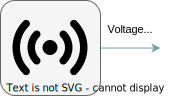
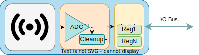
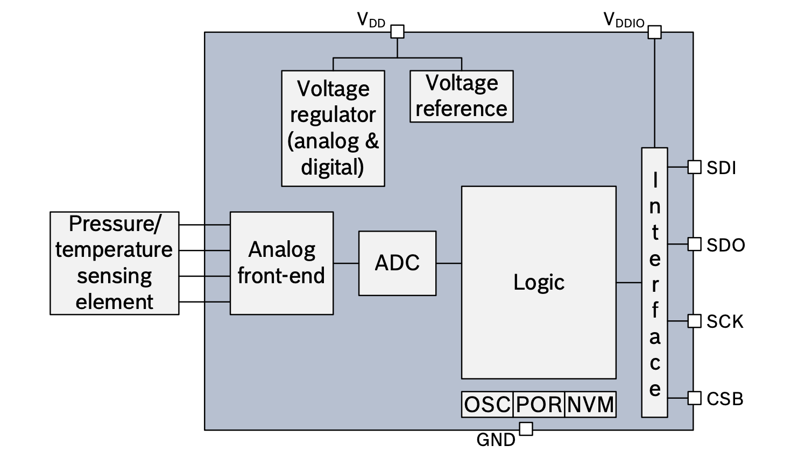

# Sensors
Analog and Digital Sensors

---
---
# Bibliography
for this section

**BOSCH**, *[BMP280 Digital Pressure Sensor](https://www.bosch-sensortec.com/media/boschsensortec/downloads/datasheets/bst-bmp280-ds001.pdf)*
  - Chapter 3 - *Functional Description*
  - Chapter 4 - *Global memory map and register description*
  - Chapter 5 - *Digital Interfaces*
    - Subchapter 5.2 - *I2C Interface*

---
---
# Sensors
analog and digital

<div grid="~ cols-2 gap-5">

<div>

### Analog
- only the transducer (the analog sensor)
- outputs (usually) voltage
- requires:
  - an ADC to be read
  - cleaning up the noise

<br>


</div>

<div>

### Digital
- consists of:
  - a transducer (the analog sensor)
  - an ADC
  - an MCU for cleaning up the noise
- outputs data using a digital bus

<br>


</div>

</div>

---
---
# BMP280 Digital Pressure Sensor
schematics

<div align="center">

</div>

[Datasheet](https://www.bosch-sensortec.com/media/boschsensortec/downloads/datasheets/bst-bmp280-ds001.pdf)

---
---
# BMP280 Digital Pressure Sensor
registers map


[Datasheet](https://www.bosch-sensortec.com/media/boschsensortec/downloads/datasheets/bst-bmp280-ds001.pdf)

---

# Reading from a digital sensor
using synchronous/asynchronous I2C to read the `press_lsb` register of BMP280

<!--  -->

<div grid="~ cols-2 gap-5">

```rust{all|1|1,2|4|6,7|9,10}
const DEVICE_ADDR: u8 =  0x77;
const REG_ADDR: u8 = 0xf8;

i2c.write(DEVICE_ADDR, &[REG_ADDR]).unwrap();

let mut buf = [0x00u8];
i2c.read(DEVICE_ADDR, &mut buf).unwrap();

// use the value
let pressure_lsb = buf[1];
```

```rust{none|all||1|1,2|4|6,7|9,10}
const DEVICE_ADDR: u8 =  0x77;
const REG_ADDR: u8 = 0xf8;

i2c.write(DEVICE_ADDR, &[REG_ADDR]).await.unwrap();

let mut buf = [0x00u8];
i2c.read(DEVICE_ADDR, &mut buf).await.unwrap();

// use the value
let pressure_lsb = buf[1];
```

</div>


---
---
# Writing to a digital sensor
using synchronous/asynchronous I2C to set up the `ctrl_meas` register of the BMP280 sensor 

<!--  -->

<div grid="~ cols-2 gap-5">

```rust{all|1|1,2|4,5|7|9,10}
const DEVICE_ADDR: u8 =  0x77;
const REG_ADDR: u8 = 0xf4;

// see subchapters 3.3.2, 3.3.1 and 3.6
let value = 0b100_010_11;

i2c.write(DEVICE_ADDR, &[REG_ADDR]);

let buf = [REG_ADDR, value];
i2c.write(DEVICE_ADDR, &buf).unwrap();
```

```rust{none|all|1|1,2|4,5|7|9,10}
const DEVICE_ADDR: u8 =  0x77;
const REG_ADDR: u8 = 0xf4;

// see subchapters 3.3.2, 3.3.1 and 3.6
let value = 0b100_010_11;

i2c.write(DEVICE_ADDR, &[REG_ADDR]);

let buf = [REG_ADDR, value];
i2c.write(DEVICE_ADDR, &buf).await.unwrap();
```

</div>
