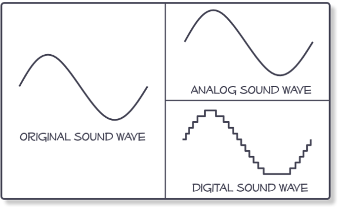
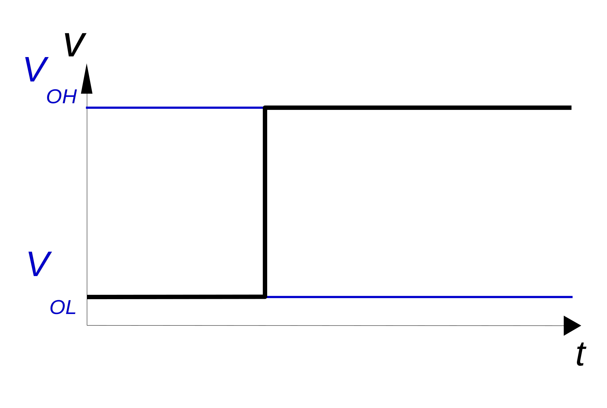
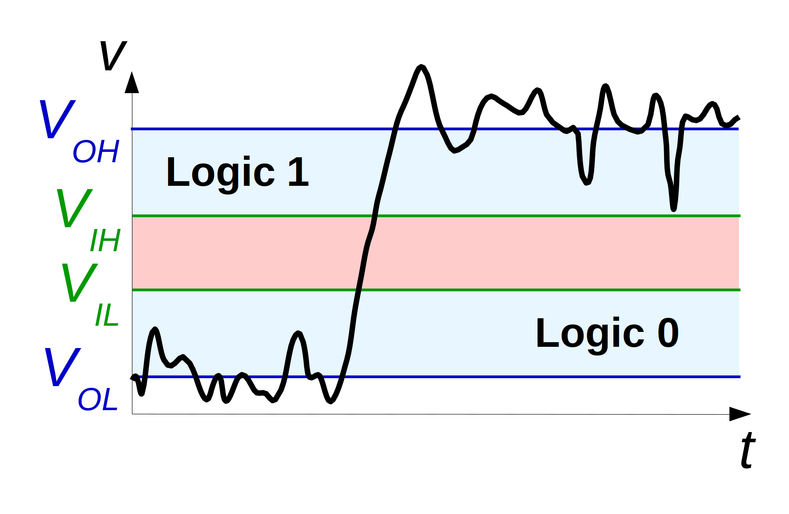
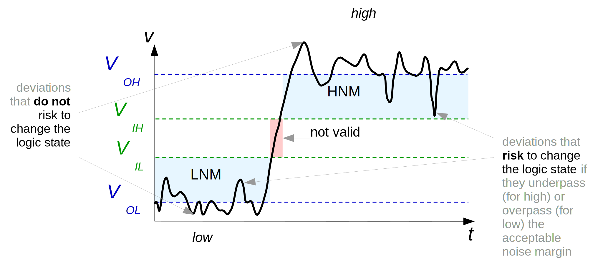

# Signals
Digital Signals - Recap 

---

# Signals
Analog vs Digital

- *analog signals* are *real* signals
- *digital signals* are *a numerical representation* of an analog signal (software level)
- hardware usually works with two-level digital signals (hardware level)

#### Exceptions
- in wireless and in high-speed cable communication things get more complicated

> for PCB level / between integrated circuits on the same board / inside the same chip - things are a "a little simpler" - as detailed in the following

---

# Why use digital in computing?

Signal that we *want* to generate with an output pin

<v-click>

Signal that what we actually generate

</v-click>

> Why we sill use it? Because after passing through an IC or a gate inside an IC - the signal si "rebuilt" and if the "digital discipline" described in the following is respected - we can preserve the information after numerous "passes". Thus, each element can behave with a large margin for error, yet the final result is correct.

---
---
# Noise Margin

