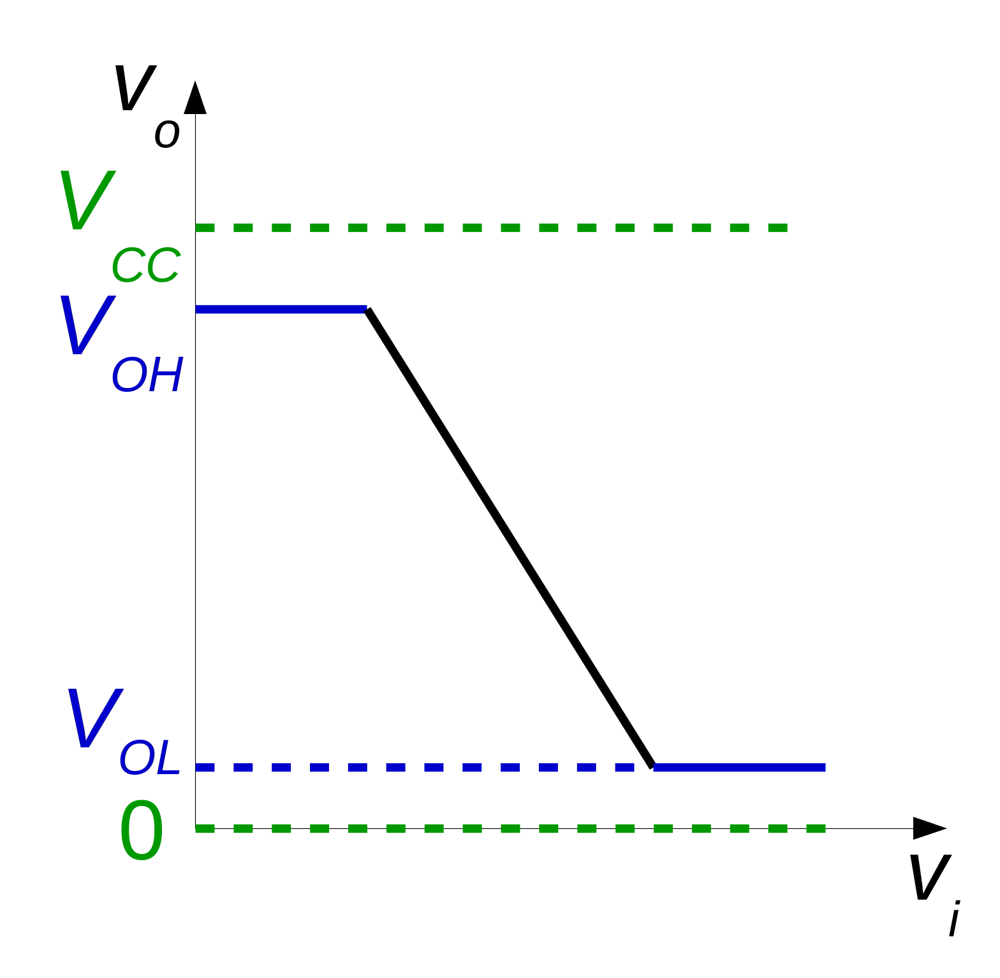
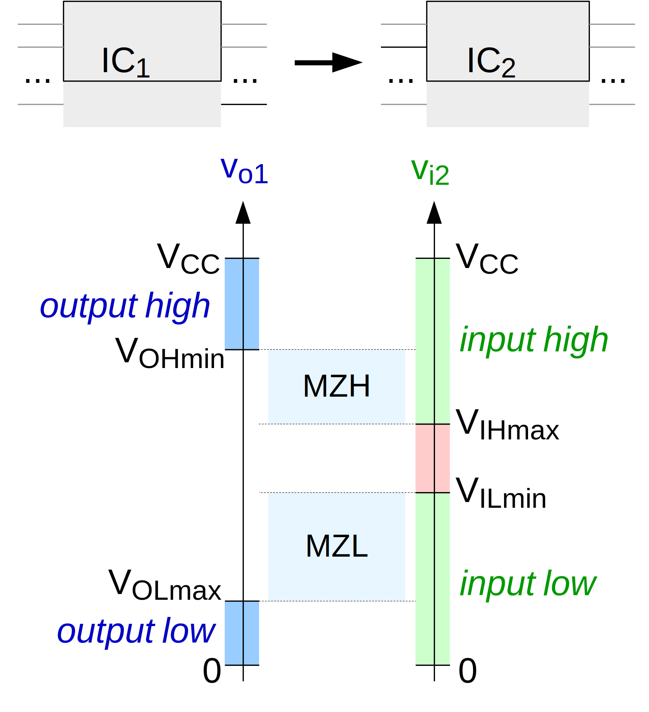
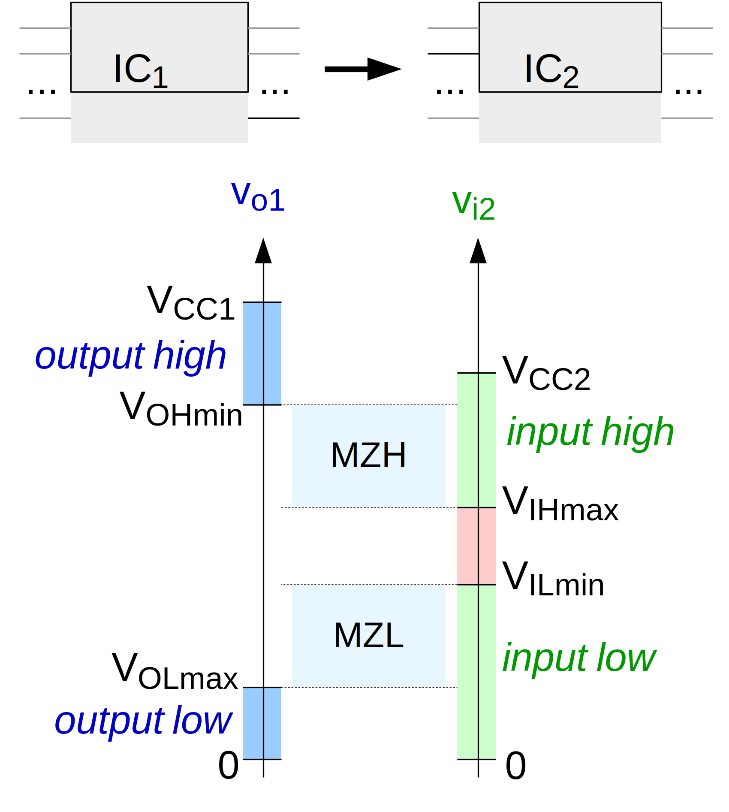
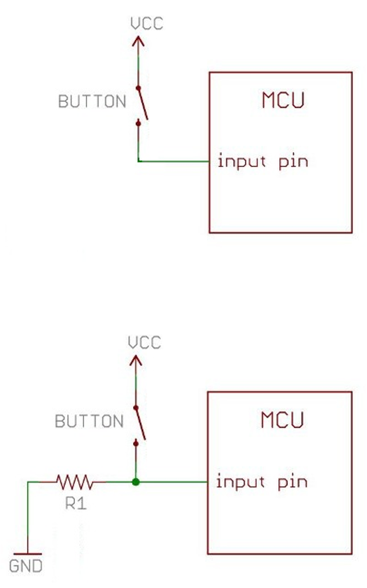
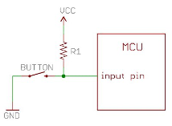

# Why is the output not ideal?

### The two corresponding voltage output levels are affected by:

- power supply voltage
- output current 
- temperature 
- variations in the manufacturing process 

:: right ::

 
 
 
 

 

---
layout: two-cols
---

# ICs same voltage

### Usually will work as is

- usually, they will be compatible
- conditions:
> V_OH_transmiter > V_IH_receiver

 

> V_OL_transmiter < V_IL_receiver

:: right ::

 

---
layout: two-cols
---

# VCC1 > VCC2

### Might work, might produce magic smock

- if
> V_OH_transmiter > VCC_receiver 

<b>  PROBLEM </b>

### Solutions:
- level shifter
- resistor divider / voltage limiter 

Examples:

<a href="https://www.optimusdigital.ro/ro/interfata-convertoare-de-niveluri/181-translator-de-nivel-bidirectional-cu-4-canale.html" title="Bi-Directional Level Shifter with 4 Channels">
    Bi-Directional Level Shifter (4 Channels)
</a>

 

<a href="https://www.tme.eu/en/details/tp240610/development-kits-accessories/total-phase/level-shifter/">
    Level Shifter Multi-Channel
</a>

 

<a href="https://www.adafruit.com/product/395">
   8 Channels Level Shifter
</a>

:: right ::

 
 

---
layout: two-cols
---

# VCC1 < VCC2

### Might work

- if
> V_CC_transmiter close to VIH_receiver 

<b>  Might work in an intermittent mode - hard to debug!</b>

### Solutions:
- level shifter
- resistor divider / voltage limiter 

Examples:

<a href="https://www.optimusdigital.ro/ro/interfata-convertoare-de-niveluri/181-translator-de-nivel-bidirectional-cu-4-canale.html" title="Bi-Directional Level Shifter with 4 Channels">
    Bi-Directional Level Shifter (4 Channels)
</a>

 

<a href="https://www.tme.eu/en/details/tp240610/development-kits-accessories/total-phase/level-shifter/">
    Level Shifter Multi-Channel
</a>

 

<a href="https://www.adafruit.com/product/395">
   8 Channels Level Shifter
</a>

:: right ::

 

---
layout: two-cols
---

# Why Pull-Down R

- Without pull-down – when the button is not pressed, it leaves the input pin floating.
- The second design ensures that the voltage level has a well-defined state, regardless of the button's state.
- R1 is called a "pull-down" resistor.

:: right ::

 
 
 
 

 

---
layout: two-cols
---

# Why Pull-Up R

- Same reasoning
- R1 is called a "pull-up" resistor.

##Obs:
- most microcontrollers have at least a pull-up resistor incorporated on GPIOs - that can be activated in software
- some have both pull-up and pull-down
- typically, these are sized for a 50 - 10 nA current consumption

:: right ::

 
 
 
 

 

---

# Notes on output pins

- most microcontrollers have a limit of around 10mA per output PIN
- ! do not connect an LED without a resistor in series )to limit the current) 
- ! do not connect a motor / any type of inductive load

## Solutions:
- use a transistor
- use an IC with incorporated Darlinghtons (eg: ULN2003)
