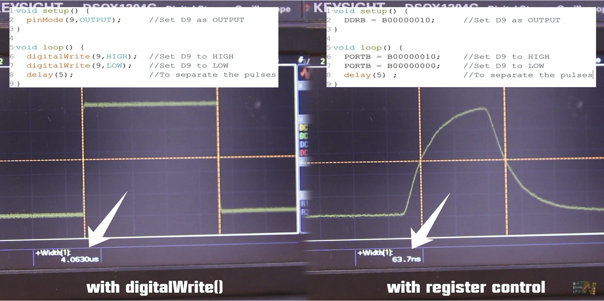

# GPIO on AVR

A simple GPIO

<i>

(Note: unlike ARM, AVR is port-maped)

</i>

---

# GPIO on AVR (the simple version)

#### There are three registers associated with the operation of port pins as digital I/Os:

<br>

> <b> DDRx - Data Direction Register. </b> If the data direction bit is 1, the pin is an input. 0 is an output.

```c
DDRB &= ~(1<<DDB7); // Makes pin PB7 an input
DDRB |= (1<<DDB5);  // Makes pin PB5 an output
```
<br>

> <b> PORTx - Port Data Register. </b> If a pin is configured as an output, setting the corresponding bit to 1 makes the pin output high. 0 makes the output low.

```c
PORTB |= (1<<PORTB5); // makes pin B5 high (e.g.: a LED would turn on)
```

<br>


> <b> PINx - Port Pin Register. </b>  Used to read the pin state.

```c
if (PINB & (1<<PINB7) == 1) { ... } // pin B7 reads a high value
```

---

# Why bare-metal and not just Arduino-style

 
