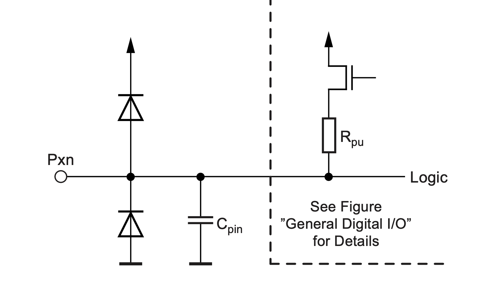

# GPIO
General Purpose Input Output - Why

---
layout: two-cols
---

# Why GPIO can be complex

### This is a minimalistic representation of a typical GPIO ping

 

> the diodes are topical over and under voltage protections

 

> C represents the topical "parasitic" capacity 

 

> Rpu = Pull-up Resistor with a transistor for on/ off towards the positive supply rail 

:: right ::

 
 
 
 

 

---
layout: two-cols
---

# AVR 328P GPIO

- PUD: PULLUP DISABLE
- SLEEP: SLEEP CONTROL
- CLKI/O: I/O CLOCK

- WDx: WRITE DDRx
- RDx: READ DDRx
- WRx: WRITE PORTx
- RRx: READ PORTx REGISTER
- RPx: READ PORTx PIN
- WPX: WRITE PINx REGISTER

:: right ::

