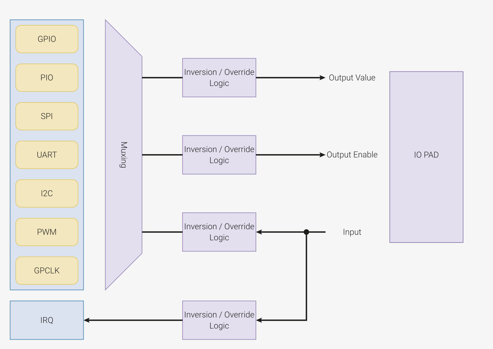
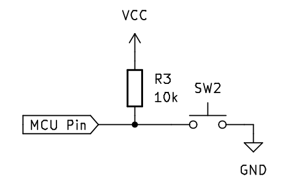

# GPIO
General Purpose Input Output for RP2040

---
---
# Bibliography
for this section

**Raspberry Pi Ltd**, *[RP2040 Datasheet](https://datasheets.raspberrypi.com/rp2040/rp2040-datasheet.pdf)*
   - Chapter 2 - *System Description*
     - Section 2.3 - *Processor subsystem*
       - Subsection 2.3.1 - *SIO*
         - Subsection 2.3.1.2 - *GPIO Control*
     - Section 2.4 - *Cortex-M0+* (except NVIC and MPU)
     - Section 2.19 - *GPIO* (except Interrupts)

---
---
# RP2040 GPIO Pins
GPIO pins are connected to the processor pins through three peripherals

<div align="center">

</div>


---
layout: two-cols
---

# GPIO

<div align="center">

</div align="center">

*SIO*: Set the pin as Input or Output\
*IO Bank (GPIO)*: Use the correct MUX function (F5)\
*PAD*: Set the pin input and output parameters

::right::

## Peripherals

|  |  |
|------|-------------|
| SIO  | Single Cycle Input/Output, is able to control the GPIO pins |
| GPIO | Multiplexes the functions of the GPIO pins |


<arrow x1="520" y1="220" x2="714" y2="270" color="#0060df" width="2" arrowSize="1" />


---
layout: two-cols
---
# SIO Registers


- Input
  - set GPIO_OE bit x to 0
  - read GPIO_IN bit x
- Ouput
  - set GPIO_OE bit x to 1
  - write GPIO_OUT bit x

:: right ::

##### GPIO_OE


##### GPIO_IN


##### GPIO_OUT


---
layout: two-cols
---

# SIO Input


##### GPIO_OE


:: right ::

##### GPIO_IN


```rust{all|4,8|4,9|10,11|4,12|5,7,13,14}
use core::ptr::read_volatile;
use core::ptr::write_volatile;

const GPIO_OE: *mut u32 = 0xd000_0020 as *mut u32;
const GPIO_IN: *const u32= 0xd000_0004 as *const u32;

let value = unsafe { 
    // write_volatile(GPIO_OE, !(1 << pin));
    let gpio_oe = read_volatile(GPIO_OE);
    // set bin `pin` of `gpio_oe` to 0 (input)
    gpio_oe = gpio_oe & !(1 << pin);
    write_volatile(GPIO_OE, gpio_oe);
    read_volatile(GPIO_IN) >> pin & 0b1
};
```


---
layout: two-cols
---

# SIO Input


##### GPIO_OE_SET


:: right ::

##### GPIO_IN


```rust{all|4,8,9|5,7,10,11}
use core::ptr::read_volatile;
use core::ptr::write_volatile;

const GPIO_OE_CLR: *mut u32= 0xd000_0028 as *mut u32;
const GPIO_IN: *const u32= 0xd000_0004 as *const u32;

let value = unsafe { 
	// set bit `pin` of `GPIO_OE` to 0 (input)
    write_volatile(GPIO_OE_CLR, 1 << pin);
    read_volatile(GPIO_IN) >> pin & 0b1
};
```


---
layout: two-cols
---

# SIO Output


##### GPIO_OE_CLR


:: right ::

##### GPIO_OUT


```rust{all|4,8,9|5,10|5,11|12|5,13}
use core::ptr::read_volatile;
use core::ptr::write_volatile;

const GPIO_OE_SET: *mut u32= 0xd000_0024 as *mut u32;
const GPIO_OUT: *mut u32 = 0xd000_0010 as *mut u32;

unsafe {
  // set bit `pin` of GPIO_OE to 1 (output)
  write_volatile(GPIO_OE_SET, 1 << pin);
  // write_volatile(GPIO_OUT, (value & 0b1) << pin);
  let gpio_out = read_volatile(GPIO_OUT);
  gpio_out = gpio_out | (value & 0b1) << pin;
  write_volatile(GPIO_OUT, gpio_out);
};
```


---
layout: two-cols
---

# SIO Output
efficient


##### GPIO_OUT_SET


:: right ::

##### GPIO_OUT_CLR


```rust{all|4,9|5,6,10-13|14}
use core::ptr::read_volatile;
use core::ptr::write_volatile;

const GPIO_OE_SET: *mut u32= 0xd000_0024 as *mut u32;
const GPIO_OUT_SET:*mut u32= 0xd000_0014 as *mut u32;
const GPIO_OUT_CLR:*mut u32= 0xd000_0018 as *mut u32;

unsafe { 
    write_volatile(GPIO_OE_SET, 1 << pin);
    let reg = match value {
      0 => GPIO_OUT_CLR,
      _ => GPIO_OUT_SET
    };
    write_volatile(reg, 1 << pin);
};
```


---
layout: two-cols
---
# IO Bank



- set `FUNCSEL` to `5` (*SIO*)

:: right ::

##### GPIOx_CTRL
Offset: 0x004, 0x00c, ... 0x0ec (0x4 + 8*x)


---
layout: two-cols
---

# IO Bank Input


```rust{all|4,8|8,11|5,12|6,10,13,14}
use core::ptr::read_volatile;
use core::ptr::write_volatile;

const GPIOX_CTRL: u32 = 0x4001_4004;
const GPIO_OE_CLR: *mut u32= 0xd000_0028 as *mut u32;
const GPIO_IN: *const u32= 0xd000_0004 as *const u32;

let gpio_ctrl = (GPIOX_CTRL + 8 * pin) as *mut u32;

let value = unsafe { 
    write_volatile(gpio_ctrl, 5);
    write_volatile(GPIO_OE_CLR, 1 << pin);
    read_volatile(GPIO_IN) >> pin & 0b1
};
```

:: right ::

##### GPIOx_CTRL
Offset: 0x004, 0x00c, ... 0x0ec (0x4 + 8*x)


---
layout: two-cols
---

# IO Bank Output


```rust{all|4,9|9,11|5,12|6,7,13-16|17}
use core::ptr::read_volatile;
use core::ptr::write_volatile;

const GPIOX_CTRL: u32 = 0x4001_4004;
const GPIO_OE_SET: *mut u32= 0xd000_0024 as *mut u32;
const GPIO_OUT_SET:*mut u32= 0xd000_0014 as *mut u32;
const GPIO_OUT_CLR:*mut u32= 0xd000_0018 as *mut u32;

let gpio_ctrl = (GPIOX_CTRL + 8 * pin) as *mut u32;
unsafe { 
    write_volatile(gpio_ctrl, 5);
    write_volatile(GPIO_OE_SET, 1 << pin);
    let reg = match value {
      0 => GPIO_OUT_CLR,
      _ => GPIO_OUT_SET
    };
    write_volatile(reg, 1 << pin);
};
```

:: right ::

##### GPIOx_CTRL
Offset: 0x004, 0x00c, ... 0x0ec (0x4 + 8*x)


---
layout: two-cols
---
# Pad Control


:: right ::
##### GPIOx Register
Offset: 0x004, 0x008, ... 0x078 (0x4 + 4*x)


---
layout: two-cols
---

# Input
read the value from pin `x`

- set the `FUNCSEL` field of `GPIOx_CTRL` to `5`
- set the `GPIO_OE_CLR` bit `x` to `1`
- read the `GPIO_IN` bit `x`
- *adjust the `GPIOx` fields to set the pull up/down resistor*



:: right ::

# Output
write a value to pin `x`

- set the `FUNCSEL` field of `GPIOx_CTRL` to `5`
- set the `GPIO_OE_SET` bit `x` to `1`
- if the value 
  - is `0`, set the `GPIO_OUT_CLR` bit `x` to `1`
  - is `1`, set the `GPIO_OUT_SET` bit `x` to `1` 
- *adjust the `GPIOx` fields to set the output current*


