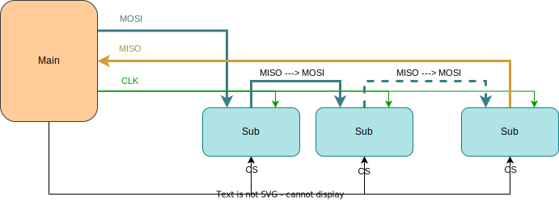

# SPI
Serial Peripheral Interface

---
---

# Bibliography
for this section

1. **Raspberry Pi Ltd**, *[RP2040 Datasheet](https://datasheets.raspberrypi.com/rp2040/rp2040-datasheet.pdf)*
   - Chapter 4 - *Peripherals*
     - Chapter 4.4 - *SPI*

2. **Paul Denisowski**, *[Understanding SPI](https://www.youtube.com/watch?v=0nVNwozXsIc)*

---
---
# SPI
a.k.a *spy*

- Used for communication between integrated circuits
- Sensors usually expose an *SPI* and an *I2C* interface
- Two device types:
  - *main* (master) - controls the communication (usually MCU)
  - *sub* (slave) - receive and transmit data when the *main* requests (usually the sensor)


<div align="center">

</div>

---
---
# Wires
3 + n

- *MOSI* - **M**ain **O**ut **S**ub **I**n - carries data from the **main** to the **subs**
- *MISO* - **M**ain **I**n **S**ub **O**ut - carries data from the active **sub** to the **main**
- *CLK* - Clock - the clock signal generated by the **main**, **subs** sample and write data to the bus only on the clock edge
- *CS** - **C**hip **S**elect - not actually part of SPI, one wire / sub, activates **one sub at a time**
  - inactive subs have to disconnect from the *MOSI* and *MISO* lines

<div grid="~ cols-2 gap-5">

<div align="center">

</div>

<div align="center">

</div>

</div>

---
layout: two-cols
---
# Transmission Example

<v-clicks>

1. **main** activates the sub device
   - sets the `CS` signal to `LOW`
3. at the same time
   - **main** puts the first bit on the `MOSI` line
   - **sub** puts the first bit on the `MISO` line
3. **main** starts the clock
4. at the *rising edge*
   -  **main** reads the data from the `MISO` line
   -  **sub** reads the data from the `MOSI` line
5. on the *falling edge*
   - **main** puts the next bit on the `MOSI` line
   - **sub** puts the next bit on the `MISO` line
6. repeat 4 and 5 until **main** decides to stop the clock

</v-clicks>


:: right ::

SPI Signals

<div align="center">

</div>

SPI Network

<div align="center">

</div>


---
layout: two-cols
---
# SPI Modes
when data is read and written

| Mode | `CPOL` | `CPHA` |
|-|-|-|
| 0 | 0 | 0 |
| 1 | 0 | 1 |
| 2 | 1 | 0 |
| 3 | 1 | 1 |

<style>
.two-columns {
    grid-template-columns: 3fr 9fr;
}
</style>

:: right ::

<div align="center">

</div>

| | | |
|-|-|-|
| `CPOL` | Clock polarity | defines when the data bit is read <br> 0: *rising edge* <br> 1: *falling edge* |
| `CPHA` | Clock phase | defines when the data is written to the line <br> 0: when `CS` *activates* or *clock edge* <br> 1: on *clock edge* (depends on `CPOL`) |

---

# Transmission Example
one main, two subs

<div align="center">

</div>

<div grid="~ cols-2 gap-5">

<div>

1. **main** activates the CS pin of **sub 1**
2. **main** writes the first bit on MOSI, **sub 1** writes the first bit on MISO
3. **main** starts the clock
4. **main** and **sub 1** send the rest of the bits
5. **main** stops the clock
6. **main** deactivates the CS pin of **sub 1**

</div>

<div>

7. **main** activates the CS pin of **sub 2**
8. **main** writes the first bit on MOSI, **sub 2** writes the first bit on MISO
9. **main** starts the clock
10. **main** and **sub 2** send the rest of the bits
11. **main** stops the clock
12. **main** deactivates the CS pin of **sub 2**

</div>

</div>


---
layout: two-cols
---

# Daisy Chaining
using several SPI devices together

<v-clicks depth="2">

1. **main** activates all the **subs**
2. on the clock edge
   - **main** sends data to **sub 1**
   - **sub 1**[^sub_data] sends data to **sub 2**
   - ...
   - **sub n-1** sends data to **sub n**
   - **sub n** sends data to **main**

</v-clicks>

[^sub_data]: usually **subs** send the previous data bit received from **main** to the **next sub**

<style>
.two-columns {
    grid-template-columns: 3fr 5fr;
}
</style>

:: right ::

activate all the **sub** devices

<div align="center">

</div>

<div align="center">

</div>


---
---
# Facts

| | | |
|-|-|-|
| Transmission | *duplex* | data must be sent in both directions at the same time |
| Clock | *synchronized* | the **main** and **sub** use the same clock, there is no need for clock synchronization |
| Wires | *MISO* / *MOSI* / *CLK* / *CS* | different read and write wires, a clock wire and an *optional* chip select wire for every sub |
| Devices | *1 main* <br> *several subs* | a receiver and a transmitter |
| Speed | *no limit* | does not have any limit, it is limited by the **main** clock and the electronics wirings |

---
---
# Usage

- EEPROMs / Flash (usually in *QSPI* mode)
  - Raspberry Pi Pico has its 2MB Flash connected using *QSPI*
- sensors
- small displays
- RP2040 has two SPI devices

<div align="center">

</div>

---
---
# Embassy API
for RP2040, synchronous

<div grid="~ cols-3 gap-5">

```rust {*}{lines: false}
pub struct Config {
  pub frequency: u32,
  pub phase: Phase,
  pub polarity: Polarity,
}
```

```rust {*}{lines: false}
pub enum Phase {
  CaptureOnFirstTransition,
  CaptureOnSecondTransition,
}
```

```rust {*}{lines: false}
pub enum Polarity {
  IdleLow,
  IdleHigh,
}
```

</div>

```rust{all|1|2|2,3|5-7|5-8|10,11|13|13,14|13,14,15|13,14,15,16}
use embassy_rp::spi::Config as SpiConfig;
let mut config = SpiConfig::default();
config.frequency = 2_000_000;

let miso = p.PIN_12;
let mosi = p.PIN_11;
let clk = p.PIN_10;
let mut spi = Spi::new_blocking(p.SPI1, clk, mosi, miso, config);

// Configure CS
let mut cs = Output::new(p.PIN_X, Level::Low);

cs.set_low();
let mut buf = [0x90, 0x00, 0x00, 0xd0, 0x00, 0x00];
spi.blocking_transfer_in_place(&mut buf);
cs.set_high();
```

---
---
# Embassy API
for RP2040, asynchronous

```rust{all|1|2|2,3|5-7|5-8|10,11|13|13,14,15|13,14,15,16|13,14,15,16,17}
use embassy_rp::spi::Config as SpiConfig;
let mut config = SpiConfig::default();
config.frequency = 2_000_000;

let miso = p.PIN_12;
let mosi = p.PIN_11;
let clk = p.PIN_10;
let mut spi = Spi::new(p.SPI1, clk, mosi, miso, p.DMA_CH0, p.DMA_CH1, config);

// Configure CS
let mut cs = Output::new(p.PIN_X, Level::Low);

cs.set_low();
let tx_buf = [1_u8, 2, 3, 4, 5, 6];
let mut rx_buf = [0_u8; 6];
spi.transfer(&mut rx_buf, &tx_buf).await;
cs.set_high();
```
