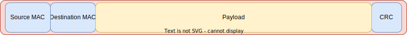

# TCP/IP Stack
Transport Control Protocol over Internet Protocol

---
---
# Bibliography
for this section

**Andrew Tanenbaum**, *Computer networks (5th edition)*
  - Chapter 1 - *Introduction*
    - Subchapter 1.4.2 - *The TCP/IP Reference Model*

---
---
# TCP/IP Stack

*the initial TCP/IP stack did not make any difference between the *Physical* and the *Data Link* layers

---
---
# Data Link Layer

- very similar for Ethernet and Wi-Fi (HDLC)
- uses *Media Access Control* (*MAC*) addresses 
- sends and receives *frames* from other devices directly connected to the same network

---
---
# Network Layer

- Internet Protocol
- uses *Internet Protocol* (IP) addresses 
  - *IPv4* - 32 bits
  - *IPv6* - 128 bits
- sends and receives *packets* from other devices remotely

---
---
# Transport Layer

- Two protocols
  - *Transport Control Protocol* (*TCP*) - stream of data, makes sure it gets to the destination
  - *User Datagram Protocol* (*UDP*) - *fire and forget*, best effort do deliver the packet
- uses *Ports* to identify the destination and source application
- sends and receives *packets*

