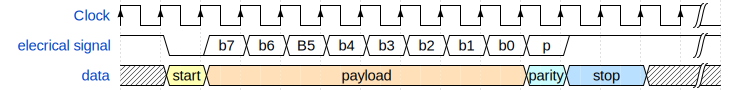
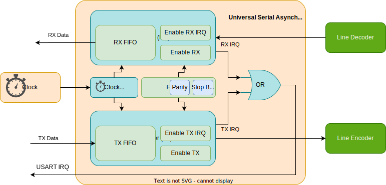
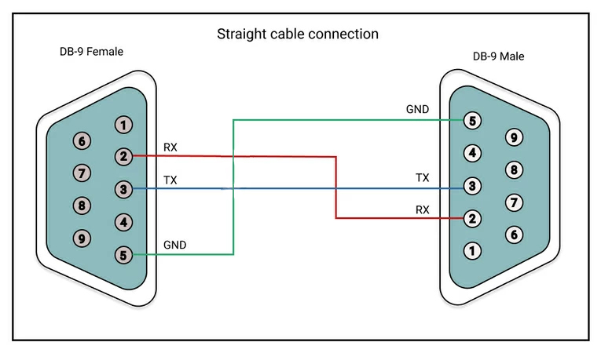
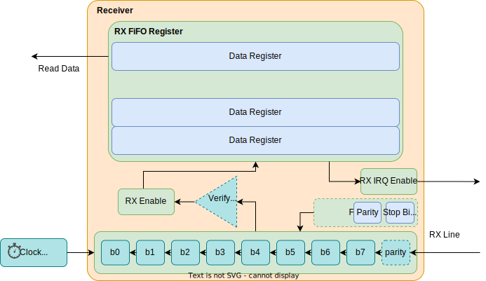
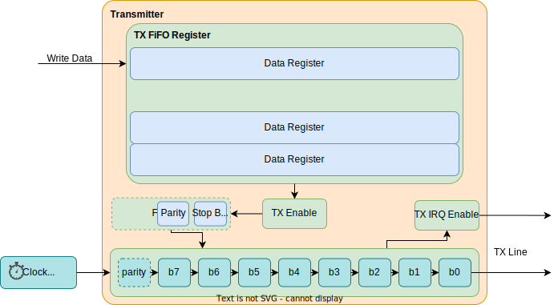
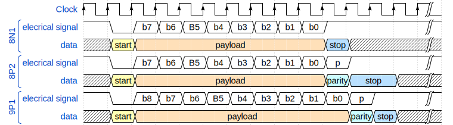
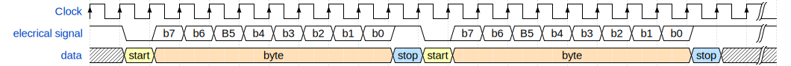
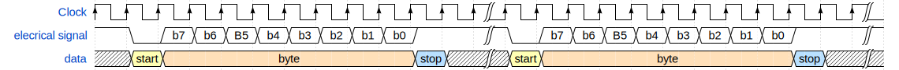
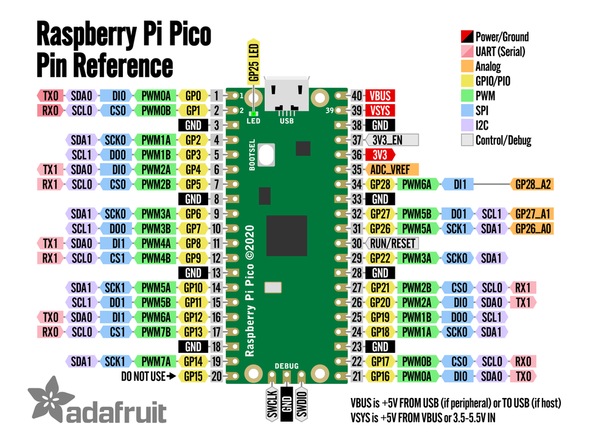

# UART
Universal Asynchronous Receiver and Transmitter

---
---
# Bibliography
for this section

1. **Raspberry Pi Ltd**, *[RP2040 Datasheet](https://datasheets.raspberrypi.com/rp2040/rp2040-datasheet.pdf)*
   - Chapter 4 - *Peripherals*
     - Chapter 4.2 - *UART*

2. **Paul Denisowski**, *[Understanding Serial Protocols](https://www.youtube.com/watch?v=LEz5UCN3aHA)*
3. **Paul Denisowski**, *[Understanding UART](https://www.youtube.com/watch?v=sTHckUyxwp8)*

---
---
# UART
aka serial port

<div grid="~ cols-2 gap-5">

<div>

- connects **two devices**
- uses two **independent** wires
  - *TX* - transmission wire
  - *RX* - reception wire
- cross-connected

</div>


</div>

**Transmission example**



---
layout: two-cols
---
# UART Device
properties

<style>
.two-columns {
    grid-template-columns: 2fr 5fr;
}
</style>

| | |
|-|-|
| *bits* | the number of bits in the payload, between 5 and 9 |
| *parity* | add or not the parity bit |
| *stop* | the number of stop bits to add, 1 or 2 |
| *baud rate* | number of elements sent per s, most used **9600** or **115200**|

:: right ::




<br>

$$

baud_{rate} = \frac{f_{clock}}{divider \times (1 + payload_{bits} + parity_{bits} + stop_{bits})}

$$

---
layout: two-cols
---
# UART Device
types

<style>
.two-columns {
    grid-template-columns: 2fr 3fr;
}
</style>

- **TTL** - *Transistor Transistor Logic* connects devices at 0 - 3.3V or 0 - 5V, used for short cables and jumper wires
- **RS232** - used for external connections and longer cables, uses -12V to 12V.
- **RS485** - industrial, uses differential voltage


:: right ::


<div align="center">

</div>

---
layout: two-cols
---
# Receiver
RX part of the serial port

<style>
.two-columns {
    grid-template-columns: 5fr 3fr;
}
</style>



:: right ::


- *Shift Register* to read **serially every bit**
- Triggers an interrupt
  - when data was received
  - (*optional*) when FIFO is half full
  - (*optional*) when FIFO is full
- FIFO is optional
  - may have a capacity of 1

---
layout: two-cols
---
# Transmitter
TX part of the serial port

<style>
.two-columns {
    grid-template-columns: 5fr 3fr;
}
</style>



:: right ::


- *Shift Register* to output **serially every bit**
- Triggers an interrupt
  - when data was sent
  - (*optional*) when FIFO is half empty
  - (*optional*) when FIFO is empty
- FIFO is optional
  - may have a capacity of 1

---
---
# Transmission Examples

| Setup | Payload | Parity | Stop |
|-|-|-|-|
| 8N1 | 8 bits | no | 1 bit |
| 8P2 | 8 bits | yes | 2 bits |
| 9P1 | 9 bits | yes | 1 bit |



---
---
# Successive Transmission
using the 8N1 data format

### Back to back


<br>

### With delay


---
---
# Facts

| | | |
|-|-|-|
| Transmission | *duplex* | data can be sent in both directions at the same time |
| Clock | *independent* | there is no clock sent between the two devices, the **receiver** has to **synchronize its clock with the transmitter** to be able to correctly read the received data |
| Wires | *RX* / *TX* | one receive write, one transmit wire, independent of each other |
| Devices | *2* | a receiver and a transmitter |
| Speed | *115 KB/s* | usually a maximum baud rate of 115200 is used |

<div align="center">

</div>

---
---
# Usage

- print debug information
- device console
- RP2040 has two USART devices

<div align="center">

</div>

---

# Embassy API
for RP2040, synchronous

<div grid="~ cols-4 gap-5">

```rust {*}{lines: false}
pub struct Config {
  pub baudrate: u32,
  pub data_bits: DataBits,
  pub stop_bits: StopBits,
  pub parity: Parity,
  pub invert_tx: bool,
  pub invert_rx: bool,
  pub invert_rts: bool,
  pub invert_cts: bool,
}
```

```rust {*}{lines: false}
pub enum DataBits {
  DataBits5,
  DataBits6,
  DataBits7,
  DataBits8,
}
```

```rust {*}{lines: false}
pub enum StopBits {
  STOP1,
  STOP2,
}
```

```rust {*}{lines: false}
pub enum Parity {
  ParityNone,
  ParityEven,
  ParityOdd,
}
```

</div>

```rust{all|1|1,2|4,5|6,7|9,10,11}
use embassy_rp::uart::Config as UartConfig;
let config = UartConfig::default();

// use UART0, Pins 0 and 1
let mut uart = uart::Uart::new_blocking(p.UART0, p.PIN_0, p.PIN_1, config);
// write
uart.blocking_write("Hello World!\r\n".as_bytes());

// read 5 bytes
let mut buf = [0; 5];
uart.blocking_read(&mut buf);
```


---

# Embassy API
for RP2040, asynchronous

```rust{all|1|3-5|7|9,10|12,13|15,16,17}
use embassy_rp::uart::Config as UartConfig;

bind_interrupts!(struct Irqs {
    UART0_IRQ => BufferedInterruptHandler<UART0>;
});

let config = UartConfig::default();

// use UART0, Pins 0 and 1
let mut uart = uart::Uart::new(p.UART0, p.PIN_0, p.PIN_1, Irqs, p.DMA_CH0, p.DMA_CH1, config);

// write
uart.write("Hello World!\r\n".as_bytes()).await;

// read 5 bytes
let mut buf = [0; 5];
uart.read(&mut buf).await;
```
