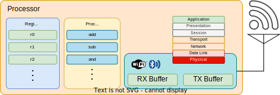
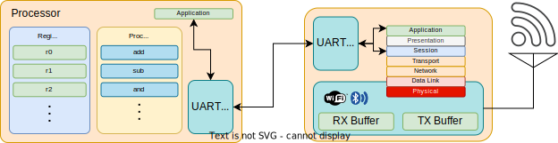

# Wi-Fi
Wireless Network

---
---
# Bibliography
for this section

**Andrew Tanenbaum**, *Computer Networks (5th edition)*
  - Chapter 1 - *Introduction*
    - Subchapter 1.5.3 - *Wireless LANs: 802.11*

---
---
# Wi-Fi

- Wireless Network
- *L2* (Data Link) Protocol
- Devices
  - **AP** - Access Point
    - acts as a hub or switch
    - handles authentication
  - **Device** - The device that connects to the network
- Frequencies
  - 2.4 GHz
  - 5 GHz

---
---
# Wireless Network Connection
security

- **Open** - everyone receives all the communication 
- **WEP** - all data is encrypted with the same key, everyone who knows the keys can read the data
- **WPA 1/2/3 (Personal)** - each **device** has a different encryption key shared with the **AP**
  - the **device** authenticates with the **AP** by using the network *passkey*
  - the **device** and the **AP** exchange a symmetric encryption key
- **WPA 1/2/3 Enterprise** - each **device** has a different encryption key shared with the **AP**
  - the **AP** provides a certificate to the **device** proving its authenticity
  - the **device** authenticates using username and password or a private key
  - the **device** and the **AP** exchange a symmetric encryption key

---
---
# Integrated Network Device
the network device is integrated into the MCU

- a radio peripheral
  - knows how to emit and receive in 2.4 and 5 GHz
  - is controlled by software
  - can generate signals for Wi-Fi, BLE, 802.15.4, 6LoPAN, Thread
- it knows how to transmit and receive buffers (*L1*)
- some devices know *L2*

---
---
# Discrete Network Device
the network device is connected into the MCU

- the MCU is connected to an external Wi-Fi/BLE device
- transport over UART, SPI or I2C
- most devices knows 
    - *L3* - provides *socket* 
    - *L4* - provides TCP/UDP *sockets* 
    - *L7* - provides application functions (usually *HTTP* and *MQTT*)

