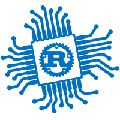

# Teaching Embedded Systems with Tock
Alexandru Radovici\
Politehnica University of Bucharest

---

# Embedded Systems in Rust
we taught an [embedded systems](https://embedded-rust-101.wyliodrin.com) course fully in Rust

## Students learned

- how hardware works
- how to actually build their own hardware device
- the Rust programming Language

## We used
- the `embassy` framework
- `async` Rust
- Rust Embedded `async` HAL

  

**90** second year **students** built **70 projects** using the Raspberry Pi Pico and Rust

<!-- Subjects -->

---
src: ./subjects.md
---

<!-- The Good -->

---
src: ./good/slides.md
---

<!-- Issues -->

---
src: ./issues/slides.md
---

<!-- Tock -->

---
src: ./tock/slides.md
---

---
---
# Conclusion
Tock could be the standard for embedded systems courses

- There is a lof of work to do
- We have 5 interns for the summer that will work on this
- Try to teach common courses or at least parts of them
