# 03 - Exceptions & Interrupts

The purpose of this lab is to understand how exceptions and hardware interrupts work and how they can be used, how to set a hard fault handler,
register interrupts and *use interrupts*  with embassy-rs.


## Resources

1. **Joseph Yiu**, *The Definitive Guide to ARM® Cortex®-M0 and Cortex-M0+ Processors, 2nd Edition* 
- Chapter 4 - *Architecture*
  - Section 4.4 - *Stack Memory Operations*
  - Section 4.5 - *Exceptions and Interrupts*
- Chapter 8 - *Exceptions and Interrupts*
  - Section 8.1 - *What are Exceptions and Interrupts*
  - Section 8.2 - *Exception types on Cortex-M0 and Cortex-M0+*
  - Section 8.3 - *Brief Overview of the NVIC*
  - Section 8.4 - *Definition of Exception Priority Levels*
  - Section 8.5 - *Vector Table*
  - Section 8.6 - *Exception Sequence Overview*
- Chapter 11 - *Fault Handling*
  - Section 11.1 - *Fault Exception Overview*
  - Section 11.2 - *What Can Cause a Fault*
  - Section 11.7 - *Lockup*
2. **Raspberry Pi Ltd**, *[RP2040 Datasheet](https://datasheets.raspberrypi.com/rp2040/rp2040-datasheet.pdf)*
- Chapter 2 - *System Description*
  - Section 2.7 - *Boot sequence*
  - Section 2.8 - *Bootrom*
    - Subsection 2.8.1 - *Processor Controlled Boot Sequence*
3. [Cortex-M0+ Devices Generic User Guide](https://developer.arm.com/documentation/dui0662/latest/)
4. [rp2040-hal documentation](https://docs.rs/rp2040-hal/0.10.0/rp2040_hal/index.html)
5. [Embassy documentation](https://embassy.dev/book/dev/runtime.html)


## What is an exception? 

Exceptions describe any condition that requires the processor to stop what it is doing
and do something else. Section 2.3.2 of [Cortex-M0+ Devices generic User Guide](https://documentation-service.arm.com/static/5f04abc8dbdee951c1cdc9f7?token=) lists 7 types of exceptions:


| Exception | Priority | Descriptions |
|-----------|----------|--------------|
| Reset | -15 | Triggered by the system at startup to start the software |
| NMI | -14 | Non Maskable Interrupts, an external interrupt that cannot be ignored, usually used for low latency peripheral needs the attention of the MCU |
| HardFault | -13 | Triggered by the MCU in case of a fault (div by 0, memory fault, ...) |
| SVC | -5 | Supervisor call, triggered usually by a process running on top of the embedded operating system when it wants to make a system call |
| PendSV | -2 | Used for pending system calls |
| SysTick | -1 | Triggered by a periodic timer, usually used by an embedded operating system for context switch |
| Interrupt (IRQ) | 0 and above| Triggered by a peripheral, or generated by a software request

## What is an interrupt?

A hardware interrupt is a type of exception which is a synchronous or asynchronous signal from a peripheral that signals the occurrence of an event that must be handled by the processor. Interrupt handling has the effect of suspending a program's normal thread of execution and launching an interrupt service routine (ISR).

Generally, to associate an interrupt with a specific routine in the program, the processor uses the interrupt vector table (IVT). In this table, each interrupt is associated with the address to which the program will jump when the interrupt is triggered. These addresses are predefined and are mapped in program memory.

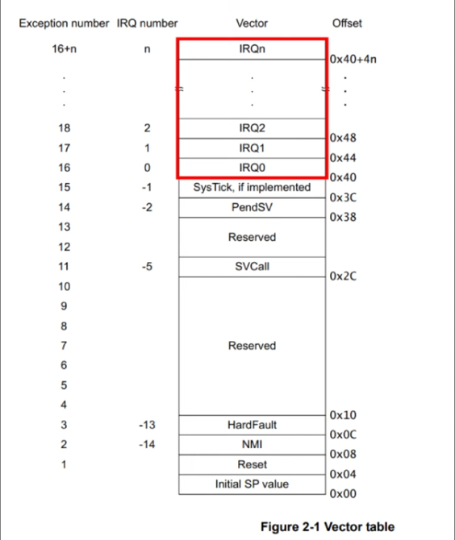

The image above illustrates the whole  vector table of ARM Cortex-M0.
It includes exceptions mapped from address 0x04 to 0x40+4n (n depends on the processor type). Lower address means higher priority.
Higher priority exceptions can interrupt lower priority exceptions.

## Exception and Interrupt Handling

When an interrupt request happens the first thing that the processor does is to memorize its current state. For ARM Cortex-M0 this happens by pushing 8 words or registered data into the main stack to provide the information
need to return the processor to what it was doing before before the interrupt request was called. This part is called the stack frame and it includes registers 0 through 3, register 12, the link register, the program counter and the program status register.

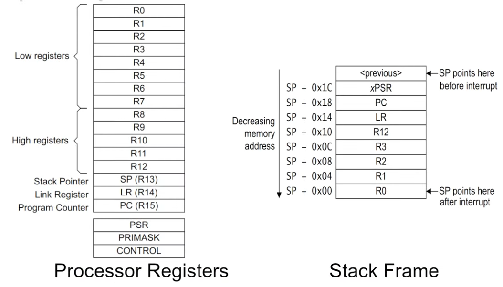


ARM Cortex-M microcontrollers also use a Nested Vectored Interrupt Controller (NVIC).The NVIC is specifically designed to handle these interrupts more efficiently. Interrupt addresses in the NVIC memory region are set according to their priority: the lower the address, the higher the priority. As suggested by the "Nested" in its name, the NVIC supports nested interrupts. This means that if a higher priority interrupt occurs while another interrupt is being processed, the controller can pause the current interrupt service routine (ISR), handle the higher priority interrupt, and then resume the interrupted ISR. This feature is crucial for responsive and real-time processing.

### Registering handlers

Exception handlers are registered using the `exception` macro provided by the `cortex-m-rt` crate.

```rust
#[exception]
unsafe fn ExceptionName() {

}
```

:::warning

The name of the exception handler function matters, as this is the way the `exception` macro knows for which exception to
register the handler. Valid exception names are `HardFault`, `SysTick`, or any other exception name of the MCU.

:::

Interrupt handlers are registered using the `interrupt` macro provided by the `cortex-m-rt` crate.

```rust
#[interrupt]
unsafe fn IRQ_NAME() {

}
```

:::warning

The name of the interrupt handler function matters, as this is the way the `interrupt` macro knows for which interrupt to
register the handler. Valid exception names are any of the [provided interrupts](#available-interrupt-request-signals-irq).

:::

## RP2040

The RP2040 is an ARM Cortex-M0+ dual core processor. It does have some particularities.

### Boot

The RP2040 boots from an internal bootloader that sets the initial interrupt IVT.

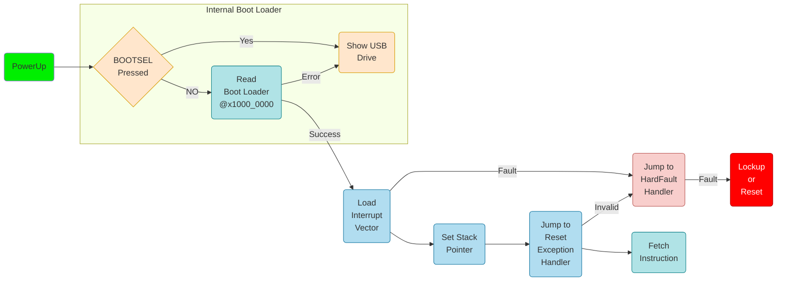

The before starting the actual code written into Flash, the internal bootloader loads a secondary bootloader that
is written in Flash (the first 256 bytes) together with the developer's app. 
This is the bootloader section that was described in [lab 02](./02#bootloader).

The IVT that the Flash application provides start after the secondary bootloader, at address 0x100.

<div align="center">
    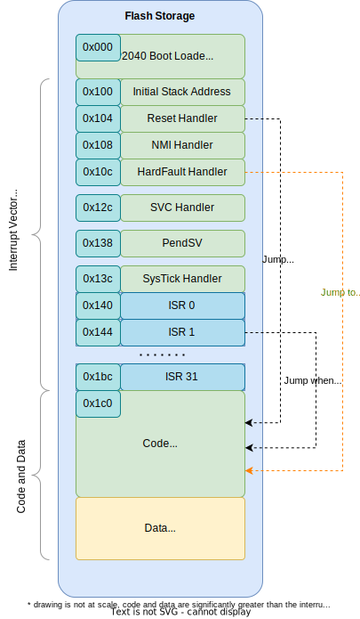
</div>

### Interrupts

The RP2040 chip has two cores (processors), and each core has its own NVIC. Each core's NVIC is connected to the same set of hardware interrupt lines with one exception: IO Interrupts. In the RP2040, IO interrupts are organized by banks, and each core has its own set of IO interrupts for each bank. The IO interrupts for each core are completely independent. For instance, Processor 0 (Core 0) can be interrupted by an event on GPIO pin 0 in bank 0, while Processor 1 (Core 1) can be interrupted by a separate event on GPIO pin 1 in the same bank. Each processor responds only to its own interrupts, allowing them to operate independently or to handle different tasks simultaneously without interfering with each other.

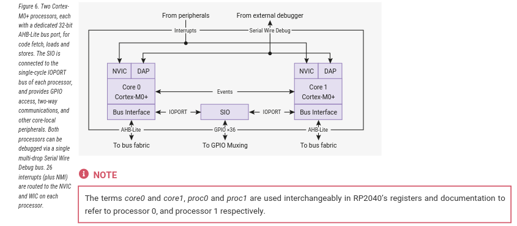

#### Available interrupt request signals (IRQ)

On RP2040, only the lower 26 IRQ signals are connected on the NVIC, as seen in the table below, and IRQs 26 to 31 are tied to zero (never firing).
The core can still be forced to enter the relevant interrupt handler by writing bits 26 to 31 in the NVIC ISPR register.

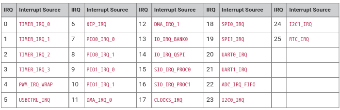

The priority order is determined for these signals is determined by :

- First, the dynamic priority level configured per interrupt by the `NVIC_IPR0-7` registers. The Cortex-M0+ implements
the two most significant bits of an 8-bit priority field, so four priority levels are available, and the numerically-lowest
level (level 0) is the highest priority.
 - Second, for interrupts with the same dynamic priority level, the lower-numbered IRQ has higher priority (using the
IRQ numbers given in the table above)

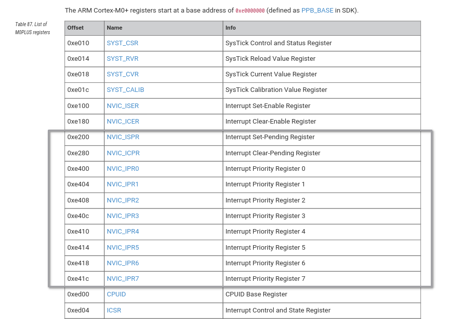

#### GPIO Interrupts

All GPIO pins in Raspberry Pi Pico support interrupts. The interrupts can be classified into three types:

- *Level High*: An interrupt occurs while a pin is HIGH or at logic 1.
- *Level Low*: An interrupt occurs while a pin is LOW or at logic 0.
- *Rising Edge*: Interrupt occurs when a pin transitions from a LOW to HIGH.
- *Falling Edge*: Interrupt occurs when a pin transitions from HIGH to LOW.

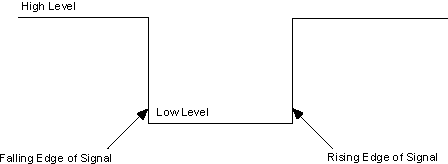

## Inspect binaries
When working in Rust, `rust-objdump` can be used to inspect the compiled output to see sections and interleaved code. This is particularly useful to inspect code and debug.

### Install cargo binutils
Before you can use `rust-objdump` with Rust projects, you'll need to install `cargo-binutils`.


```bash
cargo install cargo-binutils
rustup component add llvm-tools-preview
```

### Check section headers

```shell
rust-objdump --section-headers target/thumbv6m-none-eabi/debug/<executable_name>
```

```shell

Sections:
Idx Name            Size     VMA      Type
  0                 00000000 00000000 
  1 .vector_table   000000c0 10000100 DATA
  2 .boot_loader    00000100 10000000 DATA
  3 .text           00000b10 100001c0 TEXT
  4 .rodata         000001a4 10000cd0 DATA
  5 .data           00000000 20000000 DATA
  6 .gnu.sgstubs    00000000 10000e80 TEXT
  7 .bss            00000000 20000000 BSS
  8 .uninit         00000000 20000000 BSS
  9 .debug_abbrev   00001bce 00000000 DEBUG
 10 .debug_info     00025316 00000000 DEBUG
 11 .debug_aranges  000014b8 00000000 DEBUG
 12 .debug_str      0003c860 00000000 DEBUG
 13 .debug_pubnames 000175c6 00000000 DEBUG
 14 .debug_pubtypes 00000ee6 00000000 DEBUG
 15 .comment        00000073 00000000 
 16 .ARM.attributes 00000032 00000000 
 17 .debug_frame    00004444 00000000 DEBUG
 18 .debug_line     00023790 00000000 DEBUG
 19 .debug_ranges   00016df8 00000000 DEBUG
 20 .debug_loc      00000074 00000000 DEBUG
 21 .symtab         00000970 00000000 
 22 .shstrtab       00000103 00000000 
 23 .strtab         00000fe4 00000000 
```

### Disassemble a specific section

```bash
rust-objdump --disassemble -j .section_name target/thumbv6m-none-eabi/debug/<executable_name>
```

:::info

`cargo objdumb` and `rust-objdump` tools use llvm's `objdump` tool.
Some terminals do not parse parameters proxied to `llvm-objdump` command.
If this happens please use `llvm-objdump` script directly like so

```shell
llvm-objdump <path_to_binary> --section.headers
```

:::

## Handling a HardFault

There are several reasons why a hard fault is triggered:
- **invalid memory** reads and writes
- *invalid* address of the *reset handler* (not the case for RP2040, as the real reset handler is in the Bootrom)
- *invalid* address of the *initial stack pointer* (not the case for RP2040, as the real reset handler is in the Bootrom)
- using the *svc* instruction *in the HardFault handler*
- using the *svc* instruction *NMI handler*

### Register a HardFault handler

The `cortex-m-rt` crate allows an easy way of registering a hard fault handler by using
the `exception` macro.

```rust
#[exception]
unsafe fn HardFault(_frame: &ExceptionFrame) -> ! {
    loop{}
}
```

The `ExceptionFrame` parameter contains the state of the processor at the moment of the hard fault occurred.
It contains the stack frame (registers) that the processor pushed on the stack.

:::warning

The hard fault handler is not allowed to return, as usual. Unless an embedded operating system is used, this error is not recoverable. 

:::

### Triggering a hard fault

The easiest way of forcing a hard fault is to try to read or write to or from a memory location that is not valid.
For the RP2040, an invalid memory address is `0xf000_0000`.

```rust
// define an invalid memory address
const INVALID_ADDRESS: *mut u32 = 0xf000_0000 as *mut u32;

// write to it
unsafe {
    // this triggers a hard fault
    write_volatile(INVALID_ADDRESS, 0);
}
```

## Handle Interrupts

This labs presents two ways of handling interrupts:
- *using the embedded-hal* standard which implies actually registering interrupt handlers
- *using embassy* which is a framework that provides an API that uses interrupts

<div align="center">
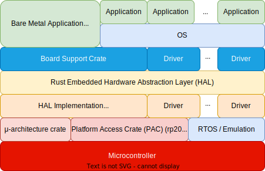
</div>

## Handle Interrupts using Embedded HAL

Setting up an interrupt is a bit more complicated than handling 
a simple exception because we also need to enable that interrupt and bind it to the signal coming from a peripheral.
Additionally, we need to manually clear the interrupt (signal that we handled the interrupt) in the 
interrupt handler, otherwise as soon as the interrupt handler finishes, it gets called again. 

### RP2040 Embedded HAL

Setting up interrupts requires a lot of register logic. To make this task easier, instead of using directly
the PAC, we can use a crate that implements the `embedded-hal` traits and which exports easier functions.

We need a way to make sure that the data we access and modify stays consistent, regardless of when ISR are called
and executed.

The [`rp2040-hal`](https://docs.rs/rp2040-hal/0.10.0/rp2040_hal/index.html) crate provides such functionality.

### Critical Section

As interrupts can fire at any time, there is no way to know when the normal application flow will be
interrupted. This can happen while writing data to registers or while reconfiguring the interrupts.

The [`critical-section`](https://docs.rs/critical-section/latest/critical_section/) crate does just that.
For single core MCUs (the way in which we use in this lab the RP2040) `critical_section::with` function simply 
disable any interrupts while in the critical section.

```rust
critical_section::with(|cs| {
    // on cortex-m single core MCUs
    // run code that should not be interrupted
});
```

### Dependencies

To make sure we can use [`rp2040-hal`](https://docs.rs/rp2040-hal/0.10.0/rp2040_hal/index.html) and [`critical-section`](https://docs.rs/critical-section/latest/critical_section/), we have to add the following dependencies to 
the `Cargo.toml` file.

```toml
# offers the critical section API
critical-section = "1.1.2"

# the "critical-section-impl" features provides the implementation of 
# the critical-section API for rp2040
rp2040-hal = { version = "0.10.0", features = ["rt", "critical-section-impl"] }
```

### Setting the interrupt handler

The `#[interrupt]` macro allows us to register a function as interrupt handler.

Usually interrupt handlers have to access global data. Due to Rust's safety rules, this is not 
directly allowed. The Rust compiler needs to *make sure at compile time* that there is no way
the code could corrupt the data that it reads or writes. 
This is why interrupts handler 
have to use `critical_section` to access data.

```rust
use rp2040_pac::interrupt;

#[interrupt]
unsafe fn IO_IRQ_BANK0() {
    critical_section::with(|cs| {
        // access global data
    });
}
```

### Configure the GPIO pins

In this example we want to trigger the `IO_IRQ_BANK0` interrupt when a pin is pressed. We have 
to use the [`rp2040-hal`](https://docs.rs/rp2040-hal/0.10.0/rp2040_hal/index.html) API to configure
the GPIO pins.

```rust
use rp2040_hal::gpio::{
    FunctionSioInput, Pin, Pins, PullUp,
};

// get the peripherals
let mut peripherals = Peripherals::take().unwrap();

// initialize the SIO (this is different from PAC, as we use the rp2040-hal)
let sio = Sio::new(peripherals.SIO);

// initialize the pins part of SIO
let pins = Pins::new(
    peripherals.IO_BANK0,
    peripherals.PADS_BANK0,
    sio.gpio_bank0,
    &mut peripherals.RESETS,
);

// configure the input pin
// replace X with a pin number
let pin: Pin<GpioX, FunctionSioInput, PullUp> = pins.gpioX.reconfigure();
```

:::warning

Do not forget to replace the `X` in `GpioX` and `gpioX` with an actual pin number.

:::

:::info

Please note the way the pin was configured. The configuration is written into the **data type**, 
that is `Pin<GpioX, FunctionSioInput, PullUp>`) instead of the `reconfigure` function's parameters. This is one of Rust's 
important features, as it prevents using invalid functions on pin that was configured in a certain way.

The data type returned by the `reconfigure` function simply does not have functions that do not work
for the configuration.

:::

### Enable interrupt 

Now that the interrupt handler is registered and the pin is configured, we can enable the interrupt.

```rust 
use rp2040_hal::Interrupt;

// Trigger on the 'falling edge' of the input pin.
// This will happen as the button is being pressed
pin.set_interrupt_enabled(Interrupt::EdgeLow, true);

```

### Enable the IO_BANK0 IRQ in the NVIC

While the interrupt has been enabled inside the *IO_Bank0* peripheral, we still
need to ask the *NVIC* peripheral to signal the processor then *IO_Bank0* triggers
the interrupt. This is done using the API of the PAC crate.

```rust
unsafe {
    rp2040_pac::NVIC::unmask(rp2040_pac::Interrupt::IO_IRQ_BANK0);
}
```

:::warning

Without enabling the interrupt in *NVIC*, the MCU will never be interrupted by the `IO_IRQ_BANK0` 
interrupt, as NVIC will never signal the MCU. In this situation, we say that the NVIC *masks* the interrupt.

:::

### Handling the interrupt

Several pins can be configured to trigger the `IO_IRQ_BANK0` interrupt. It is the ISR's (handler's) job
to talk to *IO_BANK0* and ask which pin triggered the interrupt. Moreover, the interrupt will stay active until
the ISR asks the *IO_BANK0* to clear it.

To perform this task, the ISR needs access to the `pin` variable that we configured before. The problem is
that this `pin` variable is a local variable, probably defined in the `main` function. As Rust does not 
allow global variables, we have to use a combination of the `critical-section` API and a `Mutex`.

First, we define a data type structure that will hold the global variables that we need. 
For this example it holds the pin.

```rust
struct GlobalData {
    pin: Pin<GpioX, FunctionSioInput, PullUp>
}
```

Next we have to define a `static` variable of type `GlobalPin`. Just defining the static variable is not enough,
as Rust will never allow us to modify it. Rust does not allow global mutable static variables due to safety reasons.

```rust
static GLOBAL_DATA: Mutex<Cell<Option<GlobalData>>> = Mutex::new(Cell::new(None));
```

The type definition is a little long, let's take a close look at it:
- to be able to **share** `global_data` between the `main` function and the ISR, we have to use a `Mutex`, as the ISR can execute anytime. The `Mutex` assures that only one execution flow at a time can access the value sitting inside, in this example either `main` either the ISR
- to be able to **modify** the value inside the `Mutex` we have to wrap the value in a `Cell`
- to be able to have an **initial unconfigured** value, as the `GLOBAL_DATA`'s value is only configured within `main` with actual data, we have tu use Rust's principle of NULL, `Option`, the `GLOBAL_DATA` will be initially set to `None`

We have to change the pin initialization and store the `pin` into the `GLOBAL_DATA` variable.

```rust
let local_data = GlobalData {
    pin: pins.gpio25.reconfigure(),
};
```

As soon as we have the `local_data` variable initialized (using a local variable), we have to store it in to a global variable.

```rust
 critical_section::with(|cs| {
    GLOBAL_DATA.borrow(cs).replace(Some(local_data));
});
```

### Clearing the interrupt in the interrupt handler

When the `IO_IRQ_BANK0` interrupt triggers, we use the `critical-section` to retrieve the value of the
`GLOBAL_DATA` variable and use the `pin` field to ask *IO_Bank0* to clear the interrupt that just triggered.

:::warning

Failing to ask *IO_Bank0* to clear the interrupt within the ISR will lead to the ISR being called again.

:::

```rust
#[interrupt]
unsafe fn IO_IRQ_BANK0() {
    critical_section::with(|cs| {
        let mut global_data = GLOBAL_DATA.borrow(cs).take();

        if let Some(ref mut data) = global_data {
            // execute some actions
            data.switch_a.clear_interrupt(Interrupt::EdgeLow);
        }

        GLOBAL_DATA.borrow(cs).replace(global_data);
    });
}
```

:::warning

The way this interrupt handler uses `critical-section` is not the most optimal, but it is the easiest to understand. 
Interrupt handlers should execute as less code as possible inside the `critical-section`.

:::

## Handle Interrupts using Embassy

In Embassy, handling interrupts does not involve manually setting up interrupt service routines (ISRs) in the traditional sense that you might be used to with bare-metal or lower-level embedded programming. Instead, Embassy abstracts away the hardware-specific details and provides a higher-level async API for working with hardware events, including interrupts.

Embassy uses Rust's `async`/`await` syntax to provide an easier way to write non-blocking embedded applications. This approach allows you to wait for events (like GPIO pin changes, which could be triggered by hardware interrupts underneath), in a way that looks synchronous but is actually non-blocking and handled asynchronously by the Embassy executor.

:::note

The async and await mechanisms will be discussed in more detail in course_04 and lab_05. 

:::

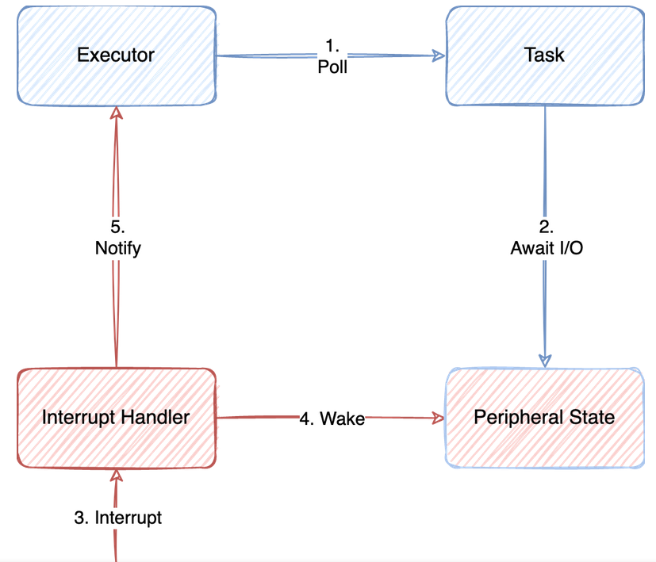

:::note

Unlike the usb drive, GPIO pins don't need explicit interrupt binding.
All interrupts handlers are already associated to the type of the input signal (rising edge, level low etc.)

:::

For example, if you're waiting for a button press, you don't need to set up the interrupt yourself; you simply use Embassy's GPIO API to wait for the pin change event.
```rust
button.wait_for_rising_edge().await
```

If we want the main loop to keep running regardless of the button state, we need to define a new task. A task in Embassy is an `async` function that will run in parallel with other tasks. It can pause its execution at certain points, waiting for some conditions to be met (like waiting for an I/O operation to complete, a timer to elapse, or an external event to occur), and then resume where it left off.

### Define the task function

The task function receives the button as an parameter.

```rust
// replace X with the button's pin number
#[embassy_executor::task]
async fn button_pressed(mut button: Input<'static, PIN_X>) {
    // initialize gpio
    loop {
        
        // Wait for the button button to be pressed
        button.wait_for_rising_edge().await;
        // Do something only if button was pressed
        // (Here should be the logic for your interrupt request handler)
        // Example: turn on the LED
        
    }
}
```

### Start the task

The main embassy task initializes the device and the button, starts the `button_pressed` task and does its work.

```rust
use embassy_executor::Spawner;

#[embassy_executor::main]
async fn main(spawner: Spawner) {
    
    // let button = ...

    //  Spawn button_pressed and send the button an argument
    spawner.spawn(button_pressed(button)).unwrap();

    loop {
        // Do something
        // ...
    }
}
```

:::warning

Tasks are scheduled in a cooperative way. This means that the current task has to stop by using the `await` keyword and ask 
the scheduler to schedule another task.
The `main` task has to use `await` at some point. Failure to do that will prevent the `button_pressed` task from running.

:::

### Sharing data with tasks

If several tasks need to share the same data, a `Mutex` similar to the one from Embedded HAL is needed. 

If tasks just need to send values to each other, sending them as arguments should work.

## Exercises

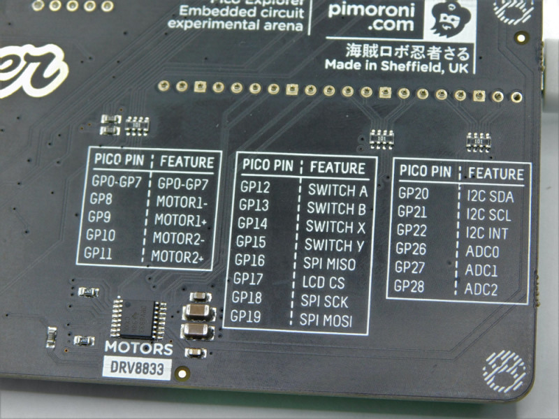

1. Connect an LED1 to pin 0 and an LED2 to pin 1. Use [KiCad](https://www.kicad.org/) to draw the schematics. (**1p**)
2. Write a program using `embedded-hal` that blinks the LED1. Use `rust-objdump` to display the sections. (**2p**)

You should be able to see the:
- bootloader section
- interrupt vector
- the code part (.text segment)

:::note

To blink a led using `embedded-hal`, take a look at [Configuring GPIO Output in Embassy](../lab/02#configure-gpio-output), from Lab 2. Embassy uses `embedded-hal`, so the functions for setting pin values to HIGH or LOW would be the same.

:::

3. Register a hard fault handler that blinks LED2. (**3p**)
   1. Generate a hard fault, you should see LED1 stop blinking (either on or off) and the LED2 blink
   2. Move the blinking LED2 code to the panic handler and call panic!() in `main` after a few LED1 blink loops
   3. Make sure panic is called when a hard fault is generated and generate a hard fault after a few LED1 blink loops
  
:::tip

All crates used in this lab have a github repo, please check [`rp2040-hal`'s repository](https://github.com/rp-rs/rp-hal/tree/main/rp2040-hal). You have there multiple examples of how to set up the gpio pins.

A very usefull example of how to setup multiple input and output pins and how to access them safely is: [gpio_irq_example.rs](https://github.com/rp-rs/rp-hal/blob/main/rp2040-hal/examples/gpio_irq_example.rs).

:::

:::info

The code written in hard fault handlers has to be very basic, as it is not very clear what triggered it.
We suggest using bare metal to blink the LED. The code cannot assume that any peripheral is already
initialized, as the fault might have occurred while initializing the board.
```rust
// reset IO Bank0
const RESET: u32 = 0x4000_c000;
const CLR: u32 = 0x3000;

const RESET_DONE: u32 = 0x4000_c008;

const GPIOX_CTRL: u32 = 0x4001_4004;
const GPIO_OE_SET: *mut u32 = 0xd000_0024 as *mut u32;
const GPIO_OUT_SET: *mut u32 = 0xd000_0014 as *mut u32;
const GPIO_OUT_CLR: *mut u32 = 0xd000_0018 as *mut u32;

// TODO - use fill in the GPIO number for LED2
const LED: u32 = ;

unsafe {
    write_volatile((RESET + CLR) as *mut u32, 1 << 5);
    while read_volatile(RESET_DONE as *const u32) & (1 << 5) == 0 {}
}

// set the LED pin the SIO function in IO_BANK0
let gpio_ctrl = (GPIOX_CTRL + 8 * LED) as *mut u32;
unsafe {
    write_volatile(gpio_ctrl, 5);
};

// set the LED pin as output in SIO
unsafe {
    write_volatile(GPIO_OE_SET, 1 << LED);
};

let mut value = 0;

loop {
    value = 1 - value;
    // write the value to the LED
    let reg = match value {
        0 => GPIO_OUT_CLR,
        _ => GPIO_OUT_SET,
    };

    unsafe { write_volatile(reg, 1 << LED) }

    // sleep
    for _ in 0..5000 {
        unsafe { asm!("nop") }
    }
}
```

:::
4. Register an interrupt on the pin connected to button A. Toggle LED2 each time the button is pressed. (**2p**)

:::info

Look at the table on the back of the Pico Explorer Base to figure out to which pin button A is connected.

:::

5. Use `embassy-rs` to obtain the same result. (**2p**)

:::tip

Spawning a new task might be a good idea.

:::
