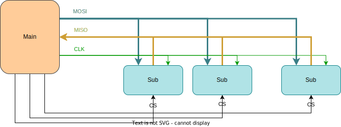
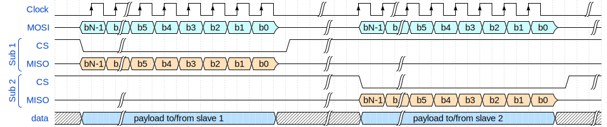
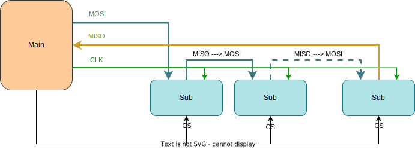
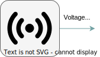
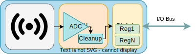
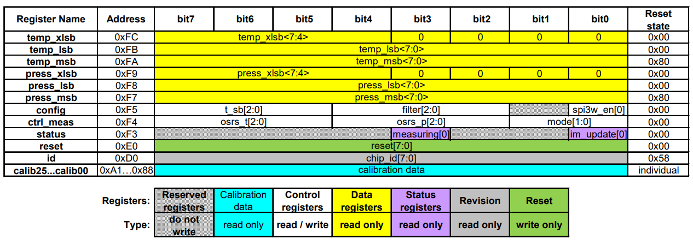
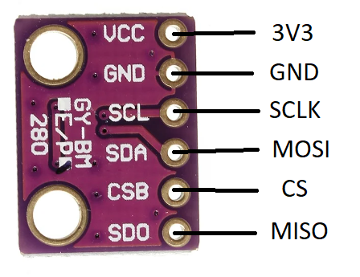
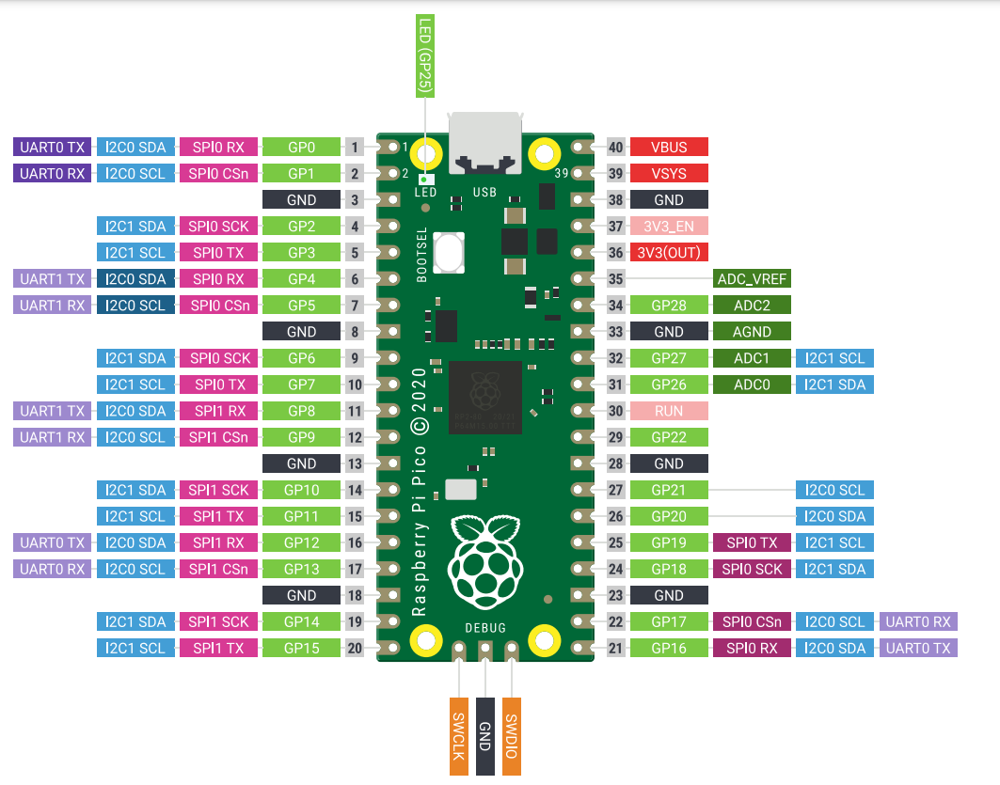
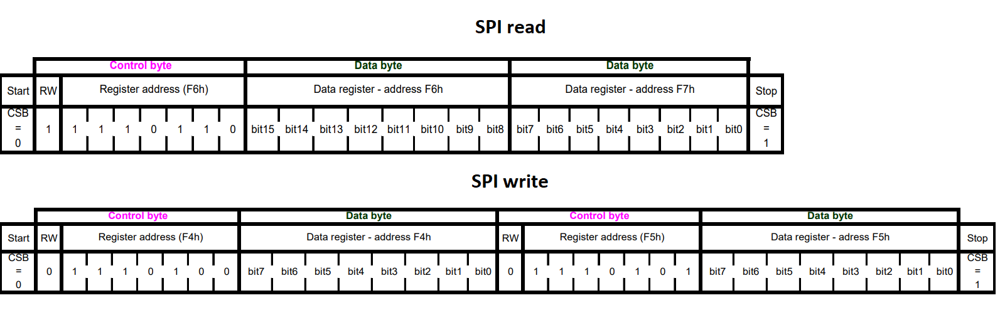
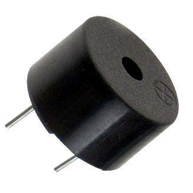

# 06 - Serial Peripheral Interface

This lab will teach you how to communicate with hardware devices using the Serial Peripheral Interface (SPI) protocol, in Embassy. 

## Resources

1. **Raspberry Pi Ltd**, *[RP2040 Datasheet](https://datasheets.raspberrypi.com/rp2040/rp2040-datasheet.pdf)*
   - Chapter 4 - *Peripherals*
     - Chapter 4.4 - *SPI*

2. **BOSCH**, *[BMP280 Digital Pressure Sensor](https://www.bosch-sensortec.com/media/boschsensortec/downloads/datasheets/bst-bmp280-ds001.pdf)*
    - Chapter 3 - *Functional Description*
    - Chapter 4 - *Global memory map and register description*
    - Chapter 5 - *Digital Interfaces*
      - Subchapter 5.3 - *SPI Interface*

3. **Paul Denisowski**, *[Understanding SPI](https://www.youtube.com/watch?v=0nVNwozXsIc)*

## Serial Peripheral Interface (SPI)

The Serial Peripheral Interface (or SPI) is a communication protocol used between microcontrollers and peripheral ICs (integrated circuits). It allows synchronous transfer of data between one *main* device and one or more *sub* devices (e.g. sensors). The main device is the one that dictates the communication.

### Data transmission



SPI transmission usually uses 4 lines:

- **CLK** - clock - generated by the main device - subs use it to synchronously read and write to the bus
- **MOSI** - **M**ain **O**ut **S**ub **I**n - used to carry data from the main device to *all* the subs
- **MISO** - **M**ain **I**n **S**ub **O**ut - used to carry data from the *active* sub to the main device
- **CS** - chip select - selects the sub to be activated, or the sub that the main wants to communicate with
                       - one wire per sub
                       - inactive subs will disconnect from the *MOSI* and *MISO* lines

:::info
The communication is *full-duplex*. This means that data is transmitted in both directions simultaneously. With that being said, during data transmission, both the main and the sub **must write** to the MOSI/MISO wires, no matter if that data is relevant or not.
:::

:::note
SPI is most commonly implemented in a 4-wire configuration. However, there is also a 3-wire configuration, where the `MOSI` and `MISO` lines are common. This makes the communication *half-duplex*, since data can be sent only in one direction at a time.
:::

#### Transmission example

1. main sets `CS` to `LOW` - the sub that the main wants to communicate with is activated - all other subs are already disconnected from `MOSI` and `MISO` lines as their CS line is not active
2. main writes the first bit on the `MOSI` line, and, *simultaneously*, sub writes the first bit on the `MISO` line
3. main starts the clock
4. on *rising edge* 
    - main reads data from the `MISO` line 
    - sub reads data from the `MOSI` line
5. on *falling edge*
    - main writes data to the `MOSI` line
    - sub writes data to the `MISO` line
6. repeat steps 4 and 5 until main stops the clock

:::note
Whether steps 4 and 5 happen on rising/falling edge depends on the `CPOL` configuration of the SPI.
:::



In the image above, the main first exchanges data with the first sub by setting its corresponding `CS` line to low. After it finishes transmission with sub 1, it deactivates it and, afterwards, initiates communication with the second sub by setting its `CS` line to low. Notice that both main and sub read and write to the MOSI/MISO line simultaneously.

### SPI modes

SPI has 4 different modes which define when data is read or written. These modes can be configured through 2 registers: `CPOL` and `CPHA`.

| Mode | `CPOL` | `CPHA` | Clock polarity in idle state | Clock phase used to read and/or write data |
|-|-|-|-|-|
| 0 | 0 | 0 | Logic Low | Data read on rising edge and written on falling edge | 
| 1 | 0 | 1 | Logic low | Data read on the falling edge and written on the rising edge |
| 2 | 1 | 0 | Logic high | Data read on the falling edge and written on the rising edge |
| 3 | 1 | 1 | Logic high | Data read on the rising edge and written on the falling edge |

| | | |
|-|-|-| 
| `CPOL` | Clock polarity | defines when the clock is considered *idle*, or when no transfer is occurring |
| `CPHA` | Clock phase | defines when the data bit is read and when it is written: depends on `CPOL` |


### Daisy Chaining

**Daisy chaining** is an SPI configuration through which the sub devices are linked together as such: 



The `MOSI` line connects the main device only to the first sub. Then, the `MISO` output of the first sub ties to the `MOSI` input of the second sub, and so forth. The final sub in the chain ties to the `MISO` line of the main device. All `CS` lines are common, therefore all subs are always active.

For example, if main wants to communicate with the second sub, it will:
- send its data through the `MOSI` line to the first sub
- the first sub will send the data to the second sub, through the common wire
- once the second sub receives the data, it will send its response to the third sub
- at the end of the chain, the last sub will send the data back to the main device through the `MISO` line

## DMA

When it comes to standard communication protocols that rely on [MMIO](./02), it would be inefficient to rely on the MCU itself to handle all of these data transfers. This is why the **Direct Memory Access** (DMA) is used. Its purpose is to offload the MCU by dealing with simple transmission to and from peripherals, and whenever it finishes a transfer, it raises an interrupt.

## SPI in Embassy

In Embassy, we can use the SPI both blocking and asynchronously. The following example will be using the asynchronous version.

:::warning
The SPI can also be used synchronously, but this means that for every transfer, the thread will be blocked, as we found out in the [previous lab](../05/index.md).
:::

First, we initialize the peripherals.

```rust
let peripherals = embassy_rp::init(Default::default());
```

Next, we create the configuration for the SPI. We can set the clock frequency, polarity and phase (the SPI mode).

```rust
let mut config = spi::Config::default();
config.frequency = 2_000_000;
config.phase = spi::Phase::CaptureOnFirstTransition;
config.polarity = spi::Polarity::IdleHigh;
```

Once we have the configuration, we can initialize the `MISO`, `MOSI` and `CLK` pins.

```rust
let miso = peripherals.PIN_X;
let mosi = peripherals.PIN_Y;
let clk = peripherals.PIN_Z;
```

Now we can create our SPI instance. The example uses the SPI0 channel, but others can be used. Being an asynchronous SPI, it also needs a pair of `DMA` channels, one that handles the *transmission* of data, and one that handles the *receiving* of data.

```rust
let mut spi = Spi::new(peripherals.SPI0, clk, mosi, miso, peripherals.DMA_CH0, peripherals.DMA_CH1, config);
```

:::info
To figure out which pins work with SPI and what channels they are associated with, you need to take a look at the pinout of the Raspberry Pi Pico.
:::

We also need a `CS` pin, that is simply a GPIO output pin. We will initialize it as such. Any pin can be used. For multiple subs, multiple pins will be initialized. 

```rust
let mut cs = Output::new(peripherals.PIN_N, Level::High);
```

Now we have set up the SPI, and can use it to communicate with the connected sub. To activate the sub, we need to set the `cs` pin to `low`.

```rust
cs.set_low();
```

Once we do this, we can use two buffers:
- `tx_buf` - used to store data to transmit to the sub via the `MOSI` line
- `rx_buf` - one to store data to receive from the sub via the `MISO` line

```rust
let tx_buf = [1_u8, 2, 3, 4, 5, 6];
let mut rx_buf = [0_u8; 6]; // dummy values, will be replaced by received data
```

:::note
`rx_buf` is mutable because the values inside the buffer will be replaced by the data received from the sub.
:::

We then use the two buffers to make the transfer. The values in `tx_buffer` will be sent over the `MOSI` and the values received over the `MISO` will be stored in `rx_buf`.

```rust
spi.transfer(&mut rx_buf, &tx_buf).await;
```

Once we are done with the transfer, we set the `cs` line back to `high` to deactivate the sub.

```rust
cs.set_high();
```

## Digital vs Analog sensors

### Analog sensors
Up to now, during the labs, we have been using *analog sensors* (photoresistor and potentiometer). Analog sensors are just a transducer, which outputs a voltage depending on its measurement (light, temperature, etc.). This output needs to be read using an ADC and processed so that it can resemble something useful to us.
:::info
For example, for an analog temperature sensor, we would be getting a voltage reading that we need to convert to an actual temperature in Celsius by using a specific formula. This formula can usually be found in the datasheet of the analog sensor.
:::



### Digital sensors
For this lab, we will be using a *digital sensor*, which is an *upgraded* version of an analog sensor. It contains a transducer, but also an internal MCU with an ADC. This means that the sensor itself deals with the analog-to-digital conversion and the processing of the voltage reading, and exposes it through a digital interface of registers that can be accessed using a specific communication protocol (e.g. SPI, I2C etc.).



## BMP280 Digital Pressure Sensor

The **BMP280** is a *digital* temperature and pressure sensor designed by Bosch. It can be interfaced both with SPI and with I2C. This means that we can read the temperature and pressure values directly from the registers of the BMP280 using SPI.

:::info
**DATASHEET**: https://www.bosch-sensortec.com/media/boschsensortec/downloads/datasheets/bst-bmp280-ds001.pdf
:::

### BMP280 Memory Map



#### Registers

`id` register - contains the ID of the BMP280

`ctrl_meas` register - used for configuring the temperature/pressure measurements of the sensor

| `ctrl_meas` bits | Name | Description |
|-|-|-| 
| Bit 7, 6, 5 | osrs_t[2:0] | Controls oversampling of temperature data. |
| Bit 4, 3, 2 | osrs_p[2:0] | Controls oversampling of pressure data. |
| Bit 1, 0 | mode[1:0] | Controls the power mode of the device. |

| osrs_p[2:0] | Pressure oversampling |
|-|-|
| 000 | Skipped (output set to 0x80000) |
| 001 | oversampling x 1 |
| 010 | oversampling x 2 |
| 011 | oversampling x 4 |
| 100 | oversampling x 8 |
| 101, others | oversampling x 16 |

| osrs_t[2:0] | Temperature oversampling |
|-|-|
| 000 | Skipped (output set to 0x80000) |
| 001 | oversampling x 1 |
| 010 | oversampling x 2 |
| 011 | oversampling x 4 |
| 100 | oversampling x 8 |
| 101, others | oversampling x 16 |

`press` registers - `press_msb`, `press_lsb`, `press_xslb` - contain the pressure measurement

`temp` registers - `temp_msb`, `temp_lsb`, `temp_xslb` - contain the temperature measurement

:::warning
Unless we write to the `osrs_p` and `osrs_t` fields of the `ctrl_meas` register, the `press` and `temp` registers will have a constant value of `0x80000`! We need to configure the pressure and temperature oversampling before reading the measurements.
:::

### BMP280 wiring

The BMP280 has 5 pins:

| Pin | Function |
|-|-|
| `VCC` | power source (3V3) |
| `GND` | ground |
| `SCL` | `CLK` line |
| `SDA` | `MOSI` line |
| `CSB` | `CS` line |
| `SDO` | `MISO` line |



:::note
The BMP280 can also be interfaced through I2C, using the same pins but with different functions.
:::

The Raspberry Pi Pico has two usable SPI channels: SPI0 and SPI1. Each channel has two sets of pins that can be used for `CLK`, `MOSI` and `MISO`. They are marked with pink in the pinout diagram.



:::info
`TX` = transmitter = `MOSI`

`RX` = receiver = `MISO`
:::

:::tip
Since we are using the Pico Explorer, it's simple to see which pins are used for SPI transmission. You can also check the back side of the Pico Explorer to see exactly which GP pins are being used by the extension for SPI.
:::

### Reading the temperature/pressure from the BMP280 sensor using Embassy

To get the temperature and pressure values we want from the digital sensor, we need to access its internal registers. The BMP280 has some rules when it comes to reading and writing to these registers, that must be extracted from the [datasheet](https://www.bosch-sensortec.com/media/boschsensortec/downloads/datasheets/bst-bmp280-ds001.pdf). Every sensor has different registers, and different ways of interfacing them, so reading the datasheet is usually required, especially when we don't have the leverage of using already existing libraries for these sensors.

First, we make sure our SPI is initialized correctly.

```rust
let peripherals = embassy_rp::init(Default::default());

let mut config = spi::Config::default();
config.frequency = 2_000_000;
// default values for phase and polarity are fine

let miso = peripherals.PIN_X;
let mosi = peripherals.PIN_Y;
let clk = peripherals.PIN_Z;
// make sure you use a SPI channel that supports the miso, mosi and clk pin numbers you chose!
let mut spi = Spi::new(peripherals.SPI0, clk, mosi, miso, peripherals.DMA_CH0, peripherals.DMA_CH1, config);

let mut cs = Output::new(peripherals.PIN_N, Level::High);
```

In section 5.3.2 of the datasheet, we get the information we need in order to read/write to a register of the BMP280. 



To know what is expected from it, the sensor needs to receive a *control byte*. This control byte contains the address of the register that we want to access, except the 7th bit of this address is changed:
- it will be `1` if we want to *read* the register
- it will be `0` if we want to *write* to the register

So, for example, if we wanted to read the register at address 0x1, we would need to send a control byte of `10000001`, and if we wanted to write to it, we would send `00000001`.

This way, we're sending a command to the sensor for it to know what to do: either send back the value of the register we requested or write to this register.

#### Reading a register

To read the value of a register, the main device (the RP2040) needs to first send a control byte containing the address of that register, with the 7th bit a `1`.
The sub device (the sensor) will then send a byte back, containing the value of the requested register.

```rust
cs.set_low();
let tx_buf = [(1 << 7) | REG_ADDR, 0x00]; // first value of buffer is the control byte, second is a *don't care* value
let mut rx_buf = [0u8; 2]; // initial values that will be replaced by the received bytes
spi.transfer(&mut rx_buf, &tx_buf).await;
cs.set_high();
let register_value = rx_buf[1]; // the second byte in the buffer will be the received register value
```

:::info
Remember, SPI is full-duplex. When the main writes, the sub also writes, no matter if it has any relevant data to send or not. This is why the `tx_buf` and `rx_buf` both have 2 elements. First, the main will send the register address (`tx_buf[0]`) and the sub will send a dummy value back (stored in `rx_buf[0]`), *at the same time*. Then, the main will send a dummy value (`tx_buf[1]`) and the sub will send the value of the register (stored in `rx_buf[1]`).
:::

:::tip
Once we send the address of a register we want to read, the sensor will continuously send back bytes containing the values of the consecutive registers. For example, if we ask to read `REG_ADDR`, the sensor will first send the register value at address `REG_ADDR`, then the value at address `REG_ADDR+1`, and so on, until we deactivate it.

```rust
cs.set_low();
let tx_buf = [(1 << 7) | REG_ADDR, 0x00, 0x00];
let mut rx_buf = [0u8; 3]; // three receive values instead of two
spi.transfer(&mut rx_buf, &tx_buf).await;
cs.set_high();
let register_value = rx_buf[1]; // the second byte in the buffer will be the received register value (REG_ADDR)
let register_value_next = rx_buf[2]; // the third byte in the buffer will be the next received register value (REG_ADDR+1)
```
This is explained in section 5.3 of the datasheet.
:::

#### Writing to a register

To write a value to a register, the main device (the RP2040) needs to first send a control byte containing the address of that register, with the 7th bit a `0`.
The main device then must send the value that it wants to write to that register.

```rust
cs.set_low();
let tx_buf = [!(1 << 7) & REG_ADDR, value_to_write]; // value_to_write is to be replaced with the 8-bit value that we want to write to this register
let mut rx_buf = [0u8; 2]; // we are not expecting any relevant information to be received, but we still need to receive dummy values anyway
spi.transfer(&mut rx_buf, &tx_buf).await;
```

### Buzzer

A buzzer is a hardware device that emits sound. There are two types of buzzers:
- *active buzzer* - connected to VCC and GND, with a resistance - emits a constant frequency
- *passive buzzer* - connected to a GPIO pin and GND, with a resistance - frequency can be controlled through the pin with PWM



:::tip
To control the buzzer, all you need to do is to set the `top` value of the PWM config to match the frequency you want!
:::

## Exercises

1. Connect the BMP280. Use the wiring configuration for the SPI, and connect the CS to GPIO 3. Next, connect the buzzer (with a resistance) to GPIO 1. Use Kicad to draw the schematic. (**1p**)
2. The example provided for exercise 2 in the lab skeleton is a basic example of how to read a register of the BMP280. Modify it to read the `id` of the BMP280 and print it over serial. (**1p**)

:::tip
Use the datasheet to find the address of the `id` register! Take a look at section 4.2 and 4.3.
:::

3. Get the pressure and temperature readings from the sensor.
- Write the `ctrl_meas` register with appropriate configuration values. You can find information on the contents you should write to this register at section 4.3.4 of the datasheet. (**2p**)
- Read the raw pressure value and print it over the serial. (**2p**)

:::tip
The pressure value is split into 3 registers: `press_msb`, `press_lsb` and `press_xlsb`. 
- `press_msb` is the first binary half of the pressure value (stands for pressure most significant bits)
- `press_lsb` is the second binary half of the pressure value (stands for pressure least significant bits)
- `press_xlsb` is an extra degree of precision for the pressure value, depends on the oversampling value written to the `ctrl_meas` register

To compute the **RAW** pressure value, we need to read `press_msb`, `press_lsb` and `press_xlsb` and reconstruct the 20-bit pressure register, as such:

`pressure = (press_msb << 12) + (press_lsb << 4) + (press_xlsb >> 4)`
:::
- Read the raw temperature value and print it over the serial. (**1p**)
:::tip
This is similar to how we read the pressure value. 
:::

4. Use the buzzer to make a sound if the temperature read from the sensor goes over a certain value. (**1p**)

:::tip
Use the buzzer with PWM for a specific sound frequency.
:::

:::warning
The `press` and`temp` registers contain the *raw* value of the pressure and temperature. To compute the pressure in Pascals and the temperature in Celsius, we need to apply a specific formula based on the internal calibration data of the sensor. For simplicity, we have already provided you with the necessary function to do compute the temperature value in the lab skeleton.

The value returned by the `calculate_temperature` function is: `actual_temp * 100`.

The formula for the actual pressure value can be found at section 3.11 of the datasheet.
:::

5. Show the temperature and pressure values on the screen. The screen also uses SPI.
- Move the sensor to the second SPI channel (SPI1). Change the wiring and code accordingly. The two SPI devices will work independently on different channels. (**1p**)
:::warning
The SPI1 channel is accessible on the Pico Explorer by using the pins marked as "motor".
:::
- Use both the sensor and the screen on the same SPI channel. This means that the two devices will be subs in the same common configuration, and therefore will use the same CLK, MOSI and MISO pins, with separate CS. (**1p**)

:::tip
For this, we will need to initialize the sensor to use the same SPI bus as the screen. For this, we can use an Embassy driver called `SpiDeviceWithConfig`, which will allow us to connect both the screen and the sensor in the same SPI configuration! Since the screen is already using a blocking SPI, we will use it when creating our SPI sensor device, like this:

```rust
let mut spi: Spi<'_, _, Blocking> = Spi::new_blocking(peripherals.SPI0, clk, mosi, miso, bmp280_config.clone()); // SPI used by the display
let spi_bus: Mutex<NoopRawMutex, _> = Mutex::new(RefCell::new(spi)); // a SPI bus Mutex that will be shared by the two sub devices

let display_spi = SpiDeviceWithConfig::new(
        &spi_bus,
        display_cs,
        display_config,
    );

let mut bmp280_spi = SpiDeviceWithConfig::new(
    &spi_bus,
    bmp280_cs,
    bmp280_config,
);

// ...display configurations and initialization...

bmp280_spi.transfer(&mut rx_buf, &tx_buf);
```
:::
