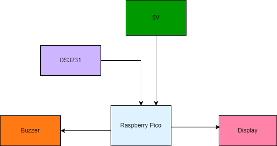
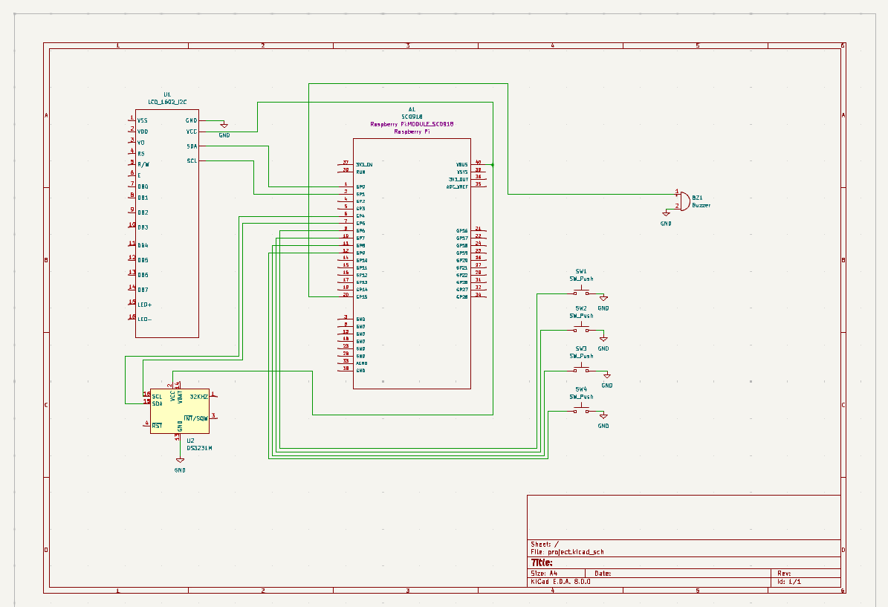
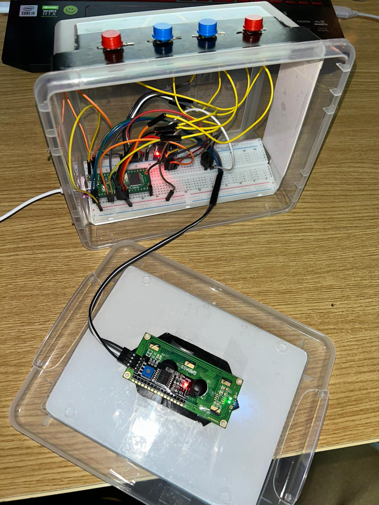
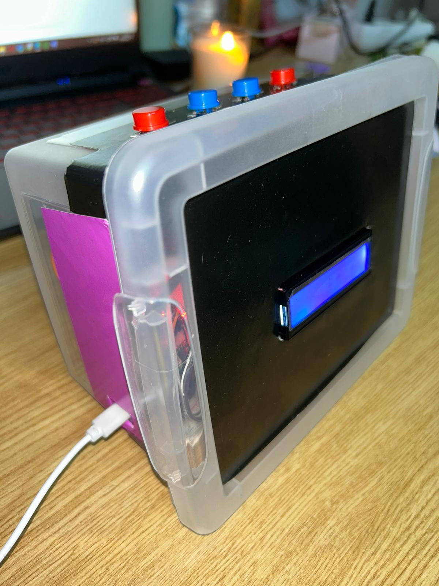
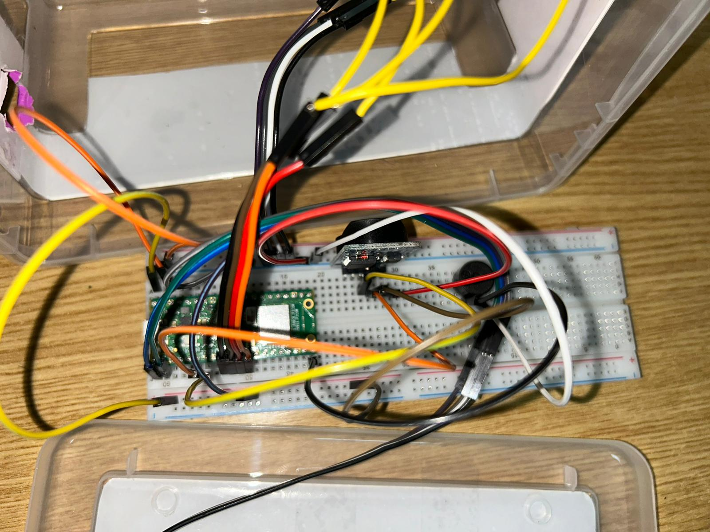
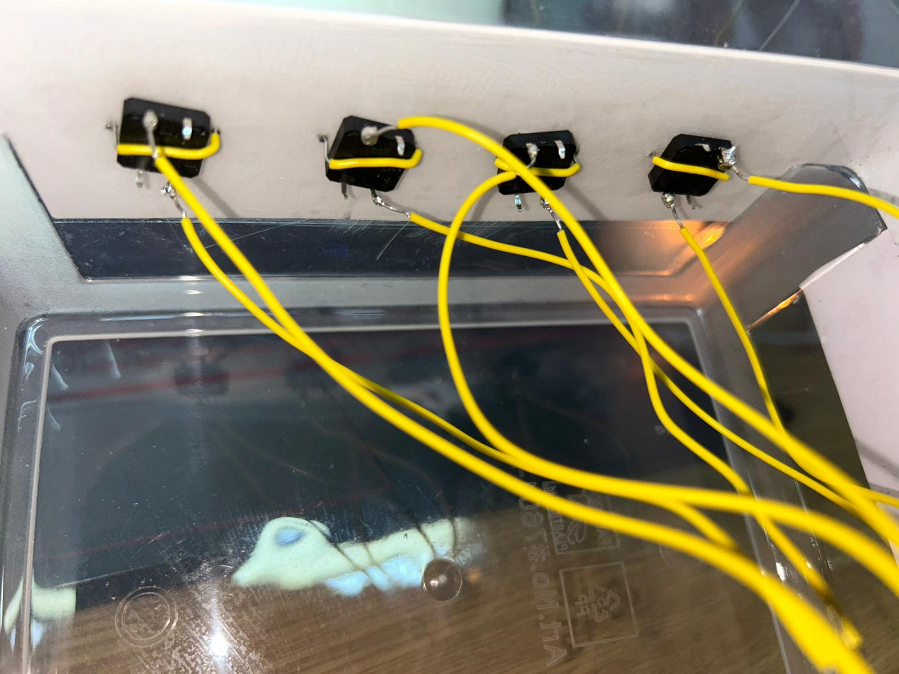

# WeatherSmart Clock
Smart Weather Clock with Alarm and Temperature Sensor

:::info 

**Author**: Nica Alexia-Stefania \
**GitHub Project Link**: https://github.com/UPB-FILS-MA/project-alexianicaa

:::

## Description

I'll design a user-friendly alarm clock with a real-time clock (RTC) module, LCD display, push buttons, and a buzzer. Additionally, I'll integrate smart weather features including customizable alarms, a temperature sensor, and weather indication. Users can set multiple alarms and will be alerted by a buzzer when the set alarm time arrives.

## Motivation

The motivation behind this project is to create a multifunctional clock that not only provides accurate timekeeping and customizable alarms but also offers real-time weather information in a fun and intuitive way. I chose this project because the clock is essential in our lives; whether you need to go to work, attend an appointment, or manage your daily tasks, knowing the time is crucial. Additionally, the weather function helps a lot when you want to know how to dress yourself.

## Architecture 


=======

*Main Components used in the WeatherSmart Clock project:*

  **1-Rasberry Pi Pico:** Microcontroller unit responsible for managing all operations.
  
  **2-LCD Display:** Shows the current temperature in Celcius.
  
  **3-Buzzer:** Acts as the audible alarm.
  
  **4-RTC Module:** Real time clock module used for accurate timekeeping

## Log

<!-- write every week your progress here -->

### Week 6 - 12 May
I started by buying the components I needed, then I connected them together.

### Week 7 - 19 May
I drew the Kicad schematics and I began writing the code.

### Week 20 - 26 May

## Hardware
In my project, the Raspberry Pi Pico microcontroller serves as the central processing unit, mandated for the task. Its low power consumption ensures efficiency throughout. It also reads data and time from the DS3231 real time clock module, and displays them, while also being able to send electrical signals to a buzzer for an alarm effect.


### Schematics







### Bill of Materials

<!-- Fill out this table with all the hardware components that you might need.

The format is 
```
| [Device](link://to/device) | This is used ... | [price](link://to/store) |

```

-->

| Device | Usage | Price |
|--------|--------|-------|
| [Rapspberry Pi Pico W](https://www.raspberrypi.com/documentation/microcontrollers/raspberry-pi-pico.html) | The microcontroller | [39 RON](https://www.optimusdigital.ro/ro/placi-raspberry-pi/12395-raspberry-pi-pico-wh.html?search_query=raspberry+pi+pico+wh&results=24) |
| [Buzzer Pasiv de 5 V](https://components101.com/misc/buzzer-pinout-working-datasheet) |Passive buzzer | [1.40 RON](https://www.optimusdigital.ro/ro/audio-buzzere/634-buzzer-pasiv-de-5-v.html?search_query=buzzer+pasiv&results=15)|
| [LCD Display](https://circuitdigest.com/article/16x2-lcd-display-module-pinout-datasheet)|Display|[15 RON](https://www.optimusdigital.ro/ro/optoelectronice-lcd-uri/62-lcd-1602-cu-interfata-i2c-si-backlight-galben-verde.html?search_query=lcd+1602+i2c&results=4)|
| [Push Button](https://components101.com/switches/push-button)|Push button|[2 RON](https://www.optimusdigital.ro/ro/butoane-i-comutatoare/1114-buton-cu-capac-rotund-rou.html?search_query=buton&results=222)|
| [RTC Module](https://www.analog.com/media/en/technical-documentation/data-sheets/DS3231.pdf)|Real time clock module|[15.98 RON](https://www.optimusdigital.ro/ro/altele/12402-modul-cu-ceas-in-timp-real-ds3231.html?search_query=ds3231&results=5)|
| Breadboard|Breadboard|[9.98 RON](https://www.optimusdigital.ro/ro/prototipare-breadboard-uri/8-breadboard-830-points.html?search_query=breadboard&results=145)|


## Software

| Library | Description | Usage |
|--------|--------|-------|
|[DHT11](https://docs.rs/dht11/latest/dht11/)|DHT11 rust library|Used to interact with DHT11 temperature sensor|
|[DS323x](https://lib.rs/crates/ds323x)|DS3231 rust library|Used to interact with DS3231 RTC module|
|[Embassy_rp](https://docs.embassy.dev/embassy-rp/git/rp2040/index.html)|Peripheral access library|Used for accessing the peripherals|


## Links
1.[PM projects 2023](https://ocw.cs.pub.ro/courses/pm/prj2023) \
2.[Raspberry Pi Pico Project - Thermometer & Clock](https://www.youtube.com/watch?v=gBofy7MMdIY)
