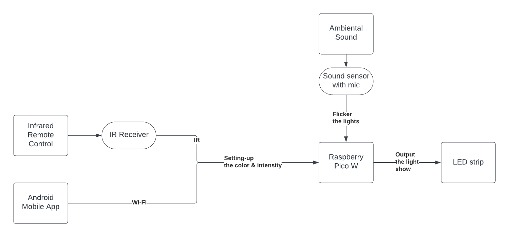
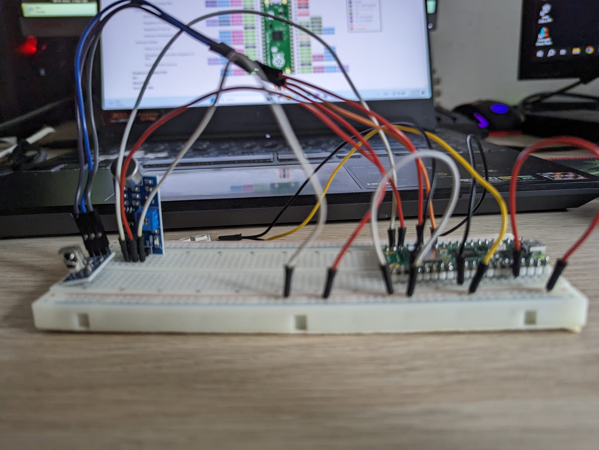
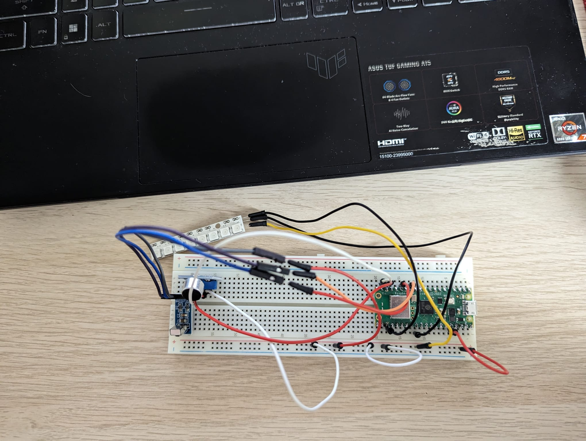
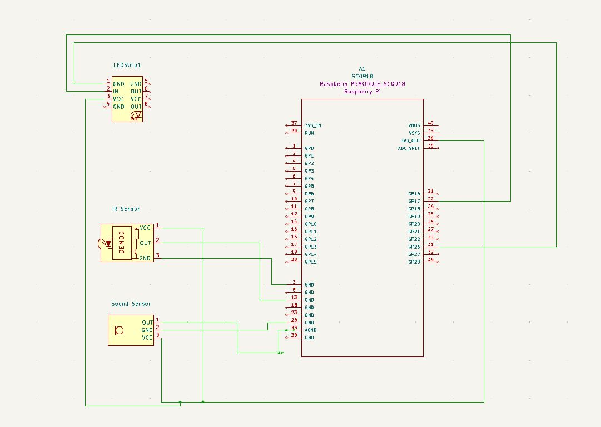

# Music Lights

A LED strip that responds to music and lights up the room accordingly.

:::info 

**Author**: BARABAȘ Cătălin-Gabriel \
**GitHub Project Link**: https://github.com/UPB-FILS-MA/project-cata-g

:::

## Description

The intensity of the LED strip will be adjusting based on ambiental sounds. The colors of the LED strip will be changed using the remote or the mobile application developed for this project using Android Studio.

## Motivation

This project's root stands in my love for ambient lighting from my computer setup. Also, I love listening to music while working, so I found this challenge a good addition to my environment.

## Architecture



- The light show will be on as long as the Raspberry PI will be plugged in
- The IR sensor will capture the signals from the remote
- The Sound sensor will capture the music in the background
- The Led Strip will flicker accordingly

## Log

<!-- write every week your progress here -->

### Week 6 - 12 May

This week, I spent a lot of time refining and re-evaluating ideas to identify a suitable project. I also managed to gather the necessary components for the project, but overall, there wasn't much progress made.

### Week 12 - 19 May

This week, I set up all the hardware on the breadboard and in KiCad. The main issue I encountered was with the sound sensor obtained last week, as it was not compatible with a Pico W. Fortunately, I got a new, more compatible sensor. During the KiCad process, I also had to modify some sensors to match what I have in the actual project.

### Week 20 - 26 May

This week, I restarted the project a lot of times until I was able to run some working code. I had a lot of problems and it was really hard to find the proper documentation. However, it was really satisfing to light up the band strip in the end.

## Hardware

In the project, the Raspberry Pi Pico W runs the logic behind the project. The Infra-Red will capture de remote control signal and will tell the micro-controller to change the intensity and the color of the LED strip. The Sound Sensor will capture the environment sound and turn on/off the LED strip to flicker on the music played. 

Here it is the actual setup:



### Schematics



### Bill of Materials

<!-- Fill out this table with all the hardware components that you might need.

The format is 
```
| [Device](link://to/device) | This is used ... | [price](link://to/store) |

```

-->

| Device | Usage | Price |
|--------|--------|-------|
| [Rapspberry Pi Pico W](https://www.raspberrypi.com/documentation/microcontrollers/raspberry-pi-pico.html) | The microcontroller | [35 RON](https://www.optimusdigital.ro/en/raspberry-pi-boards/12394-raspberry-pi-pico-w.html) |
| [Pin Header for Raspberry PI](https://static.optimusdigital.ro/60928-thickbox_default/header-de-pini-alb-254-mm-40p.jpg) | The pins for the breadboard | [0.99 RON](https://www.optimusdigital.ro/ro/componente-electronice-headere-de-pini/463-header-de-pini-alb-254-mm-40p.html) |
[LED Strip](https://static.optimusdigital.ro/23166-thickbox_default/bara-de-led-uri-rgb-ws2812-cu-8-led-uri.jpg) | The LED strip | [6.99 RON](https://www.optimusdigital.ro/ro/optoelectronice-bare-cu-leduri/753-bara-de-led-uri-rgb-ws2812-cu-8-led-uri.html)|
|[Sound Sensor](https://static.optimusdigital.ro/64125-large_default/modul-senzor-sunet-fara-cablu.jpg) | The sound sensor | [2.99 RON](https://www.optimusdigital.ro/ro/senzori-altele/12325-modul-senzor-sunet-fara-cablu.html) |
| [IR Sensor](https://static.optimusdigital.ro/23230-thickbox_default/modul-receptor-telecomanda-infrarou.jpg) | The infra-red sensor |[8.99 RON](https://www.optimusdigital.ro/ro/altele/755-modul-receptor-telecomanda-infrarou.html) |
| [Remote Control](https://static.optimusdigital.ro/52355-thickbox_default/mini-telecomanda.jpg) | The IR Remote Control | [3.60 RON](https://www.optimusdigital.ro/ro/altele/11-mini-telecomanda.html) |

## Software

| Library | Description | Usage |
|---------|-------------|-------|
| **embassy-rp**(https://docs.embassy.dev/embassy-rp/git/rp2040/index.html#)                             | Provides a Hardware Abstraction Layer (HAL) for the RP2040 microcontroller, enabling easy access to peripherals like PIO, DMA, and ADC.                                 | Controls WS2812 LED strip and reads data from the sound sensor.                                                                                                               |
| **embassy-executor**(https://docs.rs/embassy-executor/latest/embassy_executor/)                       | An asynchronous executor designed for embedded systems. It allows running multiple tasks concurrently using `async/await`.                                          | Manages the execution of the `main` function and other asynchronous tasks in the program.                                                                                       |
| **embassy-time**(https://docs.rs/embassy-time/latest/embassy_time/)                           | Provides time-related utilities for embedded environments, such as `Duration`, `Instant`, and asynchronous timers.                                                  | Used to introduce delays in the control of the WS2812 LEDs and sound sensor polling.                                                                                           |
| **rp2040-hal**(https://docs.rs/rp2040-hal/latest/rp2040_hal/)                             | A Rust Embedded-HAL implementation for the RP2040 microcontroller.                                                                                                 | Dependency for the embassy-rp crate, providing a standardized interface for interacting with the hardware.                                                                      |                                                                           |
| **defmt**(https://github.com/knurling-rs/defmt)                                  | A logging framework optimized for embedded devices, offering efficient formatting and transmission of log messages.                                                 | Used to print log messages for debugging and monitoring the program's execution.                                                                                              |
| **defmt-rtt**(https://crates.io/crates/defmt-rtt)                              | Provides a Real-Time Transfer (RTT) backend for defmt, allowing log messages to be streamed over a debug probe connection.                                          | Allows viewing the defmt log messages in real-time using a debug probe.                                                                                                       |
| **cortex-m** & **cortex-m-rt**(https://github.com/rust-embedded/cortex-m)              | Core crates for programming ARM Cortex-M microcontrollers, providing low-level access to processor features and startup code.                                         | Essential for running code on the RP2040 microcontroller.                                                                                                                     |
| **panic-probe**(https://crates.io/crates/panic-probe)                            | Redirects panic messages to the defmt logging framework, which can then be viewed over RTT.                                                                           | Helps diagnose crashes and panics in the program during development.                                                                                                         |
| **pio**(https://docs.rs/pio/latest/pio/)                                    | Provides abstractions for working with the PIO (Programmable Input/Output) peripheral of the RP2040.                                                                   | Used to configure and control the PIO state machine for generating the WS2812 timing signals.                                                                                 |
| **smart-leds**(https://github.com/smart-leds-rs/smart-leds)                             | A library for controlling addressable LED strips and matrices, supporting various protocols and pixel formats.                                                      | Simplifies the generation of color data for the WS2812 LED strip.                                                                                                             |
| **fixed** & **fixed-macro**(https://docs.rs/fixed-macro/latest/fixed_macro/)                | Libraries for fixed-point arithmetic, useful for calculations where fractional precision is needed without the overhead of floating-point operations.                  | Used in the clock configuration calculations for the WS2812 PIO state machine.                                                                                               |                                                                       |
| **embassy-usb-logger**(https://docs.rs/embassy-usb-logger/latest/embassy_usb_logger/)                     | Allows for logging messages to be sent over USB, providing an alternative to RTT for debugging and monitoring.                                                      | Not used in this code snippet, but it is included as a dependency and can be enabled for USB logging.                                                                          |
| **embedded-hal** & **embedded-hal-async**(https://docs.rs/embedded-hal/latest/embedded_hal/) | Provides standard traits for interacting with embedded hardware in a platform-agnostic way, including both blocking and asynchronous interfaces.                     | Used internally by embassy-rp and other libraries to abstract over different hardware peripherals and communication protocols.                                                   |

## Links

<!-- Add a few links that inspired you and that you think you will use for your project -->

1. [Raspberry Pi Audio Reactive LED Strip (2020)](https://www.youtube.com/watch?v=7YLF-N0596I)
2. [Sound Reactive WS LED With Raspberry Pi Pico](https://www.youtube.com/watch?v=PaSVcxk2iVk)
3. [Audio Reactive Lights with Raspberry Pi](https://www.youtube.com/watch?v=FA9rMkuVmvQ)