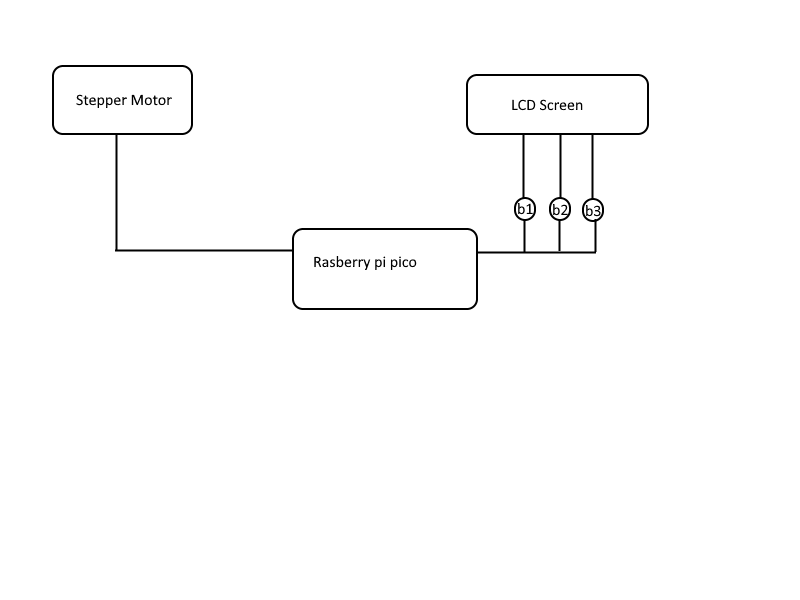
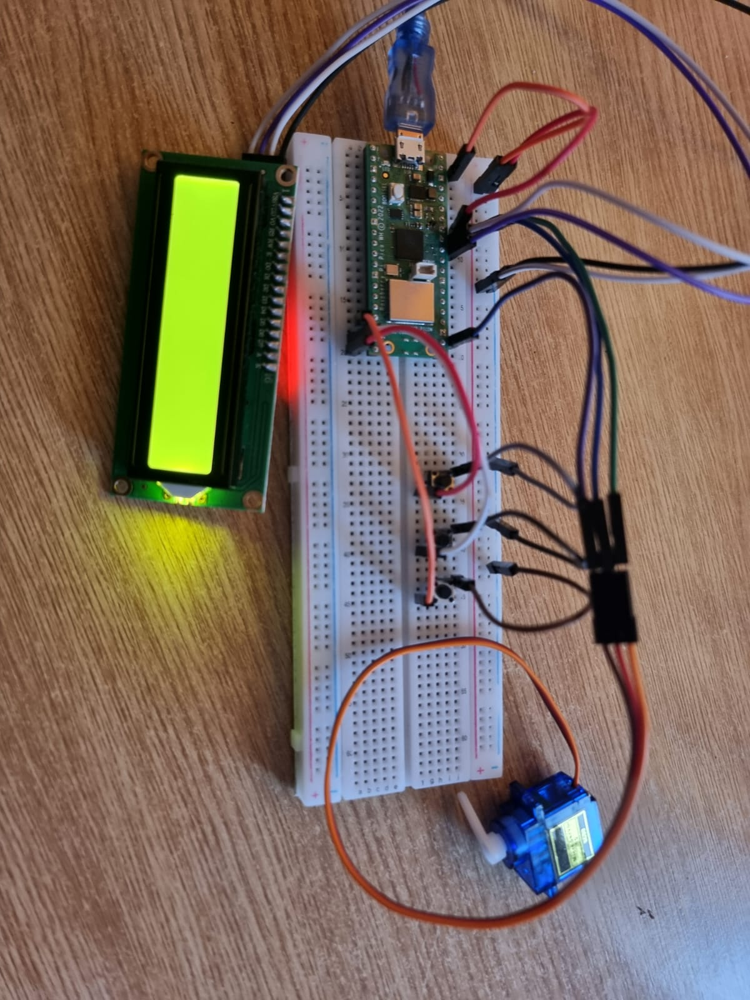
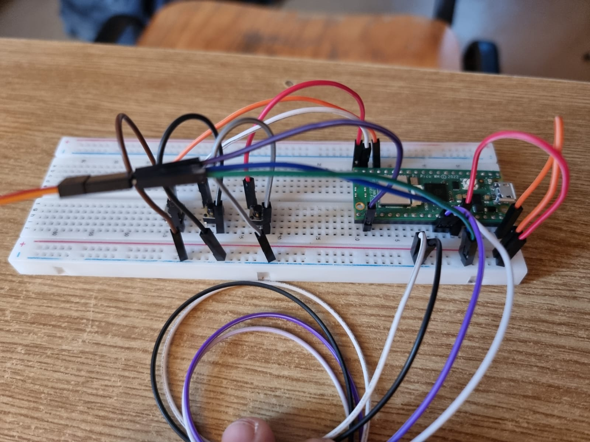
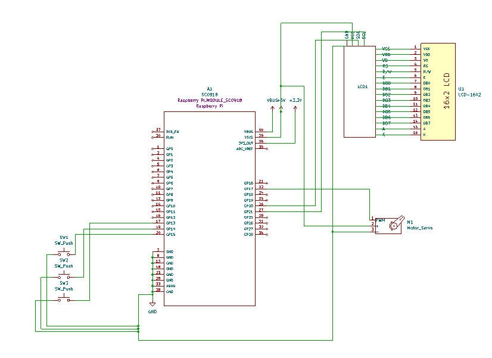

# Drawbridge/Ramp
A mechanism that can be used in a bigger scale as a drawbridge or in a smaller scale as a ramp.

:::info 

**Author**: Ciuraru Costin Cristian \
**GitHub Project Link**: https://github.com/UPB-FILS-MA/project-ciurarucostin

:::

:::

## Description

Using a motor, we will have multiple presets that will make the bridge/ramp rise to a specific angle, depending on the button pressed.
The lcd screen will show what preset will be used, for example 1 for a 30 degrees rise, 2 for a 60 degrees rise and so on.

## Motivation

I chose this project for seeing a lack of this type of mechanism in my country, drawbridges could be used in the future as we have a lot of rivers in our country. The project 
could also be used as a ramp for people in wheelchairs to be able to enter buildings without hadicapped acces, for cars to be able to get over obstacles, and the posibilites are limitless.

Being able to use my passion for electronics to help people and make life easier in general is amazing. This is a great oportunity to deepen my knowledge of 
embedded systems and multiple mechanical and electrical parts, which are crucial in my studies and future career in technolo

## Architecture 



The **Raspberry Pi Pico** serves as the central control unit, directing and managing all other components utilized within the project.


The **LCD** serves as an interface for showcasing preset used to raise the ramp, it is connected to the Pico through I2C

The **stepper-motor** is connected to an improvised ramp that will be raised in function of the button pressed.

## Log

<!-- write every week your progress here -->

### Week 6 - 12 May

### Week 7 - 19 May

Changeed from using a stepper motor to a servo-motor.
| [Servo Motor](http://www.ee.ic.ac.uk/pcheung/teaching/DE1_EE/stores/sg90_datasheet.pdf) | The servo motor | [14 RON](https://www.optimusdigital.ro/en/servomotors/26-sg90-micro-servo-motor.html?search_query=servo+motor&results=196) |


### Week 20 - 26 May

## Hardware

In my project, the Raspberry Pi Pico microcontroller serves as the central processing unit, mandated for the task. Its low power consumption ensures efficiency throughout. The LCD Screen will show what preset will be used, in function of the button pressed, the stepper motor will rise the ramp to a specified angle.


This is a picture that shows the connections of the rasberry pi pico to the components:


This is a picture that shows the breadbord from behind:


This is from above:


### Schematics



### Bill of Materials

<!-- Fill out this table with all the hardware components that you might need.

The format is 
```
| Device | Usage | Price |
|--------|--------|-------|
| [Rapspberry Pi Pico W](https://www.raspberrypi.com/documentation/microcontrollers/raspberry-pi-pico.html) | The microcontroller | [35 RON](https://www.optimusdigital.ro/en/raspberry-pi-boards/12394-raspberry-pi-pico-w.html) |
| [LCD Display](https://www.waveshare.com/datasheet/LCD_en_PDF/LCD1602.pdf) | LCD Display| [30 RON](https://www.optimusdigital.ro/ro/optoelectronice-lcd-uri/62-lcd-1602-cu-interfata-i2c-si-backlight-galben-verde.html?search_query=lcd+1602&results=17) |
| Stepper Motor | Stepper Motor | [48,99 RON](https://www.optimusdigital.ro/ro/motoare-motoare-pas-cu-pas/3912-motor-pas-cu-pas-42hb34f08ab.html?search_query=stepper+motor&results=48) |

```

-->

| Device | Usage | Price |
|--------|--------|-------|
| [Rapspberry Pi Pico W](https://www.raspberrypi.com/documentation/microcontrollers/raspberry-pi-pico.html) | The microcontroller | [35 RON](https://www.optimusdigital.ro/en/raspberry-pi-boards/12394-raspberry-pi-pico-w.html) |
| [LCD Display](https://www.waveshare.com/datasheet/LCD_en_PDF/LCD1602.pdf) | LCD Display| [30 RON](https://www.optimusdigital.ro/ro/optoelectronice-lcd-uri/62-lcd-1602-cu-interfata-i2c-si-backlight-galben-verde.html?search_query=lcd+1602&results=17) |
| [Stepper Motor](https://pages.pbclinear.com/rs/909-BFY-775/images/Data-Sheet-Stepper-Motor-Support.pdf)| The motor | [48,99 RON](https://www.optimusdigital.ro/ro/motoare-motoare-pas-cu-pas/3912-motor-pas-cu-pas-42hb34f08ab.html?search_query=stepper+motor&results=48) |


## Software

| Library | Description | Usage |
|---------|-------------|-------|
|[embassy-time](https://embassy.dev/book/dev/time_keeping.html)|Time management library  |Used for time-based operations such as delays |
|[embassy-rp](https://docs.embassy.dev/embassy-rp/git/rp2040/index.html)| Peripheral access library |Used for initializing and interacting with peripherals |
|[pwm](https://docs.embassy.dev/embassy-nrf/git/nrf52840/pwm/index.html)|Pulse-width modulation |Used for controlling the buzzer's sound |
|[embassy-executor](https://docs.embassy.dev/embassy-executor/git/std/index.html)|Asynchronous executor for Rust embedded systems| Used for task scheduling and asynchronous programming|


## Links

<!-- Add a few links that inspired you and that you think you will use for your project -->

1. [Automation of Drawbridge Model Using Raspberry Pi](https://www.technoarete.org/common_abstract/pdf/IJERECE/v8/i8/Ext_18573.pdf)
2. [How to use a stepper motor](https://www.youtube.com/watch?v=nydRO0k2aKY)
...
