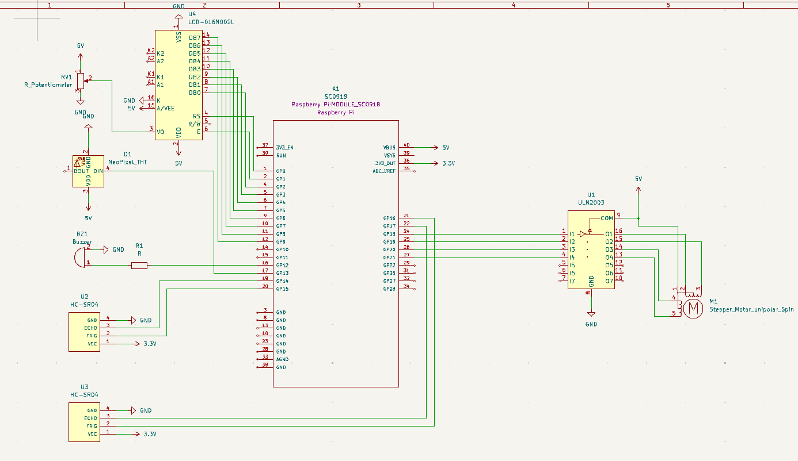
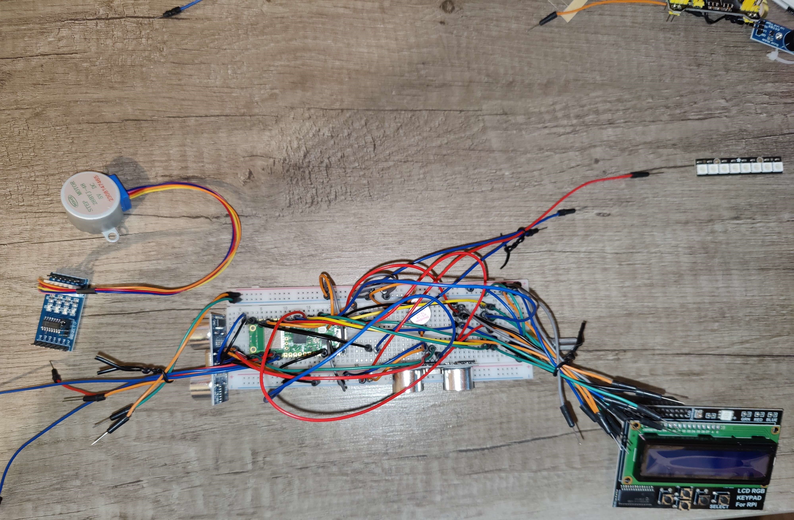
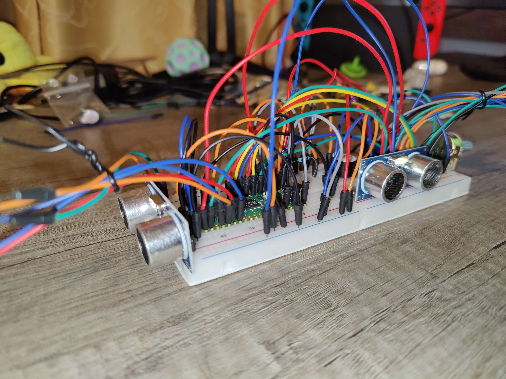

# Parking sensor with barrier control
Proximity-based parking sensor which controls a barrier on a set timer

:::info 

**Author**: Rosoiu Luca \
**GitHub Project Link**: https://github.com/UPB-FILS-MA/project-LucaRosoiu

:::

## Description

The project consists of a smart parking sensor which will detect the presence of other objects and will emmit sound and light signals when the distance is within a certain range. The signals will grow in intensity and be more frequent the closer the said object is, until it reaches the climax, at which point the emmited light becomes red and the sound is static.

Moreover, the project includes a barrier control system, which will consist of a barrier with an attached sensor that will be lifted once it detects an object get within its range. When that happens, a countdown timer will start until the barrier goes back down, just like a real life parking barrier.

## Motivation

I have been interested in cars for as long as I can remember, so I have been thinking about a way to make this project be related to a component of a real car. Therefore, I took this as an opportunity to learn how parking sensors and parking barriers work in real life.

## Architecture 


## Log

<!-- write every week your progress here -->

### Week 6 - 12 May

Switched the doppler sensor with the ultrasonic HC-SR04 sensor and the simple LED with an LED strip that changes colors based on the proximity (Green->Yellow->Red)

### Week 7 - 19 May

Integrated an LCD screen to display the distance between the object and the sensor for the parking sensor. 
Designed the KiCAD schematic for the project and finished the conceptual state of hardware, however I forgot to purchase female-male // female-female wires.

### Week 20 - 26 May

## Hardware

An ultrasonic HC-SR04 sensor will represent the base of both the parking sensor and the barrier control sensor. For the parking sensor, it will light up an LED strip that will change colors (Green->Yellow->Red) based on proximity and will trigger a buzzer that will emmit sounds and increase in frequency up until the "climax", when it emmits a static sound. The distance from the car to the sensor will be displayed on an LCD screen. As for the barrier control sensor, it will lift the barrier up and start a countdown until the barrier goes back down.

### Schematics



### Photos




### Bill of Materials

<!-- Fill out this table with all the hardware components that you might need.

The format is 
```
| [Device](link://to/device) | This is used ... | [price](link://to/store) |

```

-->

| Device | Usage | Price |
|--------|--------|-------|
| [Rapspberry Pi Pico W](https://www.raspberrypi.com/documentation/microcontrollers/raspberry-pi-pico.html) | The microcontroller | [35 RON](https://www.optimusdigital.ro/en/raspberry-pi-boards/12394-raspberry-pi-pico-w.html) |
| [2x Ultrasonic Sensor HC-SR04](https://web.eece.maine.edu/~zhu/book/lab/HC-SR04%20User%20Manual.pdf) | This will be at the base of both the parking sensor and the parking barrier sensor | [30 RON](https://www.optimusdigital.ro/en/ultrasonic-sensors/2328-senzor-ultrasonic-de-distana-hc-sr04-compatibil-33-v-i-5-v.html) |
| [Stepper Motor 28BYJ-48 5V with ULN2003 Driver](https://components101.com/motors/28byj-48-stepper-motor) | the motor to control the barrier arm | [17 RON](https://www.optimusdigital.ro/ro/motoare-motoare-pas-cu-pas/101-driver-uln2003-motor-pas-cu-pas-de-5-v-.html) |
| [Breadboard Kit](https://os.mbed.com/handbook/Breadboard) | To place the components | [22 RON](https://www.optimusdigital.ro/ro/kituri/2222-kit-breadboard-hq-830-p.html?search_query=breadboard&results=145) |
| [LCD Hat 1602 Screen](https://www.waveshare.com/datasheet/LCD_en_PDF/LCD1602.pdf) | LCD Screen to display distance | [56 RON](https://www.optimusdigital.ro/ro/lcd-uri/1158-lcd-hat-1602-pentru-raspberry-pi.html) |
| [Potentiometer](https://www.handsontec.com/dataspecs/passive/WH148%20Pot-meter.pdf) | Potentiometer for the LCD contrast | [56 RON](https://www.optimusdigital.ro/ro/componente-electronice-potentiometre/901-rezistor-variabil-10k-wh148.html) |
| [Adafruit NeoPixel 8 x 5050 LED Strip](https://www.adafruit.com/product/1426) | The LED strip | [50 RON](https://www.optimusdigital.ro/ro/optoelectronice-bare-cu-leduri/12522-bara-de-led-uri-adafruit-neopixel-8-x-5050-rgb-led.html) |
| [Buzzer](https://www.arduino.cc/reference/en/libraries/buzzer/) | The Buzzer | [2 RON](https://www.optimusdigital.ro/ro/audio-buzzere/635-buzzer-activ-de-3-v.html) |
| [220Ω Resistor](https://digchip.com/datasheets/parts/datasheet/1838/CFR-25JB-220R.php) | Resistor for the buzzer | [1 RON](https://www.optimusdigital.ro/ro/componente-electronice-rezistoare/10958-rezistor-05w-220.html) |


## Software

| Library | Description | Usage |
|---------|-------------|-------|
| [uln2003](https://github.com/MnlPhlp/uln2003) | Driver for the stepper motor | Used for integrating the motor with rust |
| [pwm](https://docs.embassy.dev/embassy-nrf/git/nrf52840/pwm/index.html)| PWM | Used for controlling the sound intensity of the buzzer |
| [gpio](https://docs.embassy.dev/embassy-stm32/git/stm32c011d6/gpio/index.html)| GPIO | Used for interacting with GPIO pins |
| [embassy-time](https://embassy.dev/book/dev/time_keeping.html)| Managing time | Used for time-based delays for the barrier |
| [embassy-rp](https://docs.embassy.dev/embassy-rp/git/rp2040/index.html)| Peripheral access library | Interacting with the peripherals |

## Links

<!-- Add a few links that inspired you and that you think you will use for your project -->

1. [Parking Sensor Video Example](https://www.youtube.com/watch?v=rDsevkPFaKI&ab_channel=AkaSoggyBunz)
2. [Parking Sensor Architecture](https://www.instructables.com/Raspberry-Pi-Park-Sensor/)
3. [Barrier Video Example](https://www.youtube.com/watch?v=Ko_pbHlJ1mE&ab_channel=SaiAnirudhG)
