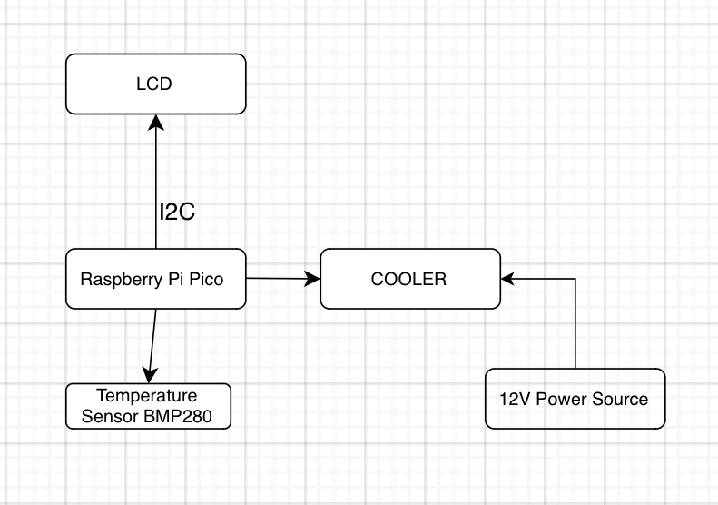

# Kalman Temperature Alert System

Temperature alert system using the Kalman Filter for perfect accuracy

:::info

**Author**: Fotescu Maria-Irina, Economu Teo-Antonio \
**GitHub Project Link**: https://github.com/UPB-FILS-MA/project-economuteo

:::

## Description

We are looking to have a clock that presents the current time and the temperature on a LCD 1602 which has an I2C interface. We will set a certain threshold on the sensor. If the temperature surpases this limit, the buzzer will start ringing and the cooler will try to cool down the sensor in order to bring the temperature back to optimal levels. In order for us to be informed about the temperature increase, the display will show a warning message and the buzzer will start ringing once the threshold is reached. For a very accurate measurement, we are going to use the Kalman Filter.

## Motivation

We are both loving mathematics, so the idea of combining complex mathematics with the Rust language and all the hardware part really drives us and keeps us going forward in pursuing an amazing project.

## Architecture

## Log

<!-- write every week your progress here -->

### Week 6 - 12 May
This week, we focused on finalizing the hardware setup for our Rust project. We faced several challenges, particularly in aligning the components correctly and ensuring stable connections. Despite these obstacles, we successfully completed the hardware assembly and we made sure that each component functions properly. The temperature sensor and fan were tested individually to ensure they responded as expected. By the end of the week, we had a fully assembled hardware setup ready for integration with the software phase.

### Week 7 - 19 May
So far, we managed to do everything related to the hardware part and almost finding a way to fix the display on the 3D print. On the journey to finish this milestone we've faced some difficulties when it came to realizing a perfect scheme in Thinkercad, but in the end we managed to do it not just on point, but also with the fan perfectly centered above the temperature sensor so the cooling part it's made as efficient as possible.

### Week 20 - 26 May
This week, we transitioned from the hardware phase to the software phase for our Rust project. Our main focus was on setting up the development environment and beginning to write the initial codebase. We encountered some initial challenges in configuring the software to interact with the hardware components, particularly with the temperature sensor and the fan. After some troubleshooting and debugging, we made significant progress. By the end of the week, we had a basic version of the software running, which successfully reads data from the temperature sensor and controls the fan speed accordingly. Our next steps will involve refining the software, adding more features, and test everything to ensure it works seamlessly.

## Hardware

### Short description

The hardware utilized includes a Raspberry Pi Pico microcontroller, a breadboard as the main board, an LCD 1602 with I2C Interface for display, a Barometric BMP280 GY pressure sensor, a buzzer, and various connectors along with an 80mm cooler.

### Gallery

### Schematic

### Bill of Materials

| Device                                  | Usage                              | Price                             |
| ---------------------------------------- | ---------------------------------- | ---------------------------------- |
| [Rapspberry Pi Pico](https://www.raspberrypi.com/documentation/microcontrollers/raspberry-pi-pico.html)    | The microcontroller | [39 RON](https://www.optimusdigital.ro/en/raspberry-pi-boards/12394-raspberry-pi-pico-w.html)                                                                                                                                                                                        |
| [Breadboard](https://components101.com/sites/default/files/component_datasheet/Breadboard%20Datasheet.pdf) | Main board          | [0 RON(Already had this)](https://www.emag.ro/kit-plusivo-microcontroller-starter-programabil-in-arduino-ide-x001fpqyl1/pd/DKJN9VMBM/?utm_source=mobile%20app&utm_medium=ios&utm_campaign=share%20product)                                                                           |
| [LCD 1602 with I2C Interface](https://www.waveshare.com/wiki/LCD1602_I2C_Module)                           | Display             | [16,34 RON](https://www.optimusdigital.ro/ro/optoelectronice-lcd-uri/2894-lcd-cu-interfata-i2c-si-backlight-albastru.html)                                                                                                                                                           |
| [Pressure sensor Barometric BMP280 GY](https://components101.com/sensors/gy-bmp280-module)                 | Pressure Sensor     | [8,49 RON](https://www.optimusdigital.ro/ro/senzori-senzori-de-presiune/1666-modul-senzor-de-presiune-barometric-bmp280.html?search_query=BMP280&results=11)                                                                                                                         |
| [Buzzer](https://www.farnell.com/datasheets/2171929.pdf)                                                   | Buzzer              | [0 RON (Already had this)](https://www.emag.ro/kit-plusivo-microcontroller-starter-programabil-in-arduino-ide-x001fpqyl1/pd/DKJN9VMBM/?utm_source=mobile%20app&utm_medium=ios&utm_campaign=share%20product)                                                                          |
| 4 Mother-Father wires 30 cm                                                                                | Connectors          | [0 RON(Already had this)](https://www.emag.ro/kit-plusivo-microcontroller-starter-programabil-in-arduino-ide-x001fpqyl1/pd/DKJN9VMBM/?utm_source=mobile%20app&utm_medium=ios&utm_campaign=share%20product)                                                                           |
| 6 Father-Father wires                                                                                      | Connectors          | [0 RON(Already had this)](https://www.emag.ro/kit-plusivo-microcontroller-starter-programabil-in-arduino-ide-x001fpqyl1/pd/DKJN9VMBM/?utm_source=mobile%20app&utm_medium=ios&utm_campaign=share%20product)                                                                           |
| [Cooler 80mm](https://www.nteinc.com/fans/80x80.pdf)                                                       | Cooler              | [10,83 RON](https://www.optimusdigital.ro/ro/altele/4906-cooler-carcasa.html?search_query=cooler&results=14&HTTP_REFERER=https%3A%2F%2Fwww.optimusdigital.ro%2Fro%2Fcautare%3Fcontroller%3Dsearch%26orderby%3Dposition%26orderway%3Ddesc%26search_query%3Dcooler%26submit_search%3D) |

## Software

| Library                                  | Description                        | Usage                              |
| ---------------------------------------- | ---------------------------------- | ---------------------------------- |
| [embassy-rp](https://crates.io/crates/embassy-rp) | Embassy Hardware Abstraction Layer (HAL) for the Raspberry Pi RP2040 microcontroller | Used for `initializing` hardware devices such as the Display, Buzzer, Fan and Sensor. |
| [embassy-embedded-hal](https://crates.io/crates/embassy-embedded-hal) | Collection of utilities to use `embedded-hal` and `embedded-storage` traits with Embassy. | Dependency of `embassy-rp` used for adding `embedded-hal` traits to embassy |
| [embassy-time](https://embassy.dev/) | Instant and Duration for embedded no-std systems, with async timer support | Stops code execution for a predefined time period |
| [embassy-executor](https://crates.io./crates/embassy-executor) | async/await executor designed for embedded usage | Used for spawning/tasking asynchronous functions like `main` and tasking functions like `logger-task` |
| [lcd1602-driver](https://crates.io/crates/lcd1602-driver) | An embedded-hal based driver for the LCD1602 display | Used for defining and customizing display's `traits` and `features` |
| [heapless](https://crates.io/crates/heapless) | `static` friendly data structures that don't require dynamic memory allocation | Used for defining `vectors` and for variables `unsigned` to `String` conversion |

## Links

<!-- Add a few links that inspired you and that you think you will use for your project -->

1. [LED Matrix](https://www.instructables.com/64x32-LED-Matrix-Clock/)
2. [Obtain Temperature Data from Raspberry Pi Pico](https://www.instructables.com/Obtain-Temperature-Data-From-on-Board-Temperature-/)
3. [Controlling an I2C Display with Arduino](https://www.instructables.com/Controlando-display-LCD-I2C-con-Arduino/)
4. [Heat Activated Cooling Fan](https://www.instructables.com/Heat-activated-cooler-fan/)
5. [Kalman Filter](https://www.intechopen.com/chapters/76884)
