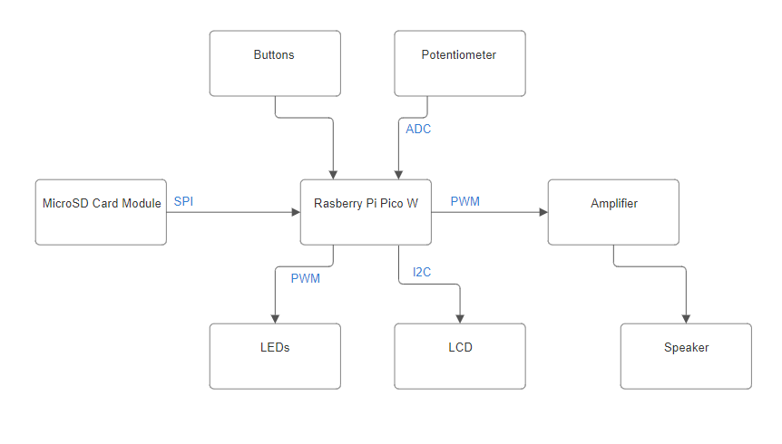

# Music Player
This project is a compact music player built with a Raspberry Pi Pico W, using Rust for development. It retrieves songs from a microSD card and outputs them to a speaker. 

:::info


**Author**: Popescu Mihai-Cristian \
**GitHub Project Link**: https://github.com/UPB-FILS-MA/project-mihaio3


:::


## Description

This project showcases a portable music player crafted using a Raspberry Pi Pico W and Rust programming language. It incorporates an SPI-connected microSD module to access songs, delivering crisp audio via a speaker coupled with an amplifier. Music is emitted through PWM modulation, ensuring quality sound reproduction. The user interface is streamlined with push buttons for fundamental functions like song navigation and playback control, complemented by a potentiometer for seamless volume adjustment. An I2C LCD screen provides song title display. Additionally, a series of PWM-controlled LEDs offer a lively visual interpretation of the music's dynamics, synchronizing brightness with the audio output's PWM duty cycle.

## Motivation

Constructing a music player using a Raspberry Pi Pico W and Rust presented me with an opportunity to delve into a project tailored to my interests while acquiring essential skills in microcontroller programming and hardware integration. As a music enthusiast, the prospect of merging technology with my passion intrigued me.

## Architecture 



## Log

<!-- write every week your progress here -->

### Week 6 - 12 May

### Week 7 - 19 May

### Week 20 - 26 May

## Hardware

Detail in a few words the hardware used.


### Bill of Materials

<!-- Fill out this table with all the hardware components that you might need.

The format is 
```
| [Device](link://to/device) | This is used ... | [price](link://to/store) |

```

-->

| Device | Usage | Price |
|--------|--------|-------|
| [Rapspberry Pi Pico W](https://www.raspberrypi.com/documentation/microcontrollers/raspberry-pi-pico.html) | The microcontroller | [35 RON] |
| [1602 LCD](https://www.waveshare.com/datasheet/LCD_en_PDF/LCD1602.pdf) | LCD Display | [16 RON] |
| [Amplifier](https://www.mouser.com/datasheet/2/115/PAM8403-247318.pdf) | Boosts audio output | [3.99 RON] |
| Buttons | Play/Pause and previous/next song | [2.16 RON] |
| Different color leds | Visual representation of the music's intensity | [6 RON] |
| Wires | Connects electronic components | [13.79 RON] |
| Breadboard | Component integration | [9.98 RON] |
| Potentiometer | Adjust volume | [2.36 RON] |
| Speaker | Outputs the song | [4.27 RON] |
| Resistors | Limits current flow | [14.99 RON] |
| MicroSD Card Module | Reads the song from the microSD| [4.39 RON] |
| Capacitor | Low-pass filter(RC) | [0.39 RON] |


## Software

| Library | Description | Usage |
|---------|-------------|-------|
| [embedded-sdmmc-rs](https://github.com/rust-embedded-community/embedded-sdmmc-rs) | MicroSD card management | Used for reading the files from microSD |
| [HD44780-driver](https://github.com/JohnDoneth/hd44780-driver) | LCD display driver | Used for displaying the name of the song playing |

## Links

<!-- Add a few links that inspired you and that you think you will use for your project -->

1. [How to connect SD Card to Raspberry Pi Pico using SPI](https://www.youtube.com/watch?v=JrYT7aJnP_I)
2. [How to use the LCD using I2C](https://www.tomshardware.com/how-to/lcd-display-raspberry-pi-pico)
3. Check and search for dependecies: [1](https://docs.rs/), [2](https://crates.io/)
4. [Example of how to play music using PWM](https://bandarra.me/2022/08/02/Play-Music-with-the-Raspberry-Pi-Pico-and-Rust/)
5. [Audio output circuit example](https://www.hackster.io/news/learn-how-to-use-pwm-to-generate-an-audio-signal-from-your-raspberry-pi-pico-00347dece8b8)
