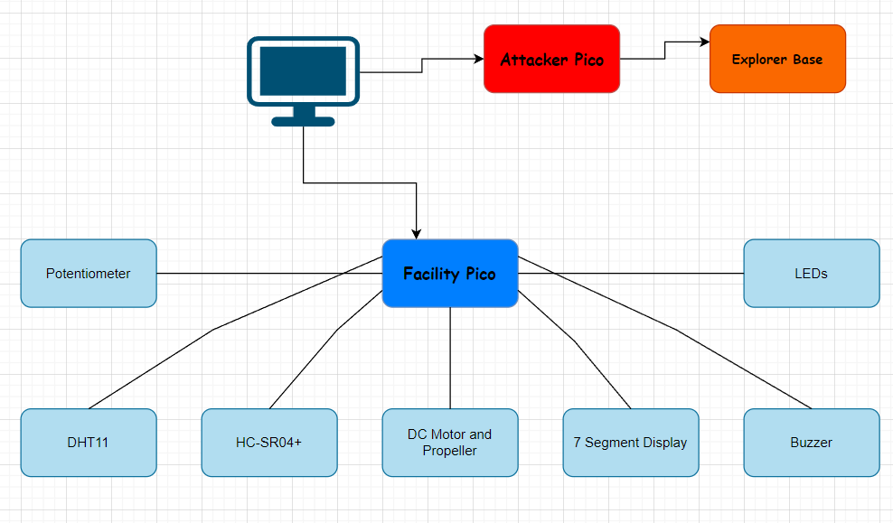
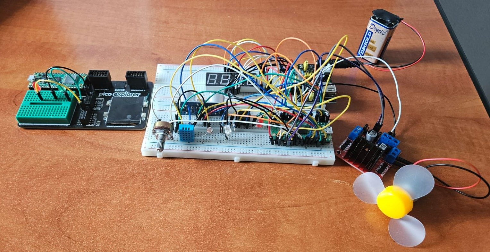
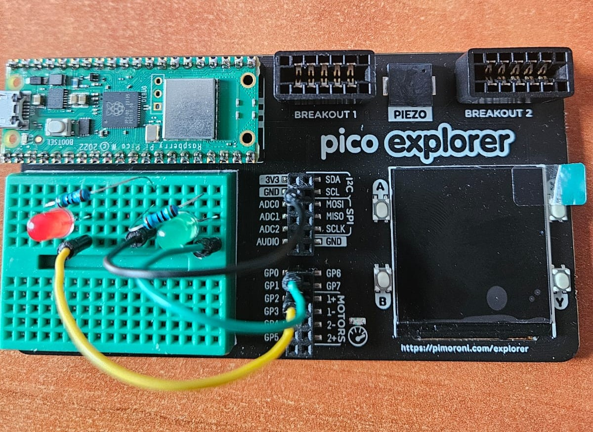
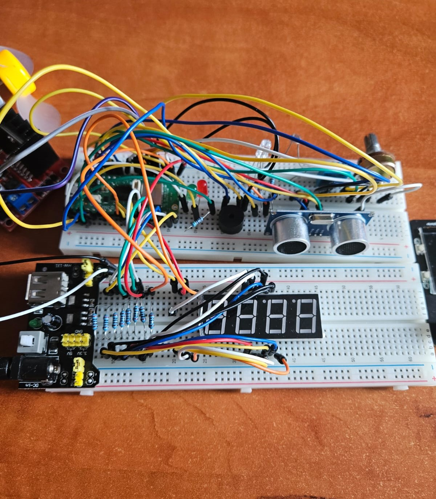
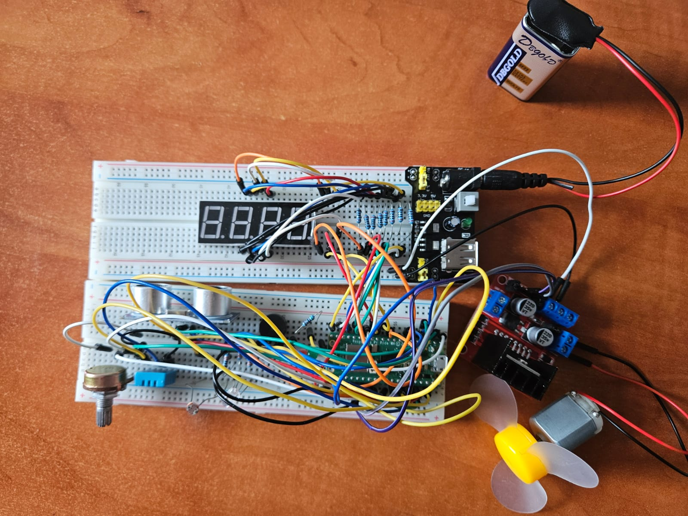
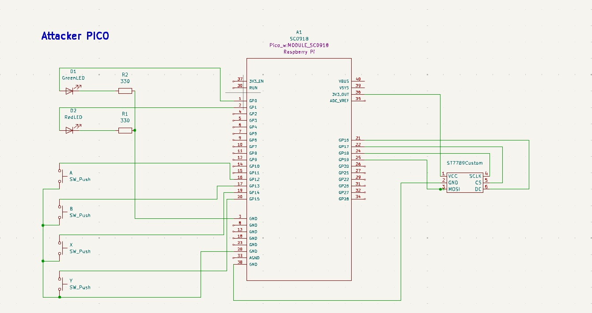
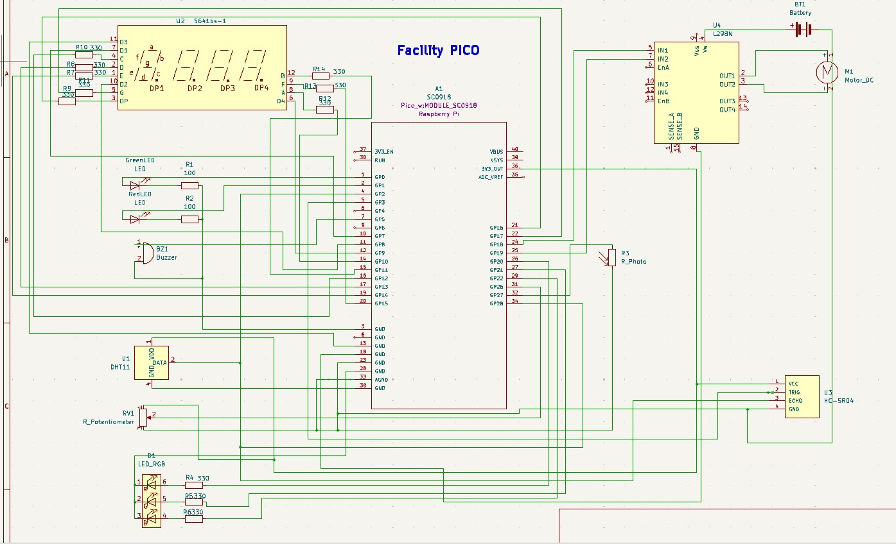
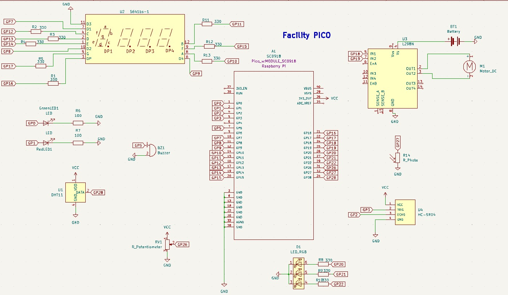

# CyberSim
Simulate cybersecurity threats and defenses within a physical environment using Raspberry Pi Pico W.

:::info 

**Author**: Ionescu Rares-Andrei \
**GitHub Project Link**: https://github.com/UPB-FILS-MA/project-RaresI

:::

## Description

This project investigates how attackers can manipulate sensor data in networked IoT-like systems.  Using two Raspberry Pi Pico W devices connected to a laptop over WiFi, it simulates how an attacker can intercept sensor readings, modify them, and send falsified data back to the laptop. The goal is to implement these attacks and explore potential strategies for detecting data manipulation. This project highlights the critical need for security measures in sensor-based systems.

## Motivation

My interest in cybersecurity stems from its technical complexity and the direct implications for system integrity.  Understanding attack vectors at the level of microprocessor architecture, specifically how an attacker could manipulate data flows or exploit vulnerabilities, is crucial for designing robust defenses.  I chose this project because it provides a tangible way to explore these threats by simulating attacks on a sensor-equipped embedded system. Developing and implementing countermeasures allows me to directly apply concepts from my Microprocessor Arhitecture coursework to safeguard the system. This hands-on experience will prove invaluable as I pursue a career focused on cybersecurity.

## Architecture 



## Log

<!-- write every week your progress here -->

### Week 6 - 12 May
This past week, I focused on gathering the essential components for my project, successfully acquiring most of the items needed. In addition to sourcing materials, I dedicated time to researching online, seeking inspiration to refine my concept. After careful consideration and exploration of various ideas, I finalized the project idea that I plan to implement. This dual approach of preparation and planning has set a solid foundation for the next stages of my project.

### Week 7 - 19 May
In the second week of my project, I completed several key tasks. I gathered all necessary materials and created multiple KiCad schematics. I developed a detailed schematic with wiring for the facility Pico, a cleaner schematic showing only port connections, and a fully wired schematic for the attacker Pico. I also constructed the hardware components on breadboards and the Pico Explorer board, allowing for real-life testing and refinement of the designs. Also, I have created the ST7789 driver symbol for the attacker Pico, added the HC-SR04 symbol and footprint and modified a symbol for the 4 digit 7 segment display in order to match the one I have.

### Week 20 - 26 May
This week, I successfully created runnable code for two Raspberry Picos: the Attacker Pico and the Facility Pico. I implemented code to enable the Facility Pico to act as a server and the Attacker Pico to function as a client. Additionally, I developed defensive mechanisms for the Facility Pico and designed unrecognizable attacks from the Attacker Pico. A significant portion of my time was dedicated to resolving issues with new dependencies. I was challenged by the complexity, which was higher than I anticipated, but it provided valuable learning experiences and growth in handling intricate systems. Now, having learned from my mistakes, I will have a better approximation of future projects' complexity and be more prepared to tackle them efficiently.

## Hardware

Core Components

2 x Raspberry Pi Pico W: (Attacker and Facility)
Raspberry Pi Pico Explorer Base: Provides breadboard, labeled pins, buttons, and LEDs.
Computer: (Intermediary and data display)

Sensors

Photoresistor: For measuring light levels.
Temperature and Humidity Sensor: To monitor environmental conditions.
Ultrasonic Distance Sensor (HC-SR04+): For measuring distances.

Actuators

LEDs (various colors): As visual indicators.
RGB LED: To provide color-based feedback.
Buzzer: For sound alerts/notifications.
DC Motor with Propeller: For simulation of a fan-like device.

Development and Prototyping

Jumper Wires
Potentiometer: For variable input and user adjustments.

Additional Components

7-Segment Display: To display numerical data
Buttons: For user input or interaction.

Up next, here are presented some pictures of the hardware:
Wiring for both Picos:

Attacker Pico:

Facility Pico:



### Schematics

Here are presented the KiCAD Schematics

The Attacker:

The Facility:

The Facility(created for a cleaner design):


### Bill of Materials

<!-- Fill out this table with all the hardware components that you might need.

The format is 
```
| [Device](link://to/device) | This is used ... | [price](link://to/store) |

```

-->

| Device | Usage | Price |
|--------|--------|-------|
| [Rapspberry Pi Pico W x2](https://www.raspberrypi.com/documentation/microcontrollers/raspberry-pi-pico.html) | The microcontroller | [35 RON](https://www.optimusdigital.ro/en/raspberry-pi-boards/12394-raspberry-pi-pico-w.html) |
| [Raspberry Pi Pico Explorer Base](https://shop.pimoroni.com/products/pico-explorer-base?variant=32369514315859) | The base for one of the microcontrollers | [130 RON](https://ro.mouser.com/ProductDetail/397-PIM550) |
| [Photoresistor](https://components101.com/resistors/ldr-datasheet) | Detects the light intensity | [1.5 RON](https://www.optimusdigital.ro/en/others/1863-fotorezistor-tip-5528.html) |
| [Temperature and Humidity Sensor](https://www.mouser.com/datasheet/2/758/DHT11-Technical-Data-Sheet-Translated-Version-1143054.pdf) | Detects the temperature and humidity | [7 RON](https://www.optimusdigital.ro/en/temperature-sensors/99-dht11-temperature-sensor-module.html) |
| [Ultrasonic Distance Sensor (HC-SR04+)](https://www.alldatasheet.com/view.jsp?Searchword=Hcsr04&gad_source=1&gclid=Cj0KCQjwudexBhDKARIsAI-GWYUtzlbllo0qK59ZEciRPX4ooaixkCioHd7qW3eahiRhZLflTwBjznMaAm-zEALw_wcB) | Distance measurement device | [10 RON](https://ardushop.ro/ro/electronica/47-modul-senzor-ultrasonic-detector-distanta.html?gad_source=1&gclid=Cj0KCQjwudexBhDKARIsAI-GWYX_pjVdyoY5swF4wHxKcwHzeHc6-E-VAYLQRBWSBOs0_IPNZJOpLMQaAm1ZEALw_wcB) |
| [LEDs (different colors)](https://www.farnell.com/datasheets/1498852.pdf) | Using different color LEDs we can display different color combinations indicating system messages | [0.5 RON per LED](https://ardushop.ro/ro/electronica/299-led-5mm.html?search_query=LED&results=242) |
| [RGB LED](https://www.farnell.com/datasheets/3497864.pdf) | Depending on its color wo know the state of the system | [5 RON](https://ardushop.ro/ro/electronica/271-led-tricolor-cu-catod-comun.html?search_query=RGB+LED&results=249) |
| [Buzzer](https://components101.com/misc/buzzer-pinout-working-datasheet) | Goes off when an anomaly is detected | [4 RON](https://ardushop.ro/ro/electronica/194-buzzer.html?search_query=buzzer&results=16) |
| [DC Motor with Propeller](https://ardushop.ro/ro/motoare-si-drivere/437-motoras-curent-continuu.html) | Should run at some exact parameters set by the Facility Pico | [2 RON](https://ardushop.ro/ro/motoare-si-drivere/437-motoras-curent-continuu.html) |
| [Jumper Wires](https://media.digikey.com/pdf/Data%20Sheets/Digi-Key%20PDFs/Jumper_Wire_Kits.pdf) | Connect everything together | [8 RON](https://www.optimusdigital.ro/en/wires-with-connectors/12-breadboard-jumper-wire-set.html) |
| [Potentiometer](https://www.handsontec.com/dataspecs/passive/WH148%20Pot-meter.pdf) | Should be used to change the input | [2 RON](https://www.optimusdigital.ro/en/potentiometers/901-10k-wh148-variable-resistor.html) |
| [7-Segment Display](https://www.sparkfun.com/datasheets/Components/LED/7-Segment/YSD-439AR6B-35.pdf) | Will be used to display different data or status codes | [4 RON](https://ardushop.ro/ro/electronica/191-display-led-4x7-segmente.html?search_query=Display+led+7+segmente&results=312) |
| [Buttons](https://components101.com/switches/push-button) | Used to select the type of attack | [0.63 RON](https://ardushop.ro/ro/home/97-buton-mic-push-button-trough-hole.html?search_query=push+button&results=30) |
| [Breadboard](https://components101.com/sites/default/files/component_datasheet/Breadboard%20Datasheet.pdfn) | To connect different components onto it | [10 RON](https://ardushop.ro/ro/electronica/33-breadboard-830.html?search_query=breadboard&results=31) |


## Software

| Library | Description | Usage |
|---------|-------------|-------|
| [st7789](https://github.com/almindor/st7789) | Display driver for ST7789 | Used for the display for the Pico Explorer Base |
| [embedded-graphics](https://github.com/embedded-graphics/embedded-graphics) | 2D graphics library | Used for drawing to the display |
| [dht-sensor](https://docs.rs/dht-sensor/latest/dht_sensor/) | DHT11 sensor driver | Used to read the temperature and humidity levels |
| [hc-sr04](https://docs.rs/hc-sr04/latest/hc_sr04/) | HC-SR04 sensor driver | Used to read the distance |
| [embassy-rp](https://github.com/embassy-rs/embassy/tree/main/embassy-rp) | The embassy-rp HAL targets the Raspberry Pi RP2040 microcontroller. | The HAL implements both blocking and async APIs for many peripherals |
| [cyw43](https://github.com/embassy-rs/embassy/tree/main/cyw43) | Rust driver for the CYW43439 wifi chip, used in the Raspberry Pi Pico W. | Used to help using the wifi chip |
| [embassy_executor](https://github.com/embassy-rs/embassy) | The Embassy executor is an async/await executor designed for embedded usage along with support functionality for interrupts and timers. | Manage asynchronous operations |
| [embassy_time](https://docs.embassy.dev/embassy-time/git/default/index.html) | Provides Instant, Duration and Timer types that are globally available and never overflow. | Timekeeping, delays and timeouts. |
| [embassy_net](https://docs.embassy.dev/embassy-time/git/default/index.html) | A no-std no-alloc async network stack, designed for embedded systems. | Networking functionality |
| [static_cell](https://docs.rs/static_cell/latest/static_cell/) | Provides a no-std-compatible, no-alloc way to reserve memory at compile time for a value. | Statically allocated, initialized at runtime cell. |
| [cyw43_pio](https://crates.io/crates/cyw43-pio) | RP2040 PIO driver for the nonstandard half-duplex SPI used in the Pico W. | The PIO driver offloads SPI communication with the WiFi chip and improves throughput. |
| [log](https://docs.rs/log/latest/log/) | The log crate provides a single logging API that abstracts over the actual logging implementation. | A lightweight logging facade. |
| [core](https://doc.rust-lang.org/core/) | Portable glue between the language and its libraries defining the intrinsic and primitive building blocks of all Rust code | The Rust Core Library is the dependency-free foundation of The Rust Standard Library. |

## Links

<!-- Add a few links that inspired you and that you think you will use for your project -->

1. [Different projects related to my idea](https://github.com/raspberrypi/pico-examples)
2. [An idea I may use](https://www.youtube.com/watch?v=e_f9p-_JWZw&ab_channel=NetworkChuck)
3. [Inspirational](https://www.raspberrypi.com/news/hacking-ikea/)
