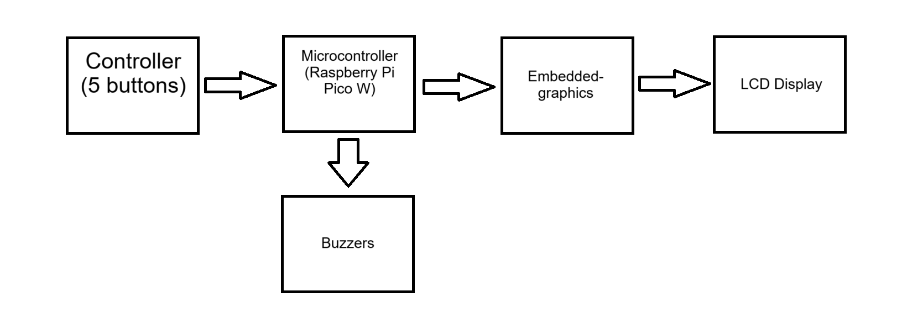
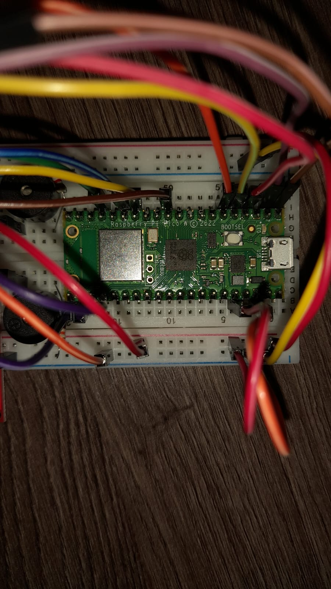
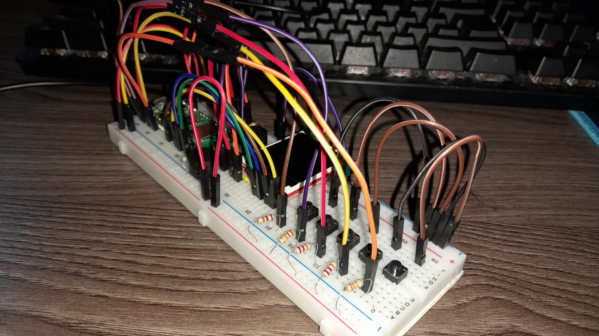
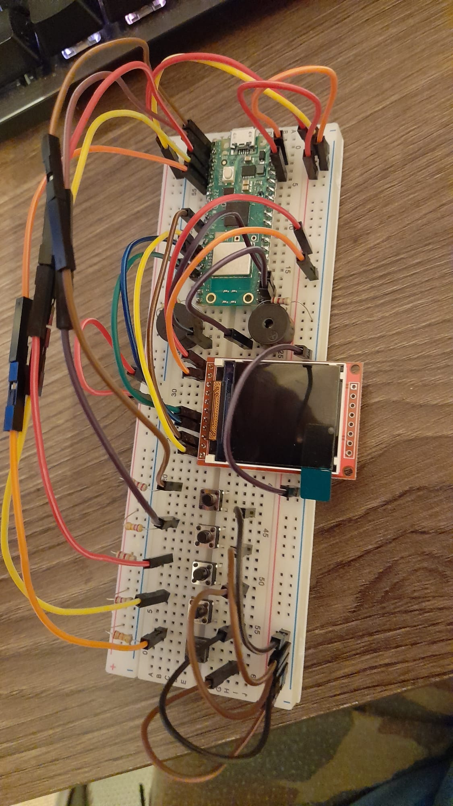
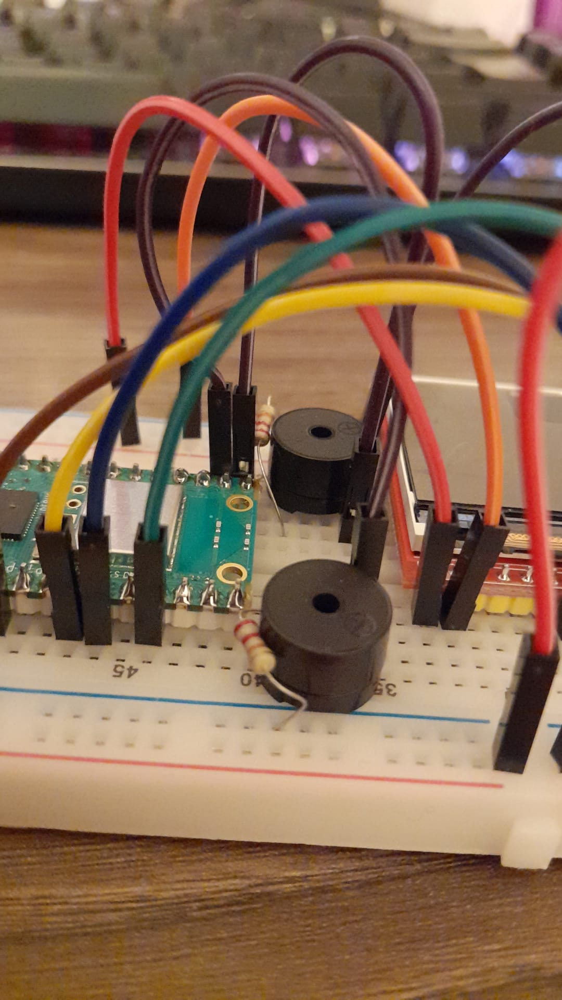
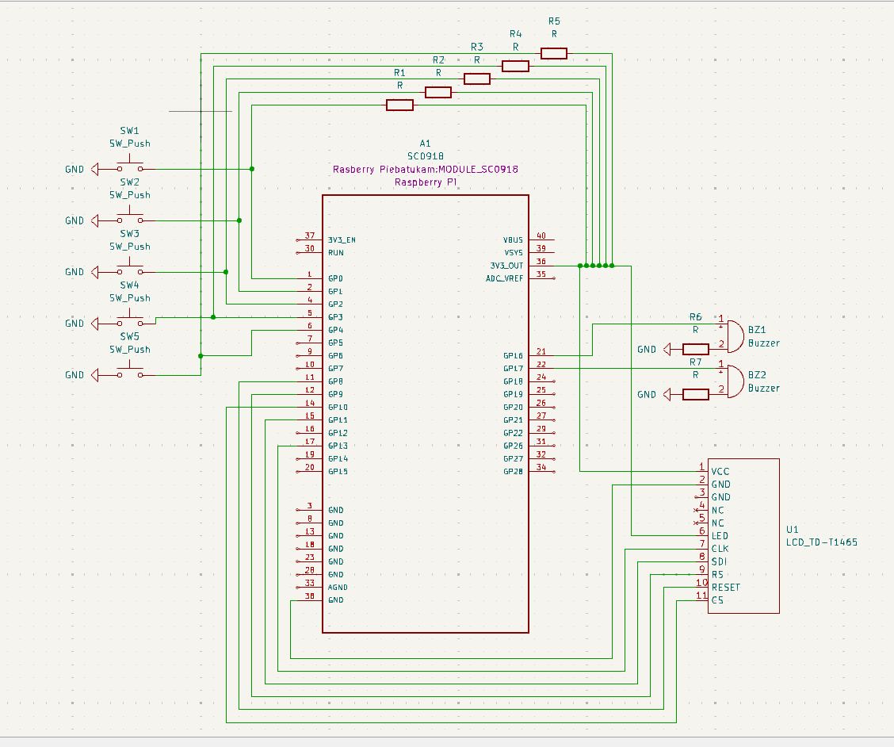

# Tic-Tac_Toe
This project aims to emulate the popular game Tic-Tac_Toe on a Rapspberry Pi.


:::info

**Author**: Teodor-Matei FRÂNCU \
**GitHub Project Link**: [link_to_github](https://github.com/UPB-FILS-MA/project-Angery-Stoman)

:::

## Description


In this project I will try to recreate simplified version of a game console of the 1990's. The controller for playing the game will be composed of 5 buttons, 4 of which for navigating the game itself (up down left right) and the last for inputting your move. The game will be displayed using a small LCD display that will run using Embedded-graphics, thereby giving the user a simple yet effective interface for playing the game. To emulate the feel of retro games, a buzzer (or more, if need be) will be used to play a simple 8-bit styled theme and specific sounds for inputting moves and losing or winning the game. The game will be played against  another player.


## Motivation

I've always wanted to delve into game making, and while this may not be much, it's a small step into the world of game making. Tic Tac Toe feels simple enough for someone of my hardware knowledge level to recreate it. Choosing a game as my project also adds a level of difficulty to the journey of creating it, as I have only coded games using html, c++/c# and javascript, a.k.a. only software. This will be the first time any game that I have made has a hardware component to it.
And as an added bonus I'm quite passionate about video games and I spend most of my free time playing them, so this project is right up my alley.

## Architecture 



### Main Components

Here is the list of all of the main components and a short description of their utility:

-Controller \
This controller is composed of 5 simple buttons, 4 of them are for inputting directions (up down left and right) and one is for imputting your move (placing down x or 0 on the playing field)

-Microcontroller \
The brains of this project, responsible with interpreting the input of the controller and sending the appropriate data to be displayed by the LCD display and to the buzzers.

-Display \
Comprised of an lcd display that will present the user the game itself, a 3x3 matrice that both the player and the computer will play on.

-Buzzers \
Used to play different sounds according to the users inputs and the state of the game (loss/win/idle)

### Connections

-Controller to Microcontroller: \
The input of the controller is directly connected to the microcontroller, which interprets these commands and modifies the state of other components accordingly.

-Microcontroller to Display: \
The microcontroller sends data to be displayed on the LCD display, which in turn displays the instructions that it receives from the microcontroller.

-Microcontroller to Buzzers: \
The microcontroller, depending on what is happening in game, will tell the buzzers to either play the game theme, a song for when the player loses and one for when they win. Additionally, on player input, a small chime will be played.

## Log

<!-- write every week your progress here -->

### Week 6 - 12 May
-In this week I have written the Index.md and created a rough sketch of the project itself using paint. 

### Week 7 - 19 May
-In this week I have finished the hardware part of the project, connecting every component between itself and tested it. Furthermore, I created the Kicad Schematic for the project itself and the LCD display.

### Week 20 - 26 May

## Hardware

At the moment, this is how my project looks like right now. Keep in mind that this version is meant to be used as a testing grounds for the software program. As we approach the day of the final product, for example, the buttons and lcd display will be moved onto a smalled bredboard, to allow for an easier way of pressing them, without having to jam your fingers in between wires. Furthermore, I will design a small case for the bredboard which will resemble a game console.

These are the connections of the microcontroller:


These are the buttons, which are connected using pull-up resistors:


This is how the lcd diplay is connected to the microcontroller:


These are the buzzers of the project:


### Schematics



### Bill of Materials

<!-- Fill out this table with all the hardware components that you might need.

The format is 
```
| [Device](link://to/device) | This is used ... | [price](link://to/store) |

```

-->

| Device | Usage | Price | 
|--------|--------|-------|
| [Rapspberry Pi Pico W](https://www.raspberrypi.com/documentation/microcontrollers/raspberry-pi-pico.html) | The microcontroller | [35 RON](https://www.optimusdigital.ro/en/raspberry-pi-boards/12394-raspberry-pi-pico-w.html) | 
| [Display](https://www.optimusdigital.ro/ro/index.php?controller=attachment&id_attachment=196) | Displays the game | [30 RON](https://www.optimusdigital.ro/ro/optoelectronice-lcd-uri/12392-modul-lcd-de-18-cu-spi-i-controller-st7735-128x160-px.html?gad_source=1&gclid=Cj0KCQjwudexBhDKARIsAI-GWYW_FcUUf-veHQYVdumHZVaVkLbAsaFEqVJjGCpSuVWwelo4iq26zUQaAlL_EALw_wcB) | 
| Bredboard | Connecting the components | [10 RON](https://www.optimusdigital.ro/ro/prototipare-breadboard-uri/8-breadboard-830-points.html) | 
| Wires | Connecting the components | [7 RON](https://www.optimusdigital.ro/ro/fire-fire-mufate/888-set-fire-tata-tata-40p-20-cm.html?search_query=fire&results=437) | 
| Resistances | Needed in order to not damage the components | [5 RON](https://www.optimusdigital.ro/ro/componente-electronice-rezistoare/858-rezistor-025w-18k.html?search_query=rezistor&results=120) | 
| 5 Buttons | For controlling the game | [2 RON](https://www.optimusdigital.ro/ro/butoane-i-comutatoare/1119-buton-6x6x6.html) | 
| 2/3 Buzzers | Playing music | [4 or 6 RON](https://www.optimusdigital.ro/ro/audio-buzzere/12247-buzzer-pasiv-de-33v-sau-3v.html?search_query=buzzer&results=62) | 

## Software

| Library | Description | Usage | 
|--------|--------|-------|
| [st7789](https://github.com/almindor/st7789) | Display driver for ST7789 | Used for the display for the Pico Explorer Base| 
| [embedded-graphics](https://github.com/embedded-graphics/embedded-graphics) | 2D graphics library | Used for drawing to the display | 
| [embassy_rs](https://github.com/embassy-rs/embassy) | Embassy framework for embedded systems | Used for its many useful and versatile libraries | 

## Links

1. [Gameboy](https://en.wikipedia.org/wiki/Game_Boy)

